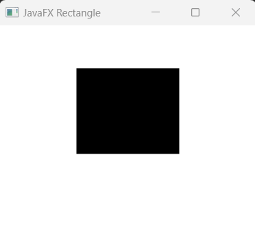
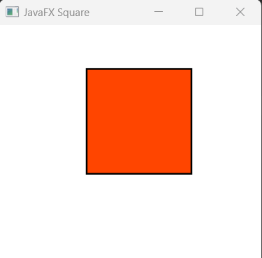
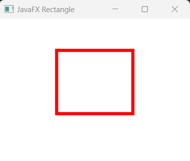
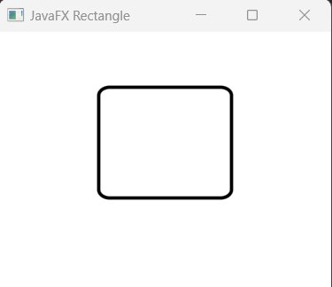
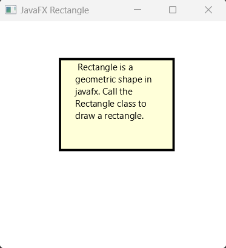
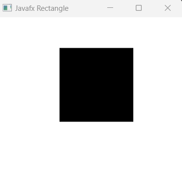
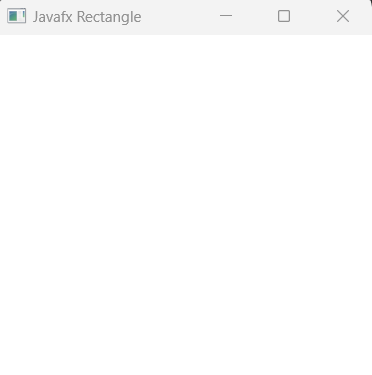
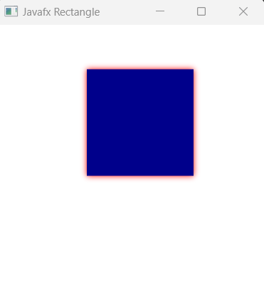

## Javafx Rectangle

Rectangle is a 2D geometric shape in javafx. The package javafx.scene.shape.Shape is responsible to draw a Rectangel shape. So we have to import the Rectangle class from this package. The Rectangle class defines a rectangle with the specified size (width and height) and location (X, Y). By default, the Rectangle class  has sharp corners and black color. But we can also make the rectangle rounded by calling arcWidth and arcHeight. 

Here is a list of important properties those are responsible to draw a rectangle.

X (setX) : Defines the X coordinate of the upper left corner of the rectangle.<br/>
Y (setY) : Defines the Y coordinate of the upper left corner of the rectangle.<br/>
Width (setWidht): Width of the rectangle.<br/>
Height (setHeight): Height of the rectangle.<br/>
ArcWidth and ArcHeight : Make the rectangle rounded corners.<br/>

Note: We can also call LayoutX and LayoutY method to set the location of Rectangle.

Additional properties can also be applied in a rectangle. Like, fill, smooth, strokeWidth, strokeOffset, strokeLineJoin etc.

## Creating a Rectagle

We can create a Rectangle by creating a rectangle constructor, then draw it by calling respected setter methods.

```js
//empty rectangle constructor
Rectangle rectangle = new Rectangle();
//a rectangle with respective properties
Rectangle rectangle1 = new Rectangle(10, 100, 60, 40);
//widht, and paint value
Rectangle rectangle1 = new Rectangle(60, 40, Color.BLUE);
```
Here all of them are default constructor of Recatangle class.

## Add Rectangle to the Scene Graph

For displaying the Recatagle shape, we have to add it to the container node like in Group container. Below is a complete example that shows a rectangle shape in the scene.

```js
package com.javaondemand;

import javafx.application.Application;
import javafx.scene.Group;
import javafx.scene.Scene;
import javafx.scene.shape.Rectangle;
import javafx.stage.Stage;

import java.io.IOException;

public class RectanlgleExample extends Application {
    @Override
    public void start(Stage stage) throws IOException {

        //creating a rectangle instance variable
        Rectangle rectangle = new Rectangle();

        //add appropriate setter methods (x, y, width, height)
        rectangle.setX(90);
        rectangle.setY(50);
        rectangle.setWidth(120);
        rectangle.setHeight(100);

        //creating a root container
        Group root = new Group();
        //call getChildren().add() method
        root.getChildren().add(rectangle);

        Scene scene = new Scene(root,300,300);
        stage.setTitle("JavaFX Rectangle");
        stage.setScene(scene);
        stage.show();
    }

    public static void main(String[] args) {
        launch();
    }
}
```

After runng the application, you see a black filled rectangle, that coordinating position is (x, y) = (90, 50) and width and height is 120 and 80 respectively. Note that, by default, the rectanle color is black. You can call setFill(Paint paint) method to change the Rectangle color.




## Change the Rectanle Color

Earlier said that, black is the default color of any rectangle shape of javafx. We can call setFill(Paint paint) method to change the default color.

```js
//now rectangle should be Green
rectangle.setFill(Color.GREEN);
```



## Change StrokeWidth and StrokeColor

There are methods available in javafx, to work with Rectanle border. Like, we can change the stroke or border default width by calling setStrokeWidth() method and change stroke color by calling the setStroke(Paint paint) method. See the following example

```js
//make the storke 5px width and color is red
rectangle.setStrokeWidth(5);
rectangle.setStroke(Color.RED);
```
Now the stroke color and width should be changed if you add the above code in your application.




## Rounded Rectangle

Let's create a rounded corner rectangle by calling arcWidth() and arcHeight() double type methods to our rectangle class.

```js
//make the rectangle corner rounded width=20, height=15
rectangle.setArcWidth(20);
rectangle.setArcHeight(15);
```

After adding the above two lins of code, kinly run the example application again you will now see a rectangle shape with rounded corners. (I changed the color of the rectanlge)




## Add text inside Rectangle

We can also add text inside a rectangle. For this, we will create a Text node with default text and then changed the Text default position so that it resides inside the recatangle shape. See a full example below that shows Rectanle shape with texts inside it.

```js
package com.javaondemand;

import javafx.application.Application;
import javafx.scene.Group;
import javafx.scene.Scene;
import javafx.scene.paint.Color;
import javafx.scene.shape.Rectangle;
import javafx.scene.text.Text;
import javafx.scene.text.TextAlignment;
import javafx.stage.Stage;

import java.io.IOException;

public class RectanlgleExample extends Application {
    @Override
    public void start(Stage stage) throws IOException {

        //create a rectangle with (x, y, width, height) properties
        Rectangle rectangle = new Rectangle(80, 50, 150, 120);
        //set the rectangle color
        rectangle.setFill(Color.rgb(255, 255, 200, 0.7));

        //set stroke with and color
        rectangle.setStrokeWidth(3);
        rectangle.setStroke(Color.BLACK);

        //create a text node
        var text_node = """
                Rectangle is a geometric shape in javafx. Call the Rectangle class to draw a rectangle.
               """;

        //creating Text node with appropriate methods call
        Text text = new Text(text_node);
        text.setFill(Color.BLACK);
        text.setLayoutX(100);
        text.setLayoutY(65);
        text.setWrappingWidth(120);
        text.setTextAlignment(TextAlignment.LEFT);

        //creating a root container
        Group root = new Group();

        //call getChildren().addAll() method
        root.getChildren().addAll(rectangle, text);

        Scene scene = new Scene(root,300,300);
        stage.setTitle("JavaFX Rectangle");
        stage.setScene(scene);
        stage.show();
    }

    public static void main(String[] args) {
        launch();
    }
}
```

Run the above example application. You now see a rectangle with texts inside it.



## Rectangle as a Square 

A javafx Rectangle can be a square too if the width and height values are same. See the below example where we give the  same width and height to rectangular object.

```js
package com.javaondemand;

import javafx.application.Application;
import javafx.scene.Group;
import javafx.scene.Scene;
import javafx.scene.paint.Color;
import javafx.scene.shape.Rectangle;
import javafx.stage.Stage;

import java.io.IOException;

public class HelloApplication extends Application {
    @Override
    public void start(Stage stage) throws IOException {

        //create a rectangle with same width and height - square
        Rectangle rectangle = new Rectangle();

        rectangle.setX(120);
        rectangle.setY(50);
        rectangle.setWidth(120);
        rectangle.setHeight(120);

        //creating a root container
        Group root = new Group();
        //call getChildren().addAll() method
        root.getChildren().addAll(rectangle);

        Scene scene = new Scene(root,300,300);
        stage.setTitle("JavaFX Square");
        stage.setScene(scene);
        stage.show();
    }

    public static void main(String[] args) {
        launch(args);
    }
}
```

If you run the example againg, you see an image of Square (same with and height)




## Make the rectangle Invisible

By default Rectangle shape is visible in the scene. But if you don't want to display it in the scene graph, just call setVisible(bool) method and provide false boolean value. Then, your rectangle shape will not be visible.

```js
//the shape will not visible now.
rectangle.setVisible(false);
```

Now you will see a blank scene and the rectangle image is hidden.



## Add color and Effect to Rectangle Shape

We can also add specific effects available in javafx to rectangle just calling setEfeect() method. Here, I am going to add DropShadow effect in our rectangle shape. Before adding dropShadow effect, we must import the class from this package javafx.scene.effect.DropShadow; 

```js
//add effects
rectangle.setFill(Color.DARKBLUE);
rectangle.setEffect(new DropShadow(10.0, Color.RED));
```

Run the example application again, and you see now a darkBlue rectangular shape with DropShadow effect.



