## Javafx Sphere

The Sphere class defines the 3 dimentional Sphere (almost circular or globe type) with the specified radius. It is a 3 dimentional shape created with a given radius and optional division int value.

## Responsive constructors: 

Sphere(): Creats a new instance of Sphere with 1.0 default radius value.<br/>
Sphere(double value): Creates new instance of Sphere class with the specified radius.<br/>
Sphere(double value, int divisions): Here a Sphere object is generated with the specified radius value and optional number of divisions int value.<br/>

## Creating Sphere: 

We can simply create a Sphere shape by instantiating a Sphere constructor. Like, we we here create a Sphere object and call setRadius() method with the value of 3.

```js
//creating Sphere constructor and add radius to it.
Sphere sphere = new Sphere();
sphere.setRadius(3);
```

## Create Camera and add camera to Sphere object

Now we will create a Perspective Camera with the specified ratation and translation and then, add that camera instance on our Sphere object. Why? Because, the Camera will be responsible to visualize the 3D Spehere shape on the scene. By default, the ParallelCamera is used. However, let's look over the below code.

```js
//create camera and position it
PerspectiveCamera camera = new PerspectiveCamera(true);
camera.getTransforms().addAll(
new Rotate(0, Rotate.X_AXIS),
new Rotate(0, Rotate.Y_AXIS),
new Translate(0, 0, -18)
);
```

Here, we have created a PerspectiveCamera objcet with true optional boolean value. Then, we have added X and Y coordinate rotaion and Translate class. Here, the rotation can be changed and then our Shpere (globe shape) will be different.

Note: In future post, I will try to describe more about how the rotion and translate class basically works. Overall, for displaying the 3d Sphere shape on the scene we must add a camera with translate class. Translate (x, y, z); Must set z property value (negative value).

## Create a root container and Subscene

Now we will create a root container like Group and call it's getChildren method for adding the child nodes like sphere object and camera and then we will create subscene.

```js
//create root container
Group root = new Group();
root.getChildren().add(camera);
root.getChildren().add(sphere);

//create subscene
SubScene subScene = new SubScene(root, 300, 300);
subScene.setFill(Color.ALICEBLUE);
subScene.setCamera(camera);

//creating Group and add the subscene here
Group group = new Group();
group.getChildren().add(subScene);
```

Here at last, we create anothe Group container node because Subscene isn't parent node, that's why we need a parent node to add into Scene.

## Add the Sphere to Scene. 

We must add the Spher  to the Scene class in order to display it. Here, the last group object we will add on the scene.

```js
Scene scene = new Scene(group);
```

Let's see the full example below:

```js
package com.javaondemand;

import javafx.application.Application;
import javafx.scene.*;
import javafx.scene.paint.Color;
import javafx.scene.shape.Sphere;
import javafx.scene.transform.Rotate;
import javafx.scene.transform.Translate;
import javafx.stage.Stage;

public class HelloApplication extends Application {
    @Override
    public void start(Stage stage) throws Exception {

        Sphere sphere = new Sphere();
        sphere.setRadius(3);

        //create camera and position it
        PerspectiveCamera camera = new PerspectiveCamera(true);
        camera.getTransforms().addAll(
                new Rotate(0, Rotate.X_AXIS),
                new Rotate(0, Rotate.Y_AXIS),
                new Translate(0, 0, -18)
        );


        Group root = new Group();

        root.getChildren().add(camera);
        root.getChildren().add(sphere);

        SubScene subScene = new SubScene(root, 300, 300);
        subScene.setFill(Color.ALICEBLUE);
        subScene.setCamera(camera);

        //creating Group
        Group group = new Group();
        group.getChildren().add(subScene);


        Scene scene = new Scene(group);
        stage.setTitle("JavaFX Box");
        stage.setScene(scene);
        stage.show();
    }

    public static void main(String[] args) {
        launch(args);
    }
}

```

Run the sample application and you will see a Sphere 3d shape on the scene.

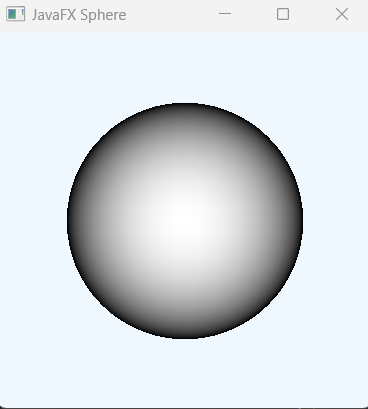

Note: By default the Sphere class uses DrawMode.FILL method, that's why you see an image like the above but if you use DrawMode.LINE you basically get an image shape like the below: 

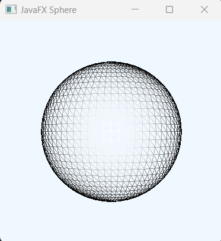


## Add Material (Color) to Shpere 

We can add different material like PhongMaterial in our Sphere shape to make our Sphere shape colorful and dynamic too.


```js
//add Material
final PhongMaterial redMaterial = new PhongMaterial();
redMaterial.setDiffuseColor(Color.RED);
redMaterial.setSpecularColor(Color.GREEN);
sphere.setMaterial(redMaterial);
```

Here the DiffuseColor add color on the Sphere node and SpecularColor add highlights. [starts from center of the box]

Run the example application again and see how our PhongMaterial works. Now it produces the below shape.

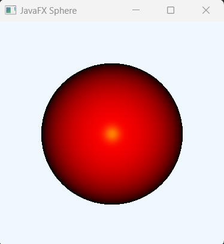

But if you use drawMode.LINE; You will get a shape like the below now.

```js
sphere.setDrawMode(DrawMode.LINE);
```

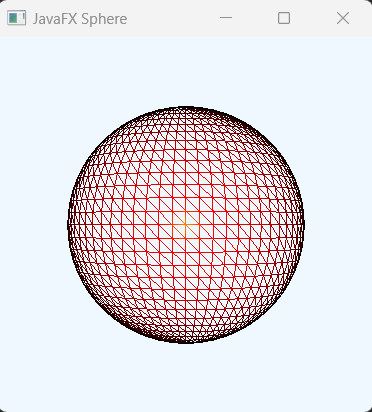


## Chnage the Rotation properites and measure the changes.

Overall, we can now create 3d Sphere shape easily. But, if we want to make your shape more dynamic then, we can do so by changing the rotaion properites (X and Y) in the Perspective camera.

## Few more Sphere shape examples: 

Rotate.X_AXIS = 30 and Rotate.Y_AXIS = 60

```js
PerspectiveCamera camera = new PerspectiveCamera(true);
camera.getTransforms().addAll(
new Rotate(30, Rotate.X_AXIS),
new Rotate(60, Rotate.Y_AXIS),
new Translate(0, 0, -18)
);
```

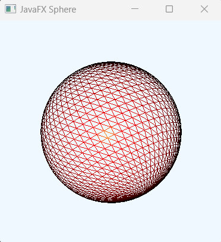

Rotate.X_AXIS = 60 and Rotate.Y_AXIS = 30

```js
PerspectiveCamera camera = new PerspectiveCamera(true);
camera.getTransforms().addAll(
new Rotate(60, Rotate.X_AXIS),
new Rotate(30, Rotate.Y_AXIS),
new Translate(0, 0, -18)
);
```

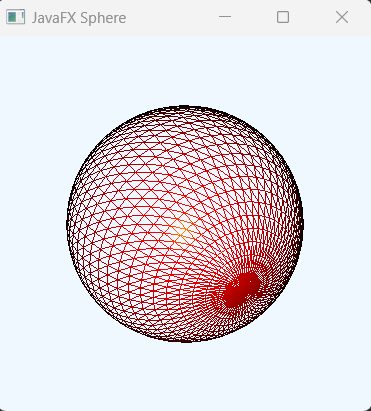

Rotate.X_AXIS = -30 and Rotate.Y_AXIS = -60

```js
PerspectiveCamera camera = new PerspectiveCamera(true);
camera.getTransforms().addAll(
new Rotate(-30, Rotate.X_AXIS),
new Rotate(-60, Rotate.Y_AXIS),
new Translate(0, 0, -18)
);
```

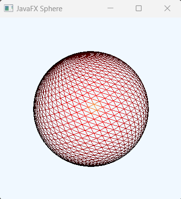

Rotate.X_AXIS = -60 and Rotate.Y_AXIS = -30

```js
PerspectiveCamera camera = new PerspectiveCamera(true);
camera.getTransforms().addAll(
new Rotate(-60, Rotate.X_AXIS),
new Rotate(-30, Rotate.Y_AXIS),
new Translate(0, 0, -18)
);
```

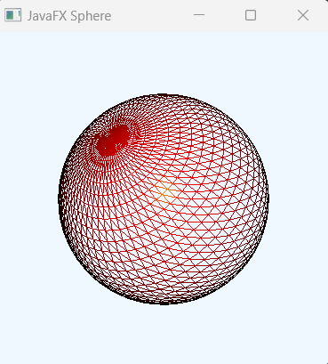

Rotate.X_AXIS = 90 and Rotate.Y_AXIS = 120

```js
PerspectiveCamera camera = new PerspectiveCamera(true);
camera.getTransforms().addAll(
new Rotate(90, Rotate.X_AXIS),
new Rotate(120, Rotate.Y_AXIS),
new Translate(0, 0, -18)
);
```

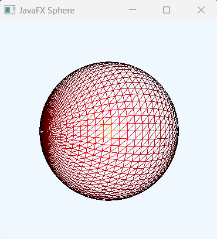

Rotate.X_AXIS = 180 and Rotate.Y_AXIS = 90

```js
PerspectiveCamera camera = new PerspectiveCamera(true);
camera.getTransforms().addAll(
new Rotate(180, Rotate.X_AXIS),
new Rotate(90, Rotate.Y_AXIS),
new Translate(0, 0, -18)
);
```


Rotate.X_AXIS = -75 and Rotate.Y_AXIS = -90

```js
PerspectiveCamera camera = new PerspectiveCamera(true);
camera.getTransforms().addAll(
new Rotate(-75, Rotate.X_AXIS),
new Rotate(-90, Rotate.Y_AXIS),
new Translate(0, 0, -18)
);
```

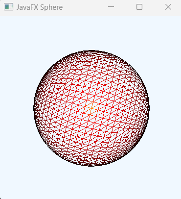

Rotate.X_AXIS = 120 and Rotate.Y_AXIS = 70

```js
PerspectiveCamera camera = new PerspectiveCamera(true);
camera.getTransforms().addAll(
new Rotate(120, Rotate.X_AXIS),
new Rotate(70, Rotate.Y_AXIS),
new Translate(0, 0, -18)
);
```

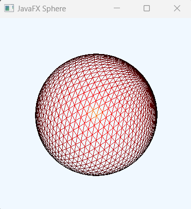


Rotate.X_AXIS = 90 and Rotate.Y_AXIS = 0

```js
PerspectiveCamera camera = new PerspectiveCamera(true);
camera.getTransforms().addAll(
new Rotate(90, Rotate.X_AXIS),
new Rotate(0, Rotate.Y_AXIS),
new Translate(0, 0, -18)
);
```

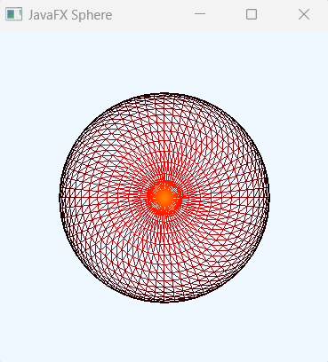


## Add optional Division int value to Sphere

Let's say we want to add division int value in our default sphere object.

```js
Sphere sphere = new Sphere(3, 1);
sphere.setDrawMode(DrawMode.LINE);
```

The output will be:

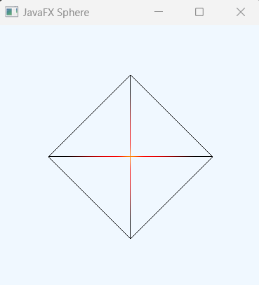

When DrawMode.FILL used, the output will be

```js
Sphere sphere = new Sphere(3, 1);
sphere.setDrawMode(DrawMode.FILL);
```
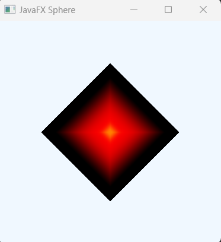

But, when we increase the Division value 1 to 5, the output literally a different one!

```js
Sphere sphere = new Sphere(3, 5);
sphere.setDrawMode(DrawMode.LINE);
```

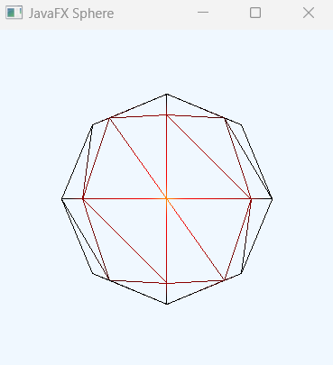

When DrawMode.FILL is used 

```js
Sphere sphere = new Sphere(3, 5);
sphere.setDrawMode(DrawMode.FILL);
```

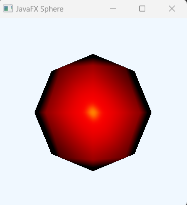

If you now just change the Divisions value or increase it, you get literally a different Sphere 3d shape. The more your Divisions int value, the deep your Sphere shape will be. And at the end you will get a FILLED shape (If you use DrawMode.LINE)

Let's add divsions int value 100 and 200 and measure your output image.

```
//first Step
Sphere sphere = new Sphere(3, 100);
sphere.setDrawMode(DrawMode.LINE);

//second Step
Sphere sphere = new Sphere(3, 200);
sphere.setDrawMode(DrawMode.LINE);
```

The output image now approximately,

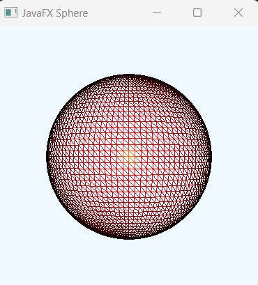


But, when it 400 (Divisions value), the output little bit strange. It meanse, if you just increase your Divisions int value, at the end you will just get filled (DrawLine.FILL) shape. 

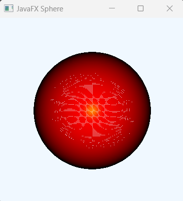

One more example, using DrawMode.FILL and Division to 7

```js
Sphere sphere = new Sphere(3, 7);
sphere.setDrawMode(DrawMode.FILL);
```

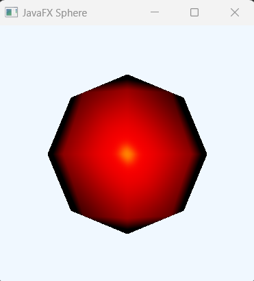