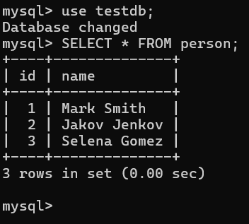
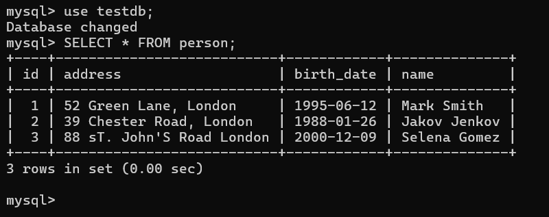

# Create Your First JPA Application

In this post we are going to explore how to create a simple jpa application using maven.

## Requirements:

Basic requirements:<br/>
1. Java development kit - jdk-8+ (Would be better if you use java 17)<br/>
2. Maven/Gradle as a build tool. Make sure you have the latest maven version install or at least version 3.6.3+ <br/>
3. An IDE like intellij Ide. <br/>


## Build A Maven Hello World Project

First of all, using the following command to build a maven hello world project

```
$ mvn archetype:generate -DgroupId=com.company -DartifactId=my-app -DarchetypeArtifactId=maven-archetype-quickstart -DarchetypeVersion=1.4 -DinteractiveMode=false
```

Tutorial: [Create Your First Maven Application](https://javaforbackend.com/first-maven-application)

Now, open your project in your favourite ide, in my case I will use Intellij Ide.

How to import projects in your favourite ides:

Intellij IDE: Right click > File > Open > Find Your Project Folder (my-app) > Click Ok.

Eclipse IDE: File > Import > Maven > Existing Maven Projects > Find Your Project Folder (my-app) > Click Finish.

Netbeans IDE: File > Open Project > Find Out Your Maven Project > Click Open Project

VS code IDE: File > Open Folder > Select The Maven Project (my-app) > Click on Select Folder


Any ide, you will use hope the above instructions would be very helpful to import your maven project.

```
my-app
|-- pom.xml
`-- src
    |-- main
    |   `-- java
    |       `-- com
    |           `-- company
    |                   `-- App.java
    `-- test
        `-- java
            `-- com
                `-- company
                    `-- app
                        `-- AppTest.java
```

After opening your simple maven project, you will get the the above project structure. If you open App.java you will see a simple Hello, World string message that will print if you run App.java file.

```
package com.company;

/**
 * Hello world!
 *
 */
public class App{
    public static void main( String[] args ) {

        System.out.println("Hello World!");
    }
}
```

As our goal is to create JPA application we have to go little bit further. Open your project pom.xml file and add the following jpa, hibernate(for the jpa implementation) mysql database dependency in the dependency section.

pom.xml file

```
<dependency>
  <groupId>jakarta.persistence</groupId>
  <artifactId>jakarta.persistence-api</artifactId>
  <version>3.1.0</version>
</dependency>

<dependency>
  <groupId>org.hibernate</groupId>
  <artifactId>hibernate-core</artifactId>
  <version>6.1.6.Final</version>
</dependency>

<dependency>
  <groupId>com.mysql</groupId>
  <artifactId>mysql-connector-j</artifactId>
  <version>8.2.0</version>
</dependency>
```

Now reload your pom.xml file to resolve the newly added dependencies. In your pom.xml file: Right Click > Maven > Reload project.

## Configure persistence.xml file

Now create resources folder in src/main folder of you project. In the resources folder create META-INF/persistence.xml file. In your persistence.xml file write the following 

**persistence.xml**

```
<?xml version="1.0" encoding="UTF-8" standalone="yes"?>
<persistence xmlns="http://xmlns.jcp.org/xml/ns/persistence"
             xmlns:xsi="http://www.w3.org/2001/XMLSchema-instance"
             xsi:schemaLocation="http://xmlns.jcp.org/xml/ns/persistence http://xmlns.jcp.org/xml/ns/persistence/persistence_2_2.xsd"
             version="2.2">

    <persistence-unit name ="default"> <!--default is your persistence unit name-->

        <properties>
            <property name="jakarta.persistence.jdbc.driver" value="com.mysql.cj.jdbc.Driver"/>
            <property name="jakarta.persistence.jdbc.url" value="jdbc:mysql://localhost:3306/testdb"/>
            <property name="jakarta.persistence.jdbc.user" value="root"/>
            <property name="jakarta.persistence.jdbc.password" value="root"/>
            <property name="hibernate.hbm2ddl.auto" value="create"/>
            <property name="hibernate.show_sql" value="true"/>
            <property name="hibernate.format_sql" value="true"/>
        </properties>
    </persistence-unit>
</persistence>
```

Here, persistence-unit is the root component and the persistence-unit name must be same as EntityManagerFactory name what you have used in your persistence class. Then, inside **properties** component we provide our database information. JDBC driver name, database url, user-name and password. Also we use hibernate specific mappings like hibernate.hbm2ddl.auto.

**Note:** hibernate.hbm2ddl.auto contains 4 possible values. 
   - create: create the schema (means create tables with data) and erase the previous data if it finds any.
   - create-drop: create the schema and drop when the application is stopped.
   - update: update the schema or table, but if you have association/linking with other tables (by using OneToOne or OneToMany etc.) like 2 table shares data with each other, you probably get error as your application then says, duplicate entry key '1/2/3..' for key 'related table details'...
   - validate: validate the schema, no changes will be generated in database.


## Create an Entity Model

Now we will create a simple entity model (database table in other words) including getter/setter methods. Let's name our Entity Model Person.java and must we have to annotate it by using the @Entity annotation.

**Person.java**

```
package com.company.model;

import jakarta.persistence.*;

@Entity(name = "Person")
@Table(name = "person")
public class Person {
    @Id
    private int id;
    private String name;
    private String address;
    private LocalDate;

    public Person() {
    }

    public Person(int id, String name) {
        this.id = id;
        this.name = name;
    }

    public int getId() {
        return id;
    }

    public void setId(int id) {
        this.id = id;
    }

    public String getName() {
        return name;
    }

    public void setName(String name) {
        this.name = name;
    }
}
```

Here inside the model package we have create a **Person.java** entity class. An entity class is just like a database table and all the properties in it would be the column names in this table. One thing to note that, every entity must need a primary key and it must be annotated by @Id annotation. Optionally we can use @Table (to externally name our database table) @Column (to externally name the database columns) annotations.


Note: The @Column annotation has few attributes to use. Such as,

name: Defines the name of the column. If not specified then the property name will be the column name. <br/>

length: Mentions the length of the column. Such as, "varchar" is used to specify the length of the string based column and it's default value is 255. <br/>

nullable: Whether the columns value can be null (empty) or not. The default option is true (means null value supported) <br/>

unique: indicates whether the column values must be unique or not. By default it's value is false. <br/>

columnDefinition: Allows to specify the sql fragment that defines the column such as, data type and constraints. <br/>

precision and scale: used for numeric columns. Precision defines total number used before decimal point and scale defines the number used after decimal point (12.005)


For the time being, all of my tutorials, I basically use name, nullable, unique and length attributes. But you can use these attributes based on your requirement. <br/>


**Note:** We will use persistent/persistence object for mentioning entities all of my tutorials.


## Create A Persistence Class

In this final step, we will create a java persistence class in order to register EntityManagerFactory and call the entity-manager to save our Person records. Create a package called dao and in it create PersonPersistent.java class

PersonPersistent.java

```
package com.company.dao;

import com.company.model.*;
import jakarta.persistence.EntityManager;
import jakarta.persistence.EntityManagerFactory;
import jakarta.persistence.Persistence;

public class DemoPersistent {
    public static void main(String[] args) {
        EntityManagerFactory emf = Persistence.createEntityManagerFactory("default");
        EntityManager em =emf.createEntityManager();
        em.getTransaction().begin();

        /*
         * Start from here
         */

        Person p1 = new Person(1, "Mark Smith");
        Person p2 = new Person(2, "Jakov Jenkov");
        Person p3 = new Person(3, "Selena Gomez");

        em.getTransaction().commit();
        em.close();
        emf.close();
    }
}
```

Here I persist or save three person objects into the mysql database. If you run the PersonPersistent.java class, three person details will be saved in your mysql database.

Open your mysql commandLine tools and run the following command to extract the person table data.

```
$ SELECT * FROM PERSON;
```



## Add New Attributes in Your Person Entity

Let's say we want to add attributes (database column) in our Person entity. They are address and birth_date

Person.java (updated person entity)

```
package com.company.model;

import jakarta.persistence.*;

@Entity(name = "Person")
@Table(name = "person")
public class Person {
    @Id
    private int id;
    private String name;
    private String address;
    private LocalDate;

    public Person() {
    }
}

    //getter/setter methods

```

PersonPersistence.java (call the setter method to save the address and birthDate)

```
p1.setAddress("52 Green Lane, London");
p1.saveBirthDate('1095-9-12')

p2.setAddress("39 Chested Road, London");
p2.saveBirthDate('1088-1-26')

p3.setAddress("88 sT. John'S Road, London)
p3.saveBirthDate('2000-12-9')
```

Just, again the persistence class, and your database table will be updated as well.


