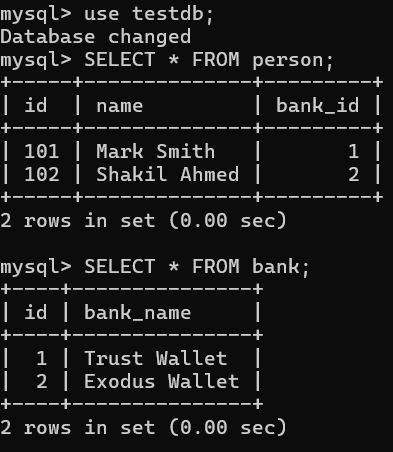

# JPA OneToOne Mapping

When one entity is associated with another entity by their simplest form and make a single valued association, I mean one entity is connected with another entity either unidirectional or bidirectional way and generate a single valued association, then we can use one-to-one mapping. In this case, one entity will be the parent entity and another one will be the reference or child entity. In one-to-one mapping there will be extra column generated inside the parent entity that holds the child entities primary_key. Note, in this case, the primary key of the child entity will be the foreignKey of the parent Entity.

## Creating Unidirectional OneToOne Mapping

Guess, we have a person and a bank entity (in other words, database table) and we are going to make one-to-one association between person and bank entity. Here the scenario would be, one person can only have one bank account and only person can see the bank account as person will be the root or parent entity of this relationship.


person.java

```
package com.company.model;


import jakarta.persistence.Entity;
import jakarta.persistence.Id;
import jakarta.persistence.OneToOne;
import jakarta.persistence.Table;

@Entity(name = "Person")
@Table(name = "person")
public class Person {

    @Id
    private int id;
    private String name;

    @OneToOne
    private Bank bank;

    public Person() {
    }

    public Person(int id, String name, Bank bank) {
        this.id = id;
        this.name = name;
        this.bank = bank;
    }

    //getter & setter methods are omitted
}
```

Note: Soon we will update the Person entity to see how to use @CollectionTable annotation.

Bank.java

```
package com.company.model;

import jakarta.persistence.*;

@Entity(name = "Bank")
@Table(name = "bank")
public class Bank {
    @Id
    @Column(name = "bank_id")
    private int id;
    @Column(name = "bank_name")
    private String bankName;

    public Bank() {
    }

    public Bank(int id, String bankName) {
        this.id = id;
        this.bankName = bankName;
    }
    //getter & setter methods are omitted
}
```

Now open PersonPersistent.java class and create few bank and person object. As both are entities, we must persist or save them in order to access their respective values.

PersonPersistent.java

```

```

Now you can see there are two tables have been created in our mysql database in the log messages.

```
create table bank (
    id integer not null,
    bank_name varchar(255),
    primary key (id)
) engine=InnoDB

create table person (
    id integer not null,
    name varchar(255),
    bank_id integer,
    primary key (id)
) engine=InnoDB
```

But if you now open your mysql commandLine tool and run the following command you can the see the person and bank tables respectively and also the associations among them.

```
mysql> use testdb;
Database changed
mysql> SELECT * FROM person;
+-----+--------------+---------+
| id  | name         | bank_id |
+-----+--------------+---------+
| 101 | Mark Smith   |       1 |
| 102 | Shakil Ahmed |       2 |
+-----+--------------+---------+
2 rows in set (0.00 sec)

mysql> SELECT * FROM bank;
+----+---------------+
| id | bank_name     |
+----+---------------+
|  1 | Trust Wallet  |
|  2 | Exodus Wallet |
+----+---------------+
2 rows in set (0.00 sec)
```



Here, the bank_id column inside the person table is the primary key of the bank table but foreign key of the person table. Here the default column name is propertyName_primaryKey (bank_id).

We can simply alter this name by using the @JoinColumn annotation. 

Person.java

```
@OneToOne
@JoinColumn(name = "person_bank_details")
private Bank bank;
```
Now the reference column name will be "person_bank_details" than default name "bank_id" 


## OneToOne Bidirectional Mapping

In this case, we also use @OneToOne annotation in the child entity referring the parent entity. It is required to use mappedBy attribute that also mentions the validity of parent entity. Such as,

Bank.java

```
package com.company.model;

import jakarta.persistence.*;

@Entity(name = "Bank")
@Table(name = "bank")
public class Bank {
    @Id
    private int id;
    @Column(name = "bank_name")
    private String bankName;

    @OneToOne(mappedBy = "bank") //bank is the attribute of person entity
    private Person person;

    public Bank() {
    }

    public Bank(int id, String bankName) {
        this.id = id;
        this.bankName = bankName;
    }

    public int getId() {
        return id;
    }

    public void setId(int id) {
        this.id = id;
    }

    public String getBankName() {
        return bankName;
    }

    public void setBankName(String bankName) {
        this.bankName = bankName;
    }
}
```

Now, it bank can also the person entity. But there will be no change in the database tables or columns. Here, we use @OneToOne annotation parent entity (person.java) and child entity (bank.java). You must use, @JoinColum annotation inside the parent entity and the mappedBy attribute used in the child entity is also mention that person is the parent entity of this relationship.

## Annotations overview used in this tutorial:

@Entity:

@Table: 

@Id:

@GeneratedValue:

@Column:

@OneToOne (one-to-one):

@JoinColumn:

mappedBy attribute: 


