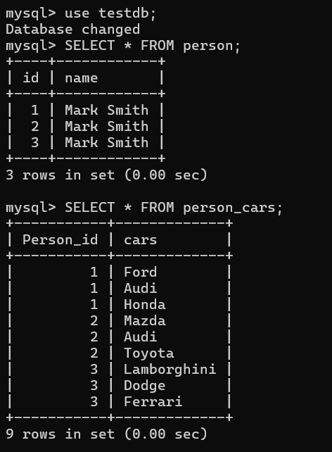
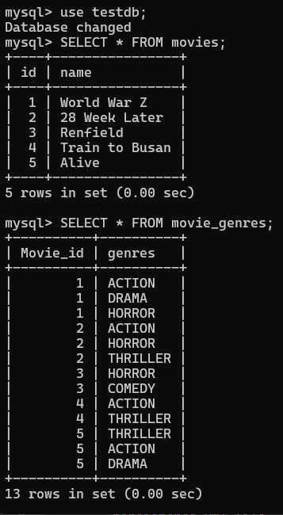

# Map a List of Values to an Entity


Sometitmes it is required  to map a list of values to an entity but those values aren't entity themselves.

Note:  Remember we use one-to-many/many-to-many mapping hierarchy while making collection valued association between entities.

Like a person has many dogs, email addresses, social media accounts, an Employee has list of roles, an Author published list of books and an Owner has list of cars etc. Here, We are going to demonstrate this scenario for the person entity. 

# Create a Person Entity

Guess we have an entity class called Person.java and it is required to map a list of values in it. Guess every person has more than one cars. In this case, we will use we @ElementCollection annotation in order to map a list of values to the person entity. 

Person.java

```
package com.company.model;

import jakarta.persistence.*;
import java.util.List;

@Entity(name = "Person")
@Table(name = "person")
public class Person {

    @Id
    @GeneratedValue(strategy = GenerationType.AUTO)
    private int id;
    private String name;
    @ElementCollection()
    public List<String> cars;

    public Person() {
    }

    public Person(String name, List<String> cars) {
        this.name = name;
        this.cars = cars;
    }

    public int getId() {
        return id;
    }

    public void setId(int id) {
        this.id = id;
    }

    public String getName() {
        return name;
    }

    public void setName(String name) {
        this.name = name;
    }

    public List<String> getCars() {
        return cars;
    }

    public void setCars(List<String> cars) {
        this.cars = cars;
    }
}
```


Now create a persistence class and let's name it PersonPersistent.java inside dao package. If you don't have dao package or folder just create a dao package in com.company package.


PersonPersistent.java

```
package com.company.dao;

import com.company.model.*;
import jakarta.persistence.EntityManager;
import jakarta.persistence.EntityManagerFactory;
import jakarta.persistence.Persistence;

import java.util.List;


public class PersonPersistent {
    public static void main(String[] args) {

        EntityManagerFactory emf = Persistence.createEntityManagerFactory("default");
        EntityManager em =emf.createEntityManager();
        em.getTransaction().begin();

        //create few person objects
        Person p1 = new Person("Mark Smith", List.of("Ford", "Audi", "Honda"));
        Person p2 = new Person("Mark Smith", List.of("Mazda", "Audi", "Toyota"));
        Person p3 = new Person("Mark Smith", List.of("Lamborghini", "Dodge", "Ferrari"));

        //invoking persist method to save the person objects in the database
        em.persist(p1);
        em.persist(p2);
        em.persist(p3);

        em.getTransaction().commit();
        em.close();
        emf.close();
    }
}
```


Note: Please don't forget to close the transaction.

Now run the PersonPersistent.java class and it will create two tables in your mysql database with the relevant data. One is person table and another is person_cars (entity_property) table. The person_cars table contains person_id (reference column) and cars column. 

Note: We can alter the cars table name something different by using the @CollectionTable annotation. Like if you write -

```
@ElementCollection()
@CollectionTable(name = "person_has_cars)
public List<String> cars;
```
then the reference table name will be person_has_cars than person_cars. But it is always good practice to give your property a good name, I mean using @CollectionTable annotation.


If your application runs successfully, open your mysql commandLine client and run the following command to extract the person and person_cars records.

```
```




You can see, the person_cars table has a foreign key (constraint) person_id and it denotes which cars relate to which person. You can easily now recognize which person has which car by it's id.

## Map a List of Values of Object Type

Sometimes it is required to map a list of values of objects type (not a simple attribute like string, int etc.) then, how to map them to our entity class?

Let's say, the person has many list of branded cars. And we want to create a class that shows the brand names. 

Now, we create CarBrand.java class in the model package and it contains the following properties. But the CarBrand.java class is not entity itself.

```
package com.javaondemand.model;

import jakarta.persistence.Embeddable;

@Embeddable //as this class is not entity
public class CarBrands {
    @Column(name = "brand_name")
    private String name;

    public CarBrands() {
        super();
    }

    public CarBrands(String name) {
        this.name = name;
    }

    public String getName() {
        return name;
    }

    public void setBrand_name(String name) {
        this.name = name;
    }
}
```


Now just update your Person.java entity class.

```
@ElementCollection(targetClass = CarBrands.class)
//we use targetClass parameter for referring the CarBrand class
@Embedded
private List<CarBrands> brands;

//getter and setter methods
```


Also update the PersonPersistent.java class.

```
List<CarBrand> brandsList1 = List.of(new CarBrands("Ford"), new CarBrands("Fiat"), new CarBrands("Ferrari"));

List<CarBrand> brandList2 = List.of(new CarBrands("Toyota"), new CarBrands("Dodge"), new CarBrands("Ferrari"));

List<CarBrand> brandList2 = List.of(new CarBrands("Mazda"), new CarBrands("Dodge"), new CarBrands("Audi"));

//now create three person object and add the car_brand_list as parameter
Person p1 = new Person("Mark Smith", brandList1);
Person p2 = new Person("Mark Smith", brandList2);
Person p3 = new Person("Mark Smith", brandList3);
```

You see now, a new table has been generated in your mysql workbench. And it is person_brands. You can also use @CollectionTable annotation to provide external name of this table. Hence the output should be your mysql database

```
mysql> select * from person_brands;
+-----------+--------------+
| Person_id | brand_name   |
+-----------+--------------+
|       1 | Ford           |
|       1 | Fiat           |
|       1 | Ferrari        |
|       2 | Toyota         |
|       2 | Dodge          |
|       2 | Ferrari        |
|       3 | Mazda          |
|       3 | Dodge          |
|       3 | Audi           |
+-----------+--------------+
6 rows in set (0.00 sec)

//But if you use @CollectionTable(name="car_brands")
//then you have to use following command but will get the same result

mysql> select * from car_brands;
+-----------+--------------+
| Person_id | brand_name   |
+-----------+--------------+
|       1 | Ford           |
|       1 | Fiat           |
|       1 | Ferrari        |
|       2 | Toyota         |
|       2 | Dodge          |
|       2 | Ferrari        |
|       3 | Mazda          |
|       3 | Dodge          |
|       3 | Audi           |
+-----------+--------------+
6 rows in set (0.00 sec)

mysql>
```


## Map Enum Type Using @ElementCollection annotation

When we need to represent fixed set of constants or known number of values that are not going to be changed, we use enum in java. Here in jpa we use @Enumerated annotation to store enum types in database. But now, I am going to show you how to use @Enumerated with @ElementCollection.

Note: There are two types of database representation for enum types. For string representation we use @EnumType.String and for numerical representation we use @EnumType.Ordinal.


However, let's say we have an entity called Movie and enumType called genre. Now we are going to map collection of genres to each movie object.

Move.java

```
package com.company.model;

import jakarta.persistence.*;
import java.util.List;

@Entity(name = "Movie")
@Table(name = "movies")
public class Movie {
    @Id
    @GeneratedValue(strategy = GenerationType.AUTO)
    private int id;
    private String name;

    @ElementCollection(targetClass = Genre.class)
    @Enumerated(EnumType.STRING)
    private List<Genre> genres;

    public Movie() {
    }

    public int getId() {
        return id;
    }

    public void setId(int id) {
        this.id = id;
    }

    public String getName() {
        return name;
    }

    public void setName(String name) {
        this.name = name;
    }

    public List<Genre> getGenres() {
        return genres;
    }

    public void setGenres(List<Genre> genres) {
        this.genres = genres;
    }
}
```

Here you can see, we use @ElementCollection in oder to map list of enums and @EnumType.String for string representation in the database.

Genre.java (EnumType)

```
package com.company.model;

public enum Genre {
    THRILLER,
    ACTION,
    COMEDY,
    HORROR,
    DRAMA
}
```


Now in the persistence class, let's see how to map list of genres to the movie object.

MoviePersistent.java

```
Movie m1 = new Movie("World War Z", List.of(Genre.ACTION, Genre.DRAMA, Genre.HORROR));
Movie m2 = new Movie("28 Week Later", List.of(Genre.ACTION, Genre.HORROR, Genre.THRILLER));
Movie m3 = new Movie("Renfield", List.of(Genre.HORROR, Genre.COMEDY));
Movie m4 = new Movie("Train to Busan", List.of(Genre.ACTION, Genre.THRILLER));
Movie m5 = new Movie("Alive", List.of(Genre.THRILLER, Genre.ACTION, Genre.DRAMA));

//save all the movies invoking the persist method
em.persist(m1);
em.persist(m2);
em.persist(m3);
em.persist(m4);
em.persist(m5);
```

If you now run the MoviePersistent.java class the following database table has been generated in you mysql database.

```
   create table movies (
       id integer not null,
        name varchar(255),
        primary key (id)
    ) engine=InnoDB
Hibernate:

create table Movie_genres (
    Movie_id integer not null,
    genres varchar(255)
) engine=InnoDB
```

It means, there are two tables have been added in our mysql database. One is movies, and another one is movies_genres. One thing to note that we can simply alter the movie_genres table name by using the @CollectionTable annotation.


Note: As Movie is the new entity you have created, you have to first register it in the persistence.xml file

persistence.xml file will look like below.
```
<persistence-unit name ="default">

        <class>com.company.model.Movie</class>

        <properties>
            <property name="jakarta.persistence.jdbc.driver" value="com.mysql.cj.jdbc.Driver"/>
            <property name="jakarta.persistence.jdbc.url" value="jdbc:mysql://localhost:3306/testdb"/>
            <property name="jakarta.persistence.jdbc.user" value="root"/>
            <property name="jakarta.persistence.jdbc.password" value="root"/>
            <property name="hibernate.hbm2ddl.auto" value="create"/>
            <property name="hibernate.show_sql" value="true"/>
            <property name="hibernate.format_sql" value="true"/>
        </properties>
</persistence-unit>
```

Okay, if you now open your mysql commandLine tool and run the following commands, the movies table and the movies_genres table will be shown

```
mysql> use testdb;
Database changed
mysql> SELECT * FROM movies;
+----+----------------+
| id | name           |
+----+----------------+
|  1 | World War Z    |
|  2 | 28 Week Later  |
|  3 | Renfield       |
|  4 | Train to Busan |
|  5 | Alive          |
+----+----------------+
5 rows in set (0.00 sec)

mysql> SELECT * FROM movie_genres;
+----------+----------+
| Movie_id | genres   |
+----------+----------+
|        1 | ACTION   |
|        1 | DRAMA    |
|        1 | HORROR   |
|        2 | ACTION   |
|        2 | HORROR   |
|        2 | THRILLER |
|        3 | HORROR   |
|        3 | COMEDY   |
|        4 | ACTION   |
|        4 | THRILLER |
|        5 | THRILLER |
|        5 | ACTION   |
|        5 | DRAMA    |
+----------+----------+
13 rows in set (0.00 sec) 
```



Here inside the movie_genres table the movie id is the primary key of the movies table and it mentions which genre is related to which movies.

Tutorial: How to store enum types in your relational database with jpa