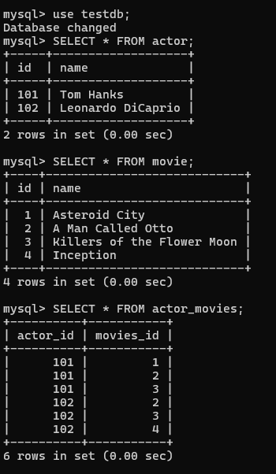

# JPA ManyToMany Mapping Tutorial

In JPA, many-to-many mapping is held between two entities where each instance one entity is associated or linked with multiple instances of other entities or vice versa. Such as, A bank account has list of owners and a person has list of bank accounts. Or, An author has list of books and a book has list of authors. Or, A student has list course and each course has list of Students. Or, a developer has list of projects and each project has list of developers. Or, a category has list of products and each product has list of category etc.

**Note:** This type of relationship (many-to-many mapping) is typically implemented using an intermediary table, also known as a join table or association table (a table that holds only primary key of the associated table) to store the primary key or relationship between the entities.


## ManyToMany Mapping OverView Bidirectional way 

Note: The use of ManyMany mapping unidirectional is sometimes error prone.

Guess that, we have two entity Actor and Movie. And we are going to establish ManyToMany relationship between these entities. Here, guess that Actor is the relationship owner.

So first of all create two entity class Actor and Movie with their respective attributes.


Actor.java (@JoinTable annotation is used)

```
package com.company.model;

import jakarta.persistence.*;

import java.util.LinkedHashSet;
import java.util.List;
import java.util.Set;

@Entity(name = "Actor")
@Table(name = "actor")
public class Actor {
    @Id
    @Column(name = "id", nullable = false)
    private Integer id;

    private String name;

    @ManyToMany
    @JoinTable(name = "actor_movies",
            joinColumns = @JoinColumn(name = "actor_id"),
            inverseJoinColumns = @JoinColumn(name = "movies_id"))
    private List<Movie> movies;

    public Actor() {
    }

    public Actor(Integer id, String name, List<Movie> movies) {
        this.id = id;
        this.name = name;
        this.movies = movies;
    }

    public Integer getId() {
        return id;
    }

    public void setId(Integer id) {
        this.id = id;
    }

    public String getName() {
        return name;
    }

    public void setName(String name) {
        this.name = name;
    }

    public List<Movie> getMovies() {
        return movies;
    }

    public void setMovies(List<Movie> movies) {
        this.movies = movies;
    }

    //equals and hashcode methods
}
```

Movie.java

```
package com.company.model;

import jakarta.persistence.*;

import java.util.List;

@Entity(name = "Movie")
@Table(name = "movie")
public class Movie {

    @Id
    private int id;
    private String name;

    @ManyToMany
    private List<Actor> actors;

    public Movie() {
    }

    public Movie(int id, String name) {
        this.id = id;
        this.name = name;
    }

    public int getId() {
        return id;
    }

    public void setId(int id) {
        this.id = id;
    }

    public String getName() {
        return name;
    }

    public void setName(String name) {
        this.name = name;
    }

    public List<Actor> getActors() {
        return actors;
    }

    public void setActors(List<Actor> actors) {
        this.actors = actors;
    }
}
```

Now, we will create the persistence class and let's name it ActorPersistent.java class.

ActorPersistent.java

```
package com.company.dao;

import com.company.model.*;
import jakarta.persistence.EntityManager;
import jakarta.persistence.EntityManagerFactory;
import jakarta.persistence.Persistence;


import java.util.ArrayList;
import java.util.List;


public class DemoPersistent {
    public static void main(String[] args) {

        EntityManagerFactory emf = Persistence.createEntityManagerFactory("default");
        EntityManager em =emf.createEntityManager();
        em.getTransaction().begin();


        //created four movie objects
        Movie m1 = new Movie(1, "Asteroid City");
        Movie m2 = new Movie(2, "A Man Called Otto");

        Movie m3 = new Movie(3, "Killers of the Flower Moon");
        Movie m4 = new Movie(4, "Inception");


        List<Movie> movieList1 = List.of(m1, m2, m3);

        List<Movie> movieList2 = List.of(m2, m3, m4);


        Actor a1 = new Actor(101,"Tom Hanks", movieList1);
        Actor a2 = new Actor(102, "Leonardo DiCaprio", movieList2);


        em.persist(m1);
        em.persist(m2);
        em.persist(m3);
        em.persist(m4);


        em.persist(a1);
        em.persist(a2);

        em.getTransaction().commit();
        em.close();
        emf.close();
    }
}
```

You can see, we have created four Movie objects first of all, then we create list object using them. Then, we have created two Actor objects and add the movieList1 and movieList2 respectively. At the end, we have persist or save them sequentially. 

If you run the ActorPersistent.java class, there will be four tables generated in your mySQL workbench. They are actor, movie, actor_movies and movie_actor table. If you look at the Actor.java class, we can see we have specified the associated table name that is actor_movies and the column names of this table. joinColumns = @JoinColumn(name = "actor_id") is for the relationship owner (in this case, the actor table) and inverseJoinColumns = @JoinColumn(name = "movies_id") is used for the child entity. The primary key of both tables will be reside in the actor_movies table respectively. But the other table, I mean movie_actor (empty table) has been generated by the database itself, I think. Because, When I play with this in h2 database, no extra table like this has not been generated (If I am not wrong)

Anyway, Open you mySQL workbench or CommandLine tool to see the generated tables as well as the stored data.


The above image mentions that, four tables has been generated after running the ActorPersistent.java class.

Now, run the following sql commands to retrieve the generated tables data.

```
mysql> use testdb;
Database changed
mysql> SELECT * FROM actor;
+-----+-------------------+
| id  | name              |
+-----+-------------------+
| 101 | Tom Hanks         |
| 102 | Leonardo DiCaprio |
+-----+-------------------+
2 rows in set (0.00 sec)

mysql> SELECT * FROM movie;
+----+----------------------------+
| id | name                       |
+----+----------------------------+
|  1 | Asteroid City              |
|  2 | A Man Called Otto          |
|  3 | Killers of the Flower Moon |
|  4 | Inception                  |
+----+----------------------------+
4 rows in set (0.00 sec)

mysql> SELECT * FROM actor_movies;
+----------+-----------+
| actor_id | movies_id |
+----------+-----------+
|      101 |         1 |
|      101 |         2 |
|      101 |         3 |
|      102 |         2 |
|      102 |         3 |
|      102 |         4 |
+----------+-----------+
6 rows in set (0.00 sec)
```



Thanks for reading this short article. This post is not completed, soon I will complete this. Tanks.

