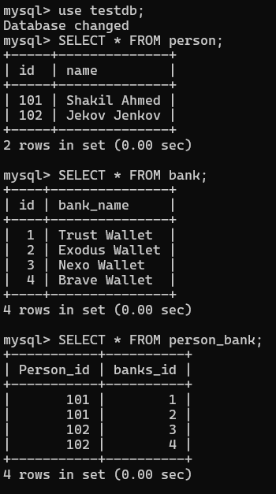
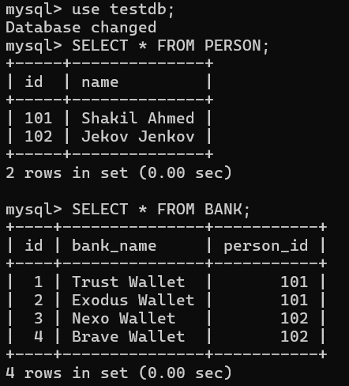

# JPA OneToMany and ManyToOne Mapping Tutorial

When it is required to mapping one entity to collection of entities we use oneToMany or ManyToOne annotation in jpa based application.

**OneToMany:** One entity is associated with collection of entities. But we use @ElementCollection annotation when the association is made with a simple pojo class, not an entity. Tutorial: Mapping list of values in jpa

**ManyToOne:** Collection of entities is associated with only one entity.

Note: When one-to-many and many-to-one is used bidirectional way, many-to-one side will always be the relationship owner. Thus, you can't use the mappedBy attribute inside the many-to-one side.

Use cases: Imagine, person and dog are entity and a person has list of dogs. Or, Author and books are entity and the author may have list of books published. Or, developer may have list of projects, a country has list of ministers, bank account has list of owners, a teacher has list of students or a category has list of products etc. are the real life scenario of using one-to-many or many-to-one annotation. You should remember that one-to-many or many-to-one mapping is only possible when both class (used in the mapping) are entity.

## Let's Implement OneToMany Mapping (Unidirectional Way)

Note: JPA tends to use bidirectional way one-to-many and many-to-one annotation and many-to-one side will always be the relationship owner. Thus, you basically can't use @JoinColumn annotation inside the one-to-many mapping side.


Note:
OneToMany annotation is used when one entity is associated with collection of other entities. and ManyToOne refers list of entity is associated with one entity.


Guess, we have Person and Bank Entity and one person has list of bank account. Thus, we will make a relationship between them using the @OneToMany annotation. But we don't use @JoinColumn annotation in this case.

Person.java

```
package com.company.model;


import jakarta.persistence.*;

import java.util.List;

@Entity(name = "Person")
@Table(name = "person")
public class Person {

    @Id
    private int id;
    private String name;

    @OneToMany(targetEntity = Bank.class)
    private List<Bank> banks;

    public Person() {
    }
    //constructors, getter and setter methods
}
```


**Note:** You can't use @JoinColumn annotation in the OneToOne side, because ManyToOne side is always considered the relationship owner and @JoinColumn is used to mention the foreign_key column name. 


**Bank.java**

```
package com.company.model;

import jakarta.persistence.*;
@Entity(name = "Bank")
@Table(name = "bank")
public class Bank {
    @Id
    private int id;
    @Column(name = "bank_name")
    private String bankName;

    public Bank() {
    }
    
    //constructors, getter and setter methods
}
```

You can see we use @OneToMany mapping annotation inside the person entity and it is associated with list of bank entities.

## Create a Persistent Class

Guess you have a persistence class for implementing the database operation. We name it **PersonPersistent.java** class.

PersonPersistent.java

```
package com.company.dao;

import com.company.model.*;
import jakarta.persistence.EntityManager;
import jakarta.persistence.EntityManagerFactory;
import jakarta.persistence.Persistence;

import java.util.ArrayList;
import java.util.List;


public class PersonPersistent {
    public static void main(String[] args) {

        EntityManagerFactory emf = Persistence.createEntityManagerFactory("default");
        EntityManager em =emf.createEntityManager();
        em.getTransaction().begin();

        Bank b1 = new Bank(1, "Trust Wallet");
        Bank b2 = new Bank(2, "Exodus Wallet");
        Bank b3 = new Bank(3, "Nexo Wallet");
        Bank b4 = new Bank(4, "Brave Wallet");

        //persist the bank objects first
        em.persist(b1);
        em.persist(b2);
        em.persist(b3);
        em.persist(b4);

        //create 2 bankList objects
        List<Bank> bankList1 = new ArrayList<>();
        bankList1.add(b1);
        bankList1.add(b2);

        List<Bank> bankList2 = new ArrayList<>();
        bankList2.add(b3);
        bankList2.add(b4);


        //create 2 person object and set bankList to each
        Person p1 = new Person(101, "Shakil Ahmed");
        Person p2 = new Person(102, "Jekov Jenkov");

        p1.setBanks(bankList1);
        p2.setBanks(bankList2);


        //persist the person objects
        em.persist(p1);
        em.persist(p2);


        em.getTransaction().commit();
        em.close();
        emf.close();
    }
}
```

Note: It is not possible to add bankList1 in both p1 and p2 object, because then you will get duplication error that, Duplicate entry '1' for key 'person_bank.UK_kko11m756tuauht5pg7c22tji' in your log messages, and nothing will be saved in your relational database. 

So, after running the PersonPersistent.java class, there will be three tables generated in your relational database, **person** table, **bank** table and an association table called **person_bank** that only contains the id (primary key) of person and bank table.

```
create table bank (
    id integer not null,
    bank_name varchar(255),
    primary key (id)
) engine=InnoDB
    
create table person (
    id integer not null,
    name varchar(255),
    primary key (id)
) engine=InnoDB

create table person_bank (
    Person_id integer not null,
    banks_id integer not null
) engine=InnoDB
```

In mySQL commandLine tool if we run the following commands, the following tables data will be displayed: 

```
mysql> use testdb;
Database changed
mysql> SELECT * FROM person;
+-----+--------------+
| id  | name         |
+-----+--------------+
| 101 | Shakil Ahmed |
| 102 | Jekov Jenkov |
+-----+--------------+
2 rows in set (0.00 sec)

mysql> SELECT * FROM bank;
+----+---------------+
| id | bank_name     |
+----+---------------+
|  1 | Trust Wallet  |
|  2 | Exodus Wallet |
|  3 | Nexo Wallet   |
|  4 | Brave Wallet  |
+----+---------------+
4 rows in set (0.00 sec)

mysql> SELECT * FROM person_bank;
+-----------+----------+
| Person_id | banks_id |
+-----------+----------+
|       101 |        1 |
|       101 |        2 |
|       102 |        3 |
|       102 |        4 |
+-----------+----------+
4 rows in set (0.00 sec)
```



## JPA OneToMany and ManyTone Mapping (Bidirectional way)

In jpa, if we want to use OneToMany and ManyToOne bidirectional way, then ManyToOne side will always be the relationship owner. So we can't use mappedBy attribute inside many-to-one side, even there will be no extra table generated and association column will always remain inside the many-to-one side.

Bank.java (updated one)

```
package com.company.model;

import jakarta.persistence.*;
@Entity(name = "Bank")
@Table(name = "bank")
public class Bank {
    @Id
    private int id;
    @Column(name = "bank_name")
    private String bankName;

    @ManyToOne(targetEntity = Person.class)
    @JoinColumn(name = "person_id")
    private Person person;


    public Bank() {
    }

    //constructors, getter and setter methods
}
```

Person.java (updated one)

```
package com.company.model;


import jakarta.persistence.*;

import java.util.List;

@Entity(name = "Person")
@Table(name = "person")
public class Person {

    @Id
    private int id;
    private String name;

    @OneToMany(mappedBy = "person")
    private List<Bank> banks;

    public Person() {
    }
    
    //constructors, getter and setter methods
}
```

As the association is not free, so we have to add person in the book object too.

PersonPersistent.java (add few more lines)

```
b1.setPerson(p1);
b2.setPerson(p1);

b3.setPerson(p2);
b4.setPerson(p2);
```


If you now again, run the PersonPersistent.java class, two tables has been generated in your mySQL workbench, instead of three (the association table will not be generated in this case).

```
create table bank (
    id integer not null,
    bank_name varchar(255),
    person_id integer,
    primary key (id)
) engine=InnoDB
    
create table person (
    id integer not null,
    name varchar(255),
    primary key (id)
) engine=InnoDB
```

So, again open mySQL commandLine tool and run the following commands

```
$ SELECT * FROM person;

$ SELECT * FROM Bank # it is the relationship owner, thus it contains the person_id as foreign key
```



Hope this post will be helpful so far. Thanks.