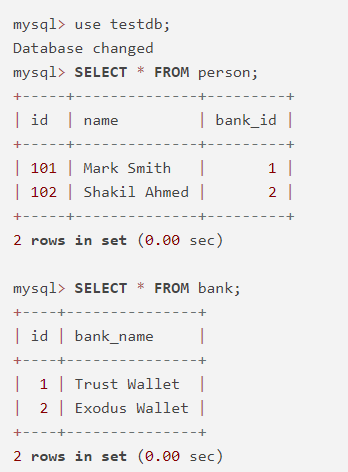

# JPA OneToOne Mapping

When one entity is associated with another entity by their simplest form and make a single valued association, I mean one entity is connected with another entity either unidirectional or bidirectional way and generate a single valued association, then we can use one-to-one mapping. In this case, one entity will be the parent entity and another one will be the reference or child entity. In one-to-one mapping there will be an extra column generated inside the parent entity (relationship owner) that holds the child entities primary_key. **Note**, in this case, the primary key of the child entity will be the foreignKey of the parent Entity.

**Remember:** When we want to create relationship between entities we usually use one-to-one, one-to-many, many-to-one or many-to-many mappings annotations but when want to make relationship between entity + non-entity we use embedded object. 


## Creating Unidirectional OneToOne Mapping

Guess, we have a person and a bank entity (in other words, database table) and we are going to make one-to-one association between person and bank entity. Here the scenario would be, one person can only have one bank account and only person can see the bank account as person will be the root or parent entity of this relationship. In other words, person will be relationship owner.


**person.java**

```
package com.company.model;


import jakarta.persistence.Entity;
import jakarta.persistence.Id;
import jakarta.persistence.OneToOne;
import jakarta.persistence.Table;

@Entity(name = "Person")
@Table(name = "person")
public class Person {

    @Id
    private int id;
    private String name;

    @OneToOne
    private Bank bank;

    public Person() {
    }

    public Person(int id, String name, Bank bank) {
        this.id = id;
        this.name = name;
        this.bank = bank;
    }

    //getter & setter methods are omitted
}
```

**Note:** Soon we will update the Person entity to see how to use @CollectionTable annotation.


**Bank.java**

```
package com.company.model;

import jakarta.persistence.*;

@Entity(name = "Bank")
@Table(name = "bank")
public class Bank {
    @Id
    @Column(name = "bank_id")
    private int id;
    @Column(name = "bank_name")
    private String bankName;

    public Bank() {
    }

    public Bank(int id, String bankName) {
        this.id = id;
        this.bankName = bankName;
    }
    //constructors, getter and setter methods
}
```

Now open **PersonPersistent.java** class and create few bank and person object. As both are entities, we must persist or save them in order to access their respective values.

**PersonPersistent.java**

```
package com.company.dao;

import com.company.model.*;
import jakarta.persistence.EntityManager;
import jakarta.persistence.EntityManagerFactory;
import jakarta.persistence.Persistence;


public class DemoPersistent {
    public static void main(String[] args) {

        EntityManagerFactory emf = Persistence.createEntityManagerFactory("default");
        EntityManager em =emf.createEntityManager();
        em.getTransaction().begin();
        
        //create two bank object
        Bank b1 = new Bank(1, "Trust Wallet");
        Bank b2 = new Bank(2, "Exodus Wallet");
        
         
        //create 2 person object
        Person p1 = new Person(101, "Mark Smith");
        p1.setBank(b1); //add the bank the to person using setBank() method.
        Person p2 = new Person(102, "Shakil Ahmed");
        p2.setBank(b2); //add the bank the to person using setBank() method.

        //firstly save bank objects otherwise person objects will not fetch the bank info
        em.persist(b1);
        em.persist(b2);
        
        //finally persist the person object
        em.persist(p1);
        em.persist(p2);


        em.getTransaction().commit();
        em.close();
        emf.close();
    }
}

```

Now you can see there are two tables have been created in our mySQL database what you see  in the log messages.


```
create table bank (
    id integer not null,
    bank_name varchar(255),
    primary key (id)
) engine=InnoDB

create table person (
    id integer not null,
    name varchar(255),
    bank_id integer,
    primary key (id)
) engine=InnoDB
```

But if you now open your mySQL commandLine tool and run the following command you can the see the person and bank tables respectively and also the associations among them.

```
mysql> use testdb;
Database changed
mysql> SELECT * FROM person;
+-----+--------------+---------+
| id  | name         | bank_id |
+-----+--------------+---------+
| 101 | Mark Smith   |       1 |
| 102 | Shakil Ahmed |       2 |
+-----+--------------+---------+
2 rows in set (0.00 sec)

mysql> SELECT * FROM bank;
+----+---------------+
| id | bank_name     |
+----+---------------+
|  1 | Trust Wallet  |
|  2 | Exodus Wallet |
+----+---------------+
2 rows in set (0.00 sec)
```



Here, the **bank_id** column inside the **person** table is the primary key of the bank table but foreign key of the person table. Here the default column name is **propertyName_primaryKey** (bank_id).

We can simply alter this name by using the **@JoinColumn** annotation. 

**Person.java**

```
@OneToOne
@JoinColumn(name = "person_bank_details")
private Bank bank;
```
Now the reference column name will be "person_bank_details" than default name "bank_id" 


## OneToOne Bidirectional Mapping

In this case, we can also use **@OneToOne** annotation in the child entity referring the parent entity. It is required to use mappedBy attribute that also mentions the validity of parent entity. I mean, it also mentions that, the person entity is the relationship owner.

**Bank.java**

```
package com.company.model;

import jakarta.persistence.*;

@Entity(name = "Bank")
@Table(name = "bank")
public class Bank {
    @Id
    private int id;
    @Column(name = "bank_name")
    private String bankName;

    @OneToOne(mappedBy = "bank") //bank is the attribute of person entity
    private Person person;

    public Bank() {
    }

    public Bank(int id, String bankName) {
        this.id = id;
        this.bankName = bankName;
    }

    public int getId() {
        return id;
    }

    public void setId(int id) {
        this.id = id;
    }

    public String getBankName() {
        return bankName;
    }

    public void setBankName(String bankName) {
        this.bankName = bankName;
    }
}
```

Now, bank also contains the person entity. But there will be no change in the database tables or columns. Here, we use @OneToOne annotation parent entity **(person.java)** and child entity **(bank.java)**. You must use, **@JoinColum** annotation inside the parent entity and the mappedBy attribute used in the child entity is also mentioned that person entity is the root of the relationship or relationship owner.


## Annotations overview used in this tutorial:

@Entity: Make a simple pojo class to a persistence class. In jpa when a java class is annotated by @Entity annotation then it represents a table in relational database.

@Table: Externally we can use it to name the table different from the entity name. If you don't use it then the entity name (means the class name) will be the table name in your relational database. Additionally, it allows customization of table name, schema and indexes.

@Id: It is a required annotation for every entity class. It marks an attribute as the primary key of the entity (in other words database table).

@GeneratedValue: It contains few strategies to generate the id or primary key of your database table. Like, we use GenerationType.Auto to generate the id automatically from 1 to n. Other common strategies are: Identity, Sequence and Table.

@Column: Maps a field to a database column name. If you don't use it then, the attribute name of the entity will be column name of your database table. Additionally, it provides options to customize the column name, length, nullable, unique etc.

@OneToOne: Create a simple association between entities. Where an instance of one entity is associated or connected with a single instance of another entity (either unidirectional or bidirectional way).

@JoinColumn: Denotes the mapping for the foreign key column in a relationship. It is used to name the foreign key column name and it's properties. Note that, it is always used inside the root entity or owning side of the relationship as always foreign key column resides in the parent table.

mappedBy attribute: It also specifies the validity of the root or parent entity of the relationship. It is used as a parameter of the non-owning side of the relationship. Note that, the value of the mappedBy attribute must be same as the associative attribute name.


