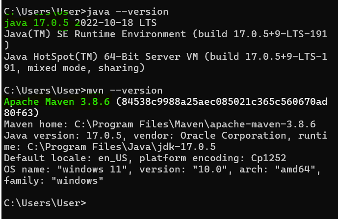

# Maven Hello World Project

In this post, we are going to explore how to create our first Maven Hello World Project using Windows command Prompt or powershell. Yes, it is also very easy to create a simple maven application using Ides like Eclipse, VS code or Intellij Ide. But, we only focus how to create maven application using cmd or powershell.

First of all, we have to make sure, maven 3.6.3+ and java 8+ (if 17+ would be useful in some cases) have already been installed in our system or not.

The following commands show us if they have already been installed or not. Open your command prompt or any developer shell and run the following commands--

```
$ java --version
$ mvn --version
```



YOu can see, java 17.0.5 and maven 3.0.6 has been installed in my system. If your get response like ``` java or maven is not recognized as an internal or external command,``` that means, you have to first download java and maven in your system.

Download Java:

Download Maven:

## Create Your First Maven Project

We are going to create a very simple maven hello world application using the following maven goal. You need somewhere for your project to reside. Create a directory somewhere and start a shell in that directory. On your command line, execute the following Maven goal or open command prompt and run the following maven command 

cmd

```
$ mvn archetype:generate -DgroupId=com.company -DartifactId=my-app -DarchetypeArtifactId=maven-archetype-quickstart -DarchetypeVersion=1.4 -DinteractiveMode=false
```

Here, com.company is your projects package name, my-app is your project name and maven-archetype-quickstart is the maven goal.

Wait few seconds, and if it is your first maven project then it would take few more seconds (even minutes) as maven will install most recent artifacts in your local repository.

When your maven app is ready, type the following in the same terminal

```
$ cd my-app
$ my-app> mvn package 
$ my-app> java -cp target/my-app-1.0-SNAPSHOT.jar com.mycompany.app.App
//output
$ my-app> Hello World!
```

Here, mvn package: will build and compile your maven project and ```java -cp target/my-app-1.0-SNAPSHOT.jar com.company.App``` command will run your compiled project.

Note that: The compiled project will reside in the target folder and would be a jar file. The file name would be app-name-version-SNAPSHOT.jar

