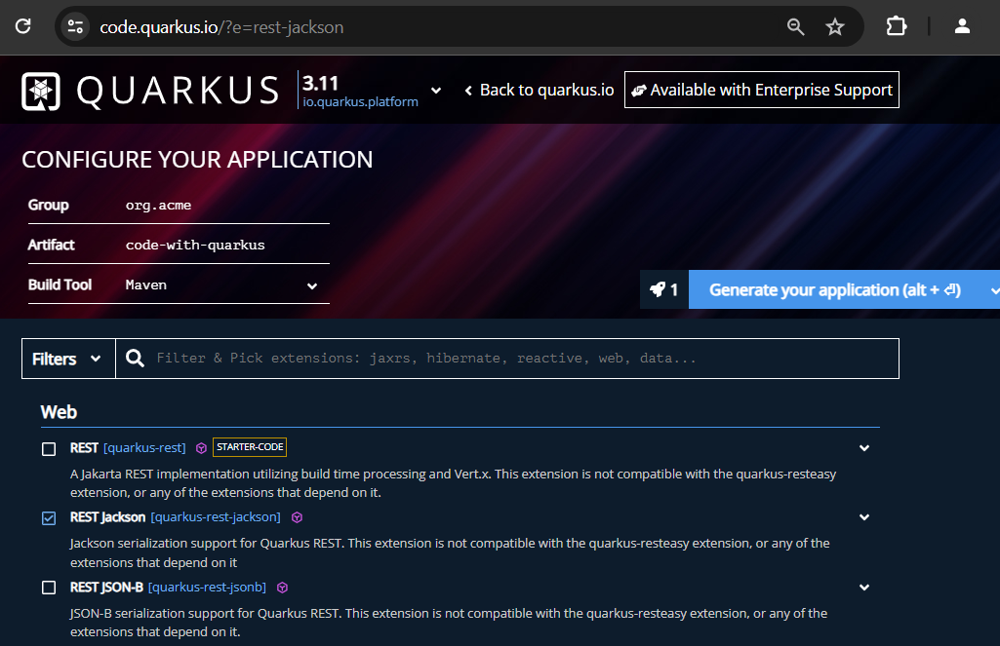
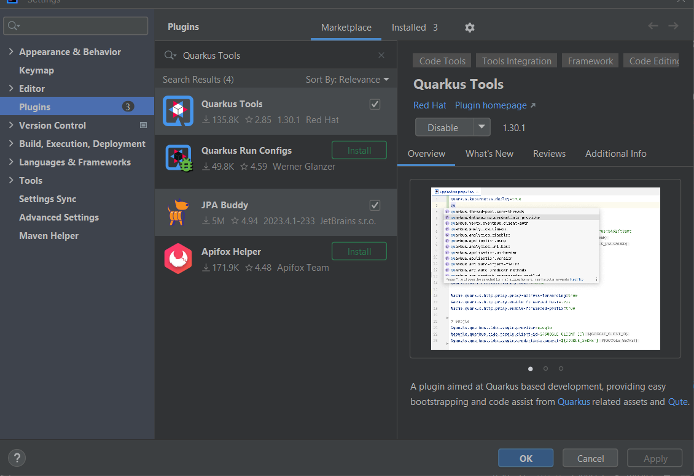
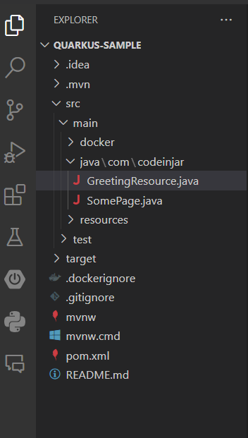
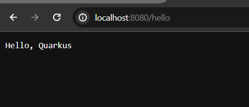
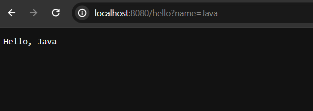

# First Quarkus Application

In this post, we are going to explore how to create a simple Quarkus application using quarkus initializer website. Even this is my first post in this quarkus tutorial series.

So, let's get started.

## What is Quarkus? 

It is really obvious to discuss little bit about Quarkus application framework before using it or creating new application with it. Quarkus is a JVM based (Java specially) application framework like Spring/Spring Boot, Micronaut or JakartaEE. Quarkus has been designed around container first philosophy. As much as possible quarkus application tries to avoid reflection, reducing startup time and memory uses. It is container first by it's nature. So, basically developing dynamic database driven applications Quarkus is used. 


**Initial requirements**
    - JavaSE version: 8+
    - Maven or Gradle as a build tool or using CLI ([https://quarkus.io/get-started/](https://quarkus.io/get-started/))
    - Maven version: 3.6.3+ (for maven users)
    - Gradle version: 7.5+ (for gradle users)
    - And IDE that support Java and maven/gradle: Like IntelliJ IDE, Eclipse or VS code.


## Bootstrap Quarkus Application

For bootstrapping our Quarkus application, we will use quarkus initializer. So, visit [https://code.quarkus.io/](https://code.quarkus.io/) using your favourite web browser and a new page will be appeared. Using this page, you can bootstrap your Quarkus application by adding required dependencies or extensions.



Here I have added **quarkus-rest-jackson** (support json) extension in order to complete this simple tutorial. Later, always you can add new extensions if required.

After adding required extensions, click on generate button, and it will now create a zip file for you. Unzip it and open it in your favourite ide.

**How to open your Quarkus Application into your favourite IDE**

**IntelliJ:** File -> Open -> Select the project folder -> Ok (finish) It will now open your project in the current window or new window. Remember your project location you have just downloaded or extracted.

**Eclipse:** File -> Import -> Existing Maven Project -> Next -> Browse (you have just download and extracted) -> Select the project folder (spring-boot-example) -> Finish

**VS Code:** File > Open Folder > Browse the existing spring boot project > Select Folder.

**NetBeans:** File > Open Project > Browse the existing spring boot project (maven project) > Open project.


**Note:** After opening your project into your favourite IDE (in my case IntelliJ IDE) wait few seconds in order to resolve the maven dependencies. As Quarkus doesn't have main class file, thus you get compile time error - **ClassNotFoundException** while running your application for the first time. So, you have to install quarkus tools plugin if you use intelliJ Ide. **How to install Quarkus Tools plugin?** - File -> Settings -> Plugins -> Search Quarkus Tools (from the marketplace) -> Click on Quarkus Tools -> Click Apply -> As usual wait few seconds till completing the download (probably you have to restart your IDE)



Let's get into the project now. 

After opening your project into your favourite ide, your project structure probably like the following -



You can either keep them or delete them, your choice.

## Open GreetingResource.java Class File 

Now open **GreetingResource.java** file and modify it little bit or keep it same.

**GreetingResource.java**

```
package com.company;

import jakarta.ws.rs.GET;
import jakarta.ws.rs.Path;
import jakarta.ws.rs.Produces;
import jakarta.ws.rs.core.MediaType;

@Path("/hello")
public class GreetingResource {

    @GET
    @Produces(MediaType.TEXT_PLAIN)
    public String greeting(){
        return "Hello, Quarkus";
    }
}
```

Here we have used jax/rs **GET** request and that produces simple text message into the "hello" endpoint.

**Note:** Root path (package level/class level) endpoint is required.

## Test The Application

Now run your application using the following maven/gradle command.

```
$ mvn quarkus:dev
$ gradle --console=plain quarkusDev
```

Or, if you already installed the Quarkus Tools for IntelliJ Ide, you can run your application by clicking the run button only or type (Shift + F10). After running your application, it runs on port 8080 in localhost, if everything is going well. Open your browser and invoke the URI: [http://localhost:8080/hello](http://localhost:8080/hello) and it will return the following "Hello, Quarkus" response.



It is also possible to change the default port other than 8080.

## How to Change the Default Port in Quarkus

Just open **application.properties** file and add the following configuration.

```
quarkus.http.port=9090 
```
Restart your application, and now your application runs on port 9090 in localhost. 

## Hot Reloading Feature is Enabled by Default

One of the unique features Quarkus provides is the hot reloading feature. If you update your site or change something, it will automatically updated without restarting your project. Such as, I have added **QueryParam** mechanism in my **hello** endpoint so that it can now react/read the uri name parameter value. Interesting thing is that you don't have to restart your application in order to apply the changes as hot reloading feature is enabled by default.


**GreetingResource.java**

```
package com.company;

import jakarta.ws.rs.*;
import jakarta.ws.rs.core.MediaType;

@Path("/hello")
public class GreetingResource {

    @GET
    @Produces(MediaType.TEXT_PLAIN)
    public String greeting(@DefaultValue("Quarkus") @QueryParam("name") String name){
        return "Hello, "+ name;
    }
}
```

Now, open [http://localhost:8080/hello](http://localhost:8080/hello) again in your browser and you will see "Hello, Quarkus" simple greeting message as we have set the default value Quarkus in our method parameter. But, if you write [http://localhost:8080/hello](http://localhost:8080/hello?name=Java) you will get the following response.



It means, now our application can interact with the name parameter value.


