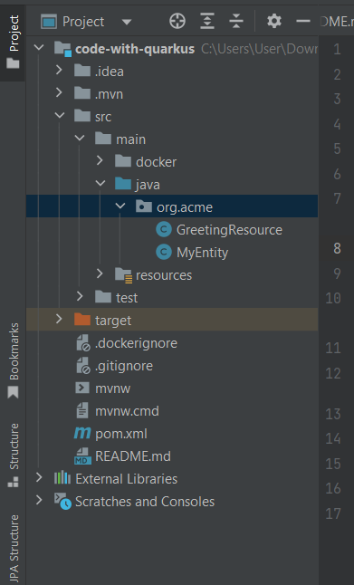
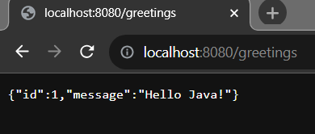

## Developing a simple Greeting Rest service using Quarkus

Initial Requirements: 

    - JavaSE version: 8+
    - Maven or Gradle as a build tool or using CLI (see the official doc)
    - Maven version: 3.6.3+
    - Gradle version: 7.5+
    - And IDE that support Java and maven/gradle: Like Intellij Ide, Eclipse or VS code.

Please follow the below steps to develop a simple Greeting rest service:

Note: We use here [https://code.quarkus.io](https://code.quarkus.io)  official site to bootstrap our quarkus application and use intellij ide to develop it. You can also use VS Code or eclipse as well.

1. Open [https://code.quarkus.io](https://code.quarkus.io) and to bootstrap your quarkus application. Provide the following metadata:
Group: com.company (or the default one)
Artifact: quarkus-example (or the default one)
Quarkus Platform Version: latest one or the recommended one
Build tool: Maven or Gradle

2. After adding the metadata, now it is time to add extensions/dependencies. As it is simple rest api that produces json Greeting response, then add RestEasy Reactive Jackson extension. 

3. Click on Generate button. It will produce a zip file and the file name should be your Artifact name.

4. Unzip it and import it or open it in your favourite Ide like intellij ide. 

Note: If you use intellij ide and want to run quarkus application from your ide, then you have to install Quarkus Tools for IntelliJ plugin from the marketplace.

Quarkus Tools for IntelliJ: File -> Settings -> Plugins -> Marketplace -> Quarkus Tools (search it) -> Install -> Restart Your Ide

Quarkus Tools for Eclipse: File -> Settings -> Plugins -> Marketplace -> Quarkus Tools (search it) -> Install -> Restart Your Ide

Quarkus Tools for VS Code: File -> Settings -> Plugins -> Marketplace -> Quarkus Tools (search it) -> Install -> Restart Your Ide

5. After importing or opening the quarkus example application into your ide, the file structure should be like below: 



Note that: There is no main Application file or main method in Quarkus application.

6. Create a simple Greeting.java pojo class in com.company package.

```
package com.company;

public class Greeting {
    private int id;
    private String message;

    public Greeting() {
    }

    public Greeting(int id, String message) {
        this.id = id;
        this.message = message;
    }

    public int getId() {
        return id;
    }

    public void setId(int id) {
        this.id = id;
    }

    public String getMessage() {
        return message;
    }

    public void setMessage(String message) {
        this.message = message;
    }
}

```

6. Now, create a GreetingResource.java class in com.company pacakge. Here we user jax-rs @GET mapping to generate json greeting service.

```js
package com.company;

import jakarta.ws.rs.*;
import jakarta.ws.rs.core.MediaType;

@Path("/")
public class GreetingResource {

    @Path("/greetings")
    @GET
    @Produces(MediaType.APPLICATION_JSON)
    public Greeting createGreetings(){
        return new Greeting(1, "Hello Java!");
    }
}

```

7. Run the application and invoke the url: [http://localhost:8080/greetings](http://localhost:8080/greetings) and you will see a simple greeting json response.



8. Let's add list of Greetings! 

```
package com.company;

import jakarta.ws.rs.*;
import jakarta.ws.rs.core.MediaType;

import java.util.List;

@Path("/")
public class GreetingResource {

    @Path("/greetings")
    @GET
    @Produces(MediaType.APPLICATION_JSON)
    public List<Greeting> createGreetings(){
        return List.of(
                new Greeting(1, "Hello Java!"),
                new Greeting(2, "Hello PHP!"),
                new Greeting(3, "Hello Python!"),
                new Greeting(4, "Hello C++!")
        );
    }
}

```

If you stop and again run the application, the json response should be in this url: [http://localhost:8080/greetings](http://localhost:8080/greetings)

```
[
  {
    "id": 1,
    "message": "Hello Java!"
  },
  {
    "id": 2,
    "message": "Hello PHP!"
  },
  {
    "id": 3,
    "message": "Hello Python!"
  },
  {
    "id": 4,
    "message": "Hello C++!"
  }
]
```

Hence, we have successfully developed a simple Greeting json service that handles the @GET request.


-----

I want to recall one more thing here that, In jax-rs curd annotations are: @GET, @Post, @PUT, @DELETE, @PATCH  but in Spring Boot we use @GetMapping, @PostMapping, @PutMapping, @DeleteMapping, @PatchMapping etc. If you ar the fan of Spring/Spring Boot you may familiar of those.

Talk Soon.

