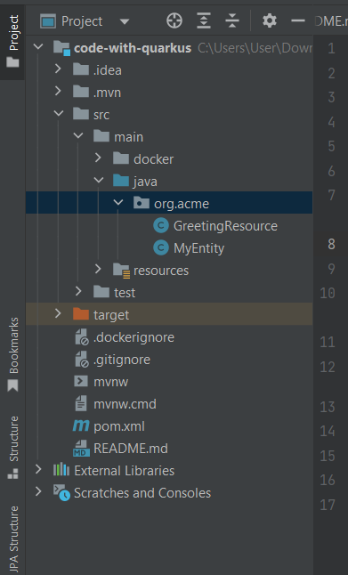

## What is Quarkus ?

- Quarkus is another Java web Application framework like Spring or Spring Boot. Quarkus has been designed around container first philosophy. As much as possible quarkust applicaton tries to avoid reflection, reducing startup time and memory usaes. It is container first by it's nature.

## How to develop your first Quarkus Applications.

Developing quarkus Application is very straightforward. You can develop your first quarkus applicaton multiple ways. Like, using Quarkus CLI, using build tools like maven or gradle or in your favourite ides like intellij ide, VS code, Eclipse etc. 

Let's create your first Quarkus application using quarkus applicaton bootstrapping site.

Steps that you should follow: 

1. Open your favourite web browser and invoke the url: https://code.quarkus.io 

2. If you visit the code.quarkus.io site, you will come to this page. From this page, you can simply bootstrap or create simple quarkus application, add extensions etc. 

//image: code.quarkus.io page

3. Let's configure your first quarkus application groupid, artifactid and build tool. 

Mine: 
Group: com.company 
Artifact: quarkus-example 
Build tool: maven 
and Quarkus platform version: 3.5 (choose latest recommended version always)

You can always, keep the default shape, as your choice. But note, the name of Artifact will be the project name here. 

5. Now, it's time to add dependencies (extensions in quarkus). As we create simple Hello World endpoint and not any type of complex service, so we can add RestEasy Reactive web or RestEasy Reactive Jacksion extension in our classpath. After adding the dependecies/extension click on Generate Your Application button. It will promt a new dialog box, with more details about extension. Just click -> Download The Zip button. You will see in your computer download (default mine) folder a new quarkus-example.zip (or code-with-quarkus.zip if you didn't change anything) file has been downloaded. 

6. Unzip the zip file and store it in any directory (remember the location).

7. Open your favourite ide like intellij, eclipse or vs code and import the unzip qurkus-example applications. 

Intellij ide: 
Eclipse: 

8. After importing the application, you see there is not Application file with main mehtod. So, running quarkus applicaton from ide needs little more steps. There are quarkus related tooling available of your Ide. In intellij ide, in stall quakus plugin: Settings -> Plugins -> Marketplace -> (search quarkus tools) and itstall it.

Note: I will show you how to run quarkus applicatin using maven and gradle commands.

9. When you import the quarkus applicaton first time, you see the following file structure. There will be not main Application file like Spring Boot. 



Note: When you use the default one and, if you use RestEasy Reactive extension, a demo java files has been generated by default. But note, that there is no Application file or main mehtod present.

10. Now, in com.company package, create GreetingResource.java file. We will use jax-rs @GET mapping for creating our first "Hello, World" endpoint.

```js
package com.company;

import jakarta.ws.rs.GET;
import jakarta.ws.rs.Path;
import jakarta.ws.rs.Produces;
import jakarta.ws.rs.core.MediaType;

@Path("/") //It doesn't need to add
public class GreetingResource {

    @GET
    @Path("/greetings")
    @Produces(MediaType.TEXT_PLAIN)
    public String greeting(){
        return "Hello, World!";
    }
}

```

This GreetingResource class only produces simple String based rest service when we invoke the url /greeting. Note, that like most of java applications, Quarkus also listens port 8080 in localhost.

11. So, open your favourinte web browser and invoke the url: http://localhost:8080/greetings and you will see a simple response like: Hello, World!

You have successfully developed a rest service that produces a simple Hello world string message.

What if we want to create custom greeting message based on different person name?

Quarkus have a mapping method @QueryParam that can bind to the web uri. It almost works like Spring Boot @RequestParam() annotation. See the code below

```js
package com.company;

import jakarta.ws.rs.*;
import jakarta.ws.rs.core.MediaType;

@Path("/")
public class GreetingResource {

    @Path("/greetings")
    @GET
    @Produces(MediaType.APPLICATION_JSON)
    public String greeting(@QueryParam("name") String name){ 
        return "Hello, %s! " +name;
    }
}

```

Now, if you invoke the url : http://localhost:8080/greetings you should get the above test response like: Hello, null! But if you add ?name=Jenkov at the end of the url like invoke the url: http://localhost:8080/greetings?name=Jenkov the response should be: Hello, Jenkov!

