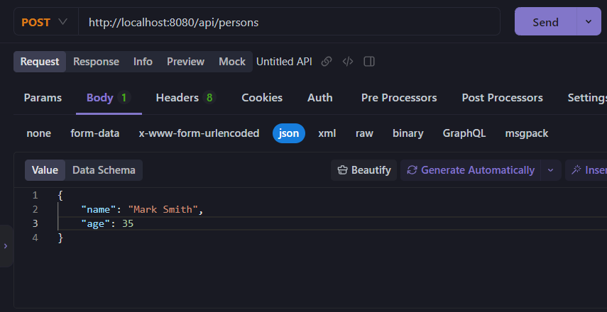
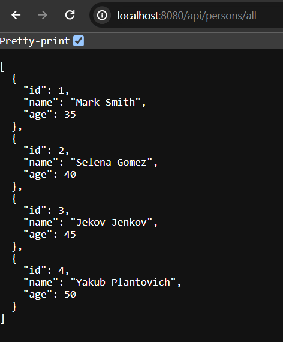

## Quarkus Hibernate ORM With Panache

In this tutorial post, we are going to explore how to use Hibernate ORM with Panache in order to add or retrieve data from our relational database (like mySQL or postgreSQL).

**Hibernate ORM with Panache:** Hibernate ORM with Panache is an ORM framework like Spring Data JPA works as as implementation of JPA (jakarta persistence). It is used to save, retrieve, update or delete data from our relational database. After all, it is used to create sophisticated CRUD Applications. Hibernate ORM with Panache helps you to make your entities trivial and fun while writing in Quarkus. One more thing, if you already use Spring Data JPA, then it will be very comfortable for you to use it in your application.

So, let's get into the project.

## Add The Required Dependencies

First of all, if you already have quarkus application ready to get started, add the following extensions or dependencies in your classpath. If you use maven as a build tool then, open **pom.xml** and add the below dependencies and reload your project.

**pom.xml**

```
<dependency>
    <groupId>io.quarkus</groupId>
    <artifactId>quarkus-rest-jackson</artifactId>
</dependency>
<dependency>
    <groupId>io.quarkus</groupId>
    <artifactId>quarkus-hibernate-orm-panache</artifactId>
</dependency>
<dependency>
    <groupId>io.quarkus</groupId>
    <artifactId>quarkus-jdbc-mysql</artifactId>
</dependency>
```

**Note:** We use JDBC driver extension for mySQL database. If you use alternative database then you can use their specific JDBC driver extension, such as (quarkus-jdbc-postgresql, quarkus-jdbc-h2 etc.)

## What if You don't have Quarkus Application Bootstrapped Yet?

In case if you are new to quarkus and don't have quarkus application bootstrapped yet, you can use quarkus CLI or quarkus initializer website [https://code.quarkus.io](https://code.quarkus.io) to create your first quarkus application. But don't forget to add the above required dependencies while generating your quarkus application. You can also use this tutorial to create your first quarkus application
[Develop Your First Quarkus Application](https://codeinar.com/first-quarkus-application/)


## Hibernate ORM with Panache Patterns

Hibernate orm with panache uses two patterns while creating entities (entities are tables of database usually).

**Reactive Pattern:** The entity class either extends **PanacheEntity** or **PanacheEntityBase** while using reactive pattern. When your entity extends **PanacheEntity**, then all the fields must be public, no primary key field required (id attribute will be added automatically), custom query methods can be defined within the entity itself (they must be public and static), no getter/setter methods required (getter/setter methods will be generated out of the box). In case you want to generate your id manually (like regular JPA entity convention) and want to define getter/setter methods for the fields then use **PanacheEntityBase**.


**Repository Pattern:** If you already use Spring Data JPA, then repository pattern will be very familiar to you. You just define your entity (with the required properties) and define repository interface class and extends **PanacheRepository** or **PanacheRepositoryBase**. Use **PanacheRepository** while you want to make the application generates id for you (thus id field will not be required) and use **PanacheEntityBase** while you want to do everything manually. 


In this tutorial, I will use reactive pattern and get the benefits of using **Hibernate ORM with Panache**.


## Create An Entity Class

First of all create an entity class in **com.company.model** folder in your project. Let's name the entity or model class **Person.java**. And don't forget to extends **PanacheEntity** or **PanacheEntityBase** (while id field is required).


**Person.java** (using reactive pattern)

```
package com.company.model;

import io.quarkus.hibernate.orm.panache.PanacheEntity;
import jakarta.persistence.*;

@Entity
public class Person extends PanacheEntity{
    /**
     * id field is added automatically when you
     * extends panacheEntity
     */
    public String name;
    public int age;

    public Person() {
    }

    public Person(String name, int age) {
        this.name = name;
        this.age = age;
    }

    /**
     * No getter and setter methods required to define
     * as they are added implicitly as you extend
     * panacheEntity
     */

}
```


## Define a Resource Class (formally controller class)

Let's create a resource class in **com.company.resources** folder.


**PersonResource.java**

```
package com.company.resources;


import com.company.model.Person;
import jakarta.transaction.Transactional;
import jakarta.ws.rs.*;
import jakarta.ws.rs.core.MediaType;
import jakarta.ws.rs.core.Response;

import java.util.List;

@Path("/api/persons")
@Produces(MediaType.APPLICATION_JSON)
public class PersonResource {

    //retrieving all person records calling listAll() method
    @GET
    @Path("/all")
    @Produces(MediaType.APPLICATION_JSON)
    public List<Person> getAll(){
        return Person.listAll();
    }

    //adding new person records using persist() method
    @POST
    @Transactional //required to use transactional
    @Produces(MediaType.APPLICATION_JSON)
    @Consumes(MediaType.APPLICATION_JSON)
    public Response save(Person person){
         if(person.id != null){
             throw new WebApplicationException("Id was set invalidly on request", 404);
        }
        //calling the persist() method
        person.persist();  
        return Response.ok().entity(person).build();
    }
}
```


In the **PersonResource.java** class we have defined jax/rs **@GET** and **@POST** annotations in order to retrieve all person data and save new person records into our relational database.


## Map The Database Configuration

Open **application.properties** file and add database configurations for mysql database.

**application.properties**

```
# MySQL Database Configuration
quarkus.datasource.db-kind=mysql
quarkus.datasource.username=<your-username>
quarkus.datasource.password=<your-password>
quarkus.datasource.jdbc.url=jdbc:mysql://localhost:3306/qtestdb

# Update the database schema
quarkus.hibernate-orm.database.generation=update
```

Here use your mysql username, password and qtestdb is mysql database name.


## Test The Application

Let's run the application using the maven/gradle command.

```
$ mvn quarkus: dev 
$ gradle --console=pain quarkusDev
```

**Note**: If you use quarkus tools for your Ide, then you can simply run your quarkus application from Ide. In this case you have to download or install the Quarkus tools plugin for your IDE.

If you run your application, it runs on port 8080 in localhost by default. So, by using your favourite web browser invoke the endpoint [http://localhost:8080/api/persons/all](http://localhost:8080/api/persons/all) and you will see a page of empty array. 


## Load Some Data

You can add few person data to this endpoint [http://localhost:8080/api/persons](http://localhost:8080/api/persons) by using cURL or Postman like rest api management software tool. Or programmatically, you can use **import.sql** file to load initial data at the time of starting our application. Here, I am using apiDOG to add few person data into the rest api endpoint.

So, open postMan or apiDog to add few person records to this endpoint: [http://localhost:8080/api/persons](http://localhost:8080/api/persons) 



Add few more person records into the same endpoint.

```
{
    "name": "Selena Gomez",
    "age": 40
}
{
    "name": "Jekov Jenkov",
    "age": "45"
}
{
    "name": "Yakub Plantovich",
    "age": "50"
}
```

After calling few POST request on our post endpoint, you invoke now the uri of [http://localhost:8080/api/persons/all](http://localhost:8080/api/persons/all) you will get the following response as a json format.



Hence, hope this post is very helpful to get started with Hibernate ORM with Panache. I believe that if you already work with Sprig Data JPA then you definitely love Hibernate ORM with Panache.

