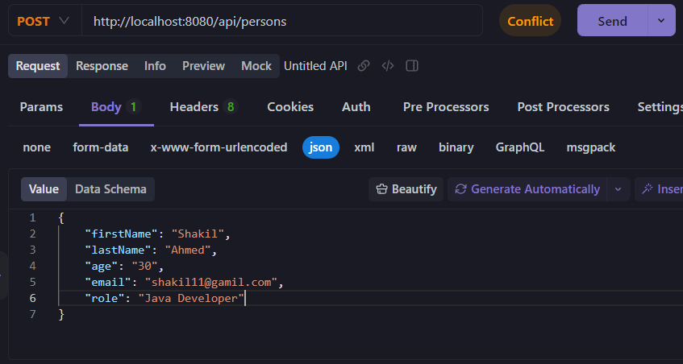
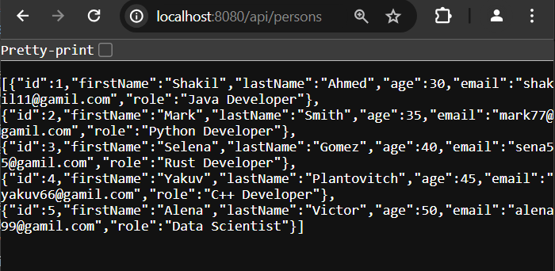
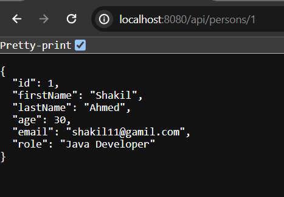
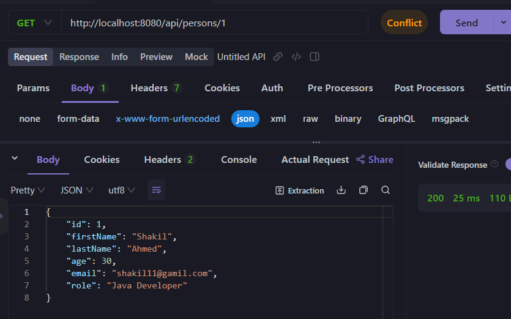
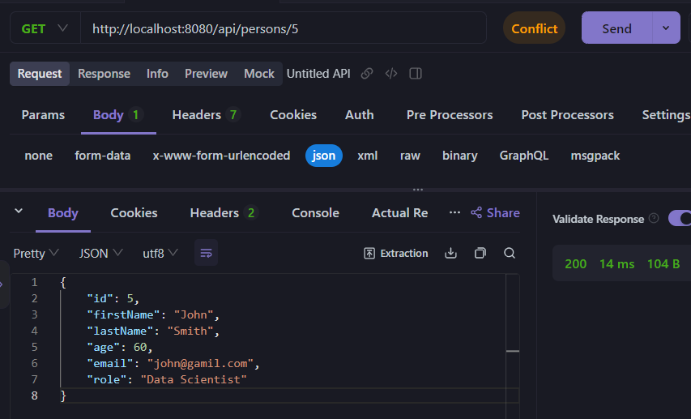
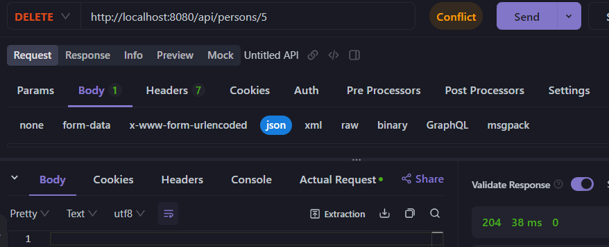
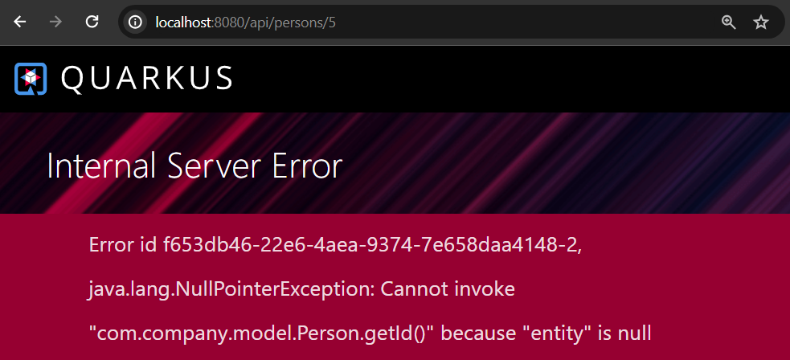

## Develop A Simple Rest API Using Quarkus Hibernate ORM with Panache

In this tutorial post, we are going to explore how easy we can develop CRUD (Create, Read, Update, Delete) like rest api application using Quarkus Hibernate ORM with Panache. Quarkus Hibernate ORM with Panache is a Quarkus extension that simplifies the development of database driven applications.

**Initial requirements**
    - JavaSE version: 17+
    - Maven or Gradle as a build tool or using CLI ([https://quarkus.io/get-started/](https://quarkus.io/get-started/))
    - Maven version: 3.6.3+ (for maven users)
    - Gradle version: 7.5+ (for gradle users)
    - And IDE that supports Java and maven/gradle: Like IntelliJ IDE, Eclipse or VS code.

## Bootstrap Your Quarkus Application

If you already have quarkus application ready to get started then add the following extensions or maven dependencies in your application classpath, will be required for this project.

```
<dependency>
    <groupId>io.quarkus</groupId>
    <artifactId>quarkus-rest-jackson</artifactId>
</dependency>
<dependency>
    <groupId>io.quarkus</groupId>
    <artifactId>quarkus-hibernate-orm-panache</artifactId>
</dependency>
<dependency>
    <groupId>io.quarkus</groupId>
    <artifactId>quarkus-jdbc-mysql</artifactId>
</dependency>
```

In case if you don't have Quarkus application bootstrapped, use Quarkus initializer website to bootstrap a simple Quarkus application with required extensions. 

Visit: [https://quarkus.io/get-started/](https://quarkus.io/get-started/) in order to create a new Quarkus application and don't forget to add the above required dependencies.

## Open Your Project Into Your Favourite IDE

After downloading the zip file, unzip it to any directory and open it into your favourite IDE.

**IntelliJ:** File -> Open -> Select the project folder -> Ok (finish) It will now open your project in the current window or new window. Remember your project location you have just downloaded or extracted.

**Eclipse:** File -> Import -> Existing Maven Project -> Next -> Browse (you have just download and extracted) -> Select the project folder (spring-boot-example) -> Finish

**VS Code:** File > Open Folder > Browse the existing spring boot project > Select Folder.

**NetBeans:** File > Open Project > Browse the existing spring boot project (maven project) > Open project.

**Note:** After opening your project into your favourite IDE (in my case IntelliJ IDE) wait few seconds in order to resolve the maven dependencies. As Quarkus doesn't have main class file, thus you get compile time error - **ClassNotFoundException** while running your application for the first time. So, you have to install quarkus tools plugin if you use intelliJ Ide. **How to install Quarkus Tools plugin?** - File -> Settings -> Plugins -> Search Quarkus Tools (from the marketplace) -> Click on Quarkus Tools -> Click Apply -> As usual wait few seconds till completing the download (probably you have to restart your IDE)


## Create An Entity Class

Let's create a simple entity class called **Person.java** in **com.company.model** folder.

**Person.java**

```
package com.company.model;

import io.quarkus.hibernate.orm.panache.PanacheEntity;
import jakarta.persistence.*;

@Entity(name = "Person")
@Table(name = "person")
public class Person extends PanacheEntity{
    /**
     * id field is added automatically when you
     * extends panacheEntity
     */
    public String firstName;
    public String lastName;
    public int age;
    public String email;
    public String role;


    public Person() {
    }

    public Person(String firstName, String lastName, int age, String email, String role) {
        this.firstName = firstName;
        this.lastName = lastName;
        this.age = age;
        this.email = email;
        this.role = role;
    }

    /**
     * getter and setter methods are omitted as they will be
     * handled by PanacheEntity, even id will be generated programmatically
     * if you want to create id externally please extends PanacheEntityBase instead of
     * PanacheEntity
     */

}
```

**Note:** It is required to annotate your model class by **@Entity** annotation. No need to define id field while you use reactive pattern and extends **PanacheEntity**.

## Create A Resource Class

Resource class is just like a controller class from where we can manage our endpoints. Hence, create a resource class called **PersonResource.java** in the resources folder and define all the CRUD **JAX/RS** rest annotations like **@GET**, **@POST**, **@PUT** and **@DELETE** annotations in order to build a simple rest api that can create, read, update or delete entity records of the database.


**PersonResource.java**

```
package com.company.resources;

import com.company.model.Person;
import jakarta.enterprise.context.ApplicationScoped;
import jakarta.transaction.Transactional;
import jakarta.ws.rs.*;
import jakarta.ws.rs.core.MediaType;
import jakarta.ws.rs.core.Response;

import java.util.List;

@Path("/api/persons")
@Produces(MediaType.APPLICATION_JSON)
@Consumes(MediaType.APPLICATION_JSON)
@ApplicationScoped
public class PersonResource {

    //method for getting all person records
    @GET
    public List<Person> getAll(){
        //call the listAll() method
        return Person.listAll();
    }

    //method for saving new person record
    @POST
    @Transactional
    public Response save(Person person){
        if(person.id !=null){
            throw new WebApplicationException("Id was set invalidly on request", 404);
        }
        //call the persist() method
        person.persist();
        return Response.ok().entity(person).build();
    }

    //method for each person records by its id
    @GET
    @Path("/{id}")
    public Person getPersonById(@PathParam("id") int id){
        Person entity = Person.findById(id);
        if(entity.id == null){
            throw new WebApplicationException("Person with id of " + id + "doesn't not exist", 404);
        }
        return Person.findById(id);
    }

    //method for updating person records
    @PUT
    @Path("/{id}")
    @Transactional
    public Person updatePerson(int id, Person person){

        Person entity = Person.findById(id);
        if ( entity.id == null) {
            throw new WebApplicationException("Person with id of " + id + "doesn't not exist", 404);
        }
        entity.firstName = person.firstName; //actually it calls setFirstName under the hood
        entity.lastName = person.lastName;
        entity.age = person.age;
        entity.email = person.email;
        entity.role = person.role;

        return entity;
    }


    //method for deleting person records
    @DELETE
    @Path("/{id}")
    @Transactional
    public Response deleteStudent(int id){
        Person entity = Person.findById(id);
        if(entity.id == null){
            throw new WebApplicationException("The person of id "+ id +"doesn't exist", 404);
        }
        entity.delete();
        return Response.status(204).build();
    }
}
```


**Note:** The root path is required and be careful when you use the **@Transactional** annotations, as it can modify the database accidentally.

## Map The Database Configuration

Open **application.properties** file and add database configurations for mysql database.


```
# MySQL Database Configuration
quarkus.datasource.db-kind=mysql
quarkus.datasource.username=<your-username>
quarkus.datasource.password=<your-password>
quarkus.datasource.jdbc.url=jdbc:mysql://localhost:3306/qtestdb

# Update the database schema
quarkus.hibernate-orm.database.generation=update
```

Here use your mysql username, password and qtestdb is the name of my database.


## Test The Application

Let's run the application using the maven/gradle command or use **Quarkus Tools** plugin. You first need to install the plugin in your IDE.

**In shell or Terminal**

```
$ mvn quarkus: dev 
$ gradle --console=pain quarkusDev
```

**Note**: If you use quarkus tools for your Ide, then you can simply run your quarkus application from Ide. In this case you have to download or install the Quarkus tools plugin for your IDE.

However, if you run your application, it runs on port 8080 in localhost by default. So, by using your favourite web browser invoke the endpoint [http://localhost:8080/api/persons](http://localhost:8080/api/persons) and you will see a page of empty array. 


## Load Some Data

You can add few person records to this endpoint [http://localhost:8080/api/persons](http://localhost:8080/api/persons) by using **cURL** or **Postman** like rest api management software tool. Or programmatically, you can use **import.sql** file to load initial data at the time of starting the application. Here, I am using **apiDOG** to add few person records into the rest api endpoint.

So, open Postman or apiDog to add some person records to this endpoint: [http://localhost:8080/api/persons](http://localhost:8080/api/persons) 



Like the above add few more person records, and click send button.

```
{
    "firstName": "Mark",
    "lastName": "Smith",
    "age": "35",
    "email": "mark77@gamil.com",
    "role": "Python Developer"
}
{
    "firstName": "Selena",
    "lastName": "Gomez",
    "age": "40",
    "email": "sena55@gamil.com",
    "role": "Rust Developer"
}
{
    "firstName": "Yakuv",
    "lastName": "Plantovitch",
    "age": "45",
    "email": "yakuv66@gamil.com",
    "role": "C++ Developer"
}
{
    "firstName": "Alena",
    "lastName": "Victor",
    "age": "50",
    "email": "alena99@gamil.com",
    "role": "Data Scientist"
}
```

After adding few demo person records now if you visit the uri in your web browser, you will see list of person records in a json format.



If you click on the pretty-print, then you will get the formatted response.

```
[
  {
    "id": 1,
    "firstName": "Shakil",
    "lastName": "Ahmed",
    "age": 30,
    "email": "shakil11@gamil.com",
    "role": "Java Developer"
  },
  {
    "id": 2,
    "firstName": "Mark",
    "lastName": "Smith",
    "age": 35,
    "email": "mark77@gamil.com",
    "role": "Python Developer"
  },
  {
    "id": 3,
    "firstName": "Selena",
    "lastName": "Gomez",
    "age": 40,
    "email": "sena55@gamil.com",
    "role": "Rust Developer"
  },
  {
    "id": 4,
    "firstName": "Yakuv",
    "lastName": "Plantovitch",
    "age": 45,
    "email": "yakuv66@gamil.com",
    "role": "C++ Developer"
  },
  {
    "id": 5,
    "firstName": "Alena",
    "lastName": "Victor",
    "age": 50,
    "email": "alena99@gamil.com",
    "role": "Data Scientist"
  }
]
```

## Retrieve Single Person Records

In order to retrieve a particular person records based on id, you can invoke the GET request in your rest api tool like apiDog or Postman. You can also get a single person in your browser too.

**Using Browser:** Invoke this URI [http://localhost:8080/api/persons/1](http://localhost:8080/api/persons/1) and it will retrieve the person records which id is 1.



```
{
  "id": 1,
  "firstName": "Shakil",
  "lastName": "Ahmed",
  "age": 30,
  "email": "shakil11@gamil.com",
  "role": "Java Developer"
}
```

**Using apiDOG or Postman:** Open Postman or ApiDOG and use this API Path [http://localhost:8080/api/persons/1](http://localhost:8080/api/persons/1), use http GET request and then click send button.



It will retrieve the first person records like the above as well.

## Update A Person Record

In order to update a person records we can simply use the API Path [http://localhost:8080/api/persons/{id}](http://localhost:8080/api/persons/{id}) and make the PUT request.


Such as, we want to update the person records which id is 5.

**Before Updating:**

```
{
    "id": 5,
    "firstName": "Alena",
    "lastName": "Victor",
    "age": 50,
    "email": "alena99@gamil.com",
    "role": "Data Scientist"
}
```

Now make the PUT request with this endpoint: [http://localhost:8080/api/persons/1](http://localhost:8080/api/persons/5) with the following updated data.

```
{
    "id": 5,
    "firstName": "John",
    "lastName": "Smith",
    "age": 60,
    "email": "john@gamil.com",
    "role": "Data Scientist"
}
```


After Updating:




## Delete A Person Record

Likewise the above, we can simply delete any person records based on id as well. Such as I want to delete the person records which id is 5. Hence, invoke the DELETE http request using Postman or cURL with this API Path [http://localhost:8080/api/persons/5](http://localhost:8080/api/persons/5) and you will get a successful message, such as your resource has been deleted (if you set one externally!).



As the entity records which id is 5 has been deleted already, now if you want to access the resource of the entity which id is 5 through web browser, you will get the following error message. Such as the entity is null which id is 5. Though it is always best practice to set up custom error message for handling errors.



I hope this tutorial is very helpful for you. 

Thanks in advance.


