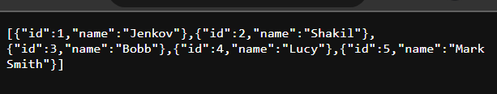

## Hibernate-orm with Panache

In this article we are going to explore how we can use hibernate-orm-panache to store or retrieve data from our relational database. Hibernate-orm-panache is a quarkus extension that provides support to work with relational database. It is almost like spring data jpa. We can use it two ways. Repository and Active record pattern. In this example we will go through both ways.


Let's get started.

If you have already quarkus application in your system, open it in any ide (like intellij ide) and then open your pom.xml file and add the hibernate-orm-panache dependency.

```js
<dependency>
    <groupId>io.quarkus</groupId>
    <artifactId>quarkus-hibernate-orm-panache</artifactId>
</dependency>
```
As well as, you have to provide your database driver to store data. As I use mysql so added mysql jdbc dependency.

```js
<dependency>
    <groupId>io.quarkus</groupId>
    <artifactId>quarkus-jdbc-mysql</artifactId>
</dependency>
```

But if you don't have quarkus applicaton presenet yet, Let's follow the below simple steps to create one. (step 1 to 5)

Initial Requirements:

    - JavaSE version: 8+
    - Maven or Gradle as a build tool or using CLI (see the officila doc)
    - Maven version: 3.6.3+
    - Gradle version: 7.5+
    - And IDE that support Java and maven/gradle: Like Intellij Ide, Eclipse or VS code.

Please follow the below steps to develop a simple Greeting rest service:

Note: We use here https://code.quarkus.io  official site to bootstrap our quarkus application and use intellij ide to develop it. You can alos use VS Code or eclipse as well.

1. Open https://code.quarkus.io and to bootstarap your quarkus application. Provide the folloiwng metadata:
Group: com.company (or the default one)
Artifact: quarkus-example (or the default one)
Quarkus Platform Version: latest one or the recommended one
Build tool: Maven or Gradle

2. After adding the metadata, now it is time to add extensions/dependencies. As it is simple rest api that produces json Greeting response, then add RestEasy Reactive Jacksion extension. 

3. Click on Genrate button. It will produce a zip file and the file name should be your Artifact name.

4. Unzip it and import it or open it in your favourite Ide like intellij ide. 

Note: If you use intellij ide and want to run quarkus application from your ide, then you have to install Quarkus Tools for IntelliJ plugin from the marketplace.

Quarkus Tools for Intelli: File -> Settings -> Plugins -> Marketplace -> Quarkus Tools (search it) -> Install -> Restart Your Ide

Quarkus Tools for Eclipse: File -> Settings -> Plugins -> Marketplace -> Quarkus Tools (search it) -> Install -> Restart Your Ide

Quarkus Tools for VS Code: Click on Extensions (Ctrl+Shift+X) -> Search for Quarkus Tools -> Install it -> Restart your ide 

5. After importing or opening the quarkus example applicaton into your ide, the file structure should be like below: 



6. Add mysql database configuration in 

```js
# datasource configuration
quarkus.datasource.db-kind = mysql
quarkus.datasource.username = root #usernmae
quarkus.datasource.password = root #password
quarkus.datasource.jdbc.url = jdbc:mysql://localhost:3306/qtestdb #5432 if postgresql

# drop and create the database at startup (use `update` to only update the schema)
quarkus.hibernate-orm.database.generation= drop-and-create
```

But if you use postgreSQL use the below consfiguration instead.

```js
# datasource configuration
quarkus.datasource.db-kind = postgresql
quarkus.datasource.username = hibernate
quarkus.datasource.password = hibernate
quarkus.datasource.jdbc.url = jdbc:postgresql://localhost:5432/hibernate_db

# drop and create the database at startup (use `update` to only update the schema)
quarkus.hibernate-orm.database.generation=drop-and-create
```

Note: There is not persistence.xml file. But we can add it externally.

Repository: (See how repostory patter works.)

7. Create Person.java entity class in com.company pacakge.

```js
package com.company;


import io.quarkus.hibernate.orm.panache.PanacheEntity;
import jakarta.persistence.*;

@Entity
public class Person {
        @Id
        @GeneratedValue(strategy = GenerationType.AUTO)
        @Column(name = "id", nullable = false)
        private Long id;

        private String name;

        public Long getId() {
                return id;
        }

        public void setId(Long id) {
                this.id = id;
        }

        public Person() {
        }

        public String getName() {
                return name;
        }

        public void setName(String name) {
                this.name = name;
        }
}

```
The field can be public or private. If you use PanacheEntity (reactive patter than repository) the field should be public and there will be no id or getter/setter methods. But, these are required when you follow the repository approach. Also note that, as id is auto generated, so when you use Postman or curl to send or update data, please don't use setId(), I don't know actually when I use it, my data has not been persisted at all, I got null values last.


8. Now create PersonRepository.java class that implemensts PanacheRepository or PanacheRepositoryBase. The differences betweeb these are, PanacheRepository takes one argument and PanacheRepositoryBase takes two argument.


```js
package com.company;

import io.quarkus.hibernate.orm.panache.PanacheRepositoryBase;
import jakarta.enterprise.context.ApplicationScoped;

@ApplicationScoped
public class PersonRepository implements PanacheRepositoryBase<Person, Integer> {
    //custom queries
}

```

9. Now create PersonResource.java class. Here we have only get and post request. Root class level path is required.


```js
package com.company;

import jakarta.inject.Inject;
import jakarta.transaction.Transactional;
import jakarta.ws.rs.*;
import jakarta.ws.rs.core.MediaType;
import jakarta.ws.rs.core.Response;

import java.util.List;

@Path("/persons")
@Produces(MediaType.APPLICATION_JSON)
public class PersonResource {

    @Inject
    PersonRepository personRepository;

    public PersonResource(PersonRepository personRepository){
        this.personRepository = personRepository;
    }
    //get mapping
    @GET
    @Path("/all")
    @Produces(MediaType.APPLICATION_JSON)
    public List<Person> getAll(){
        return personRepository.listAll();
    }
    @POST
    @Transactional
    @Produces(MediaType.APPLICATION_JSON)
    @Consumes(MediaType.APPLICATION_JSON)
    public Response savePerson(Person person){
        personRepository.persist(person);
        return Response.status(Response.Status.CREATED).entity(person).build();
    }
}
```

10. Run the applicaton and add few person data using Postman. If you add few data using postman, then invoke the url: http://localhost:8080/persons/all from your favourite web browser. You will get json response with person data.


Seems, everything is going well. I feel more comfortable when I use Repository pattern in Spring boot. So, in upcoming tutorial, I always use Rective pattern. 

In reactive pattern, Your entity will be like this. And absolutely, there will be not getter/setter methods involved. Even you can't create id externally. All will be handled by PanacheEntity. Note: Your fields should be public than private.

```js
package com.company;


import io.quarkus.hibernate.orm.panache.PanacheEntity;
import jakarta.persistence.*;

@Entity
public class Person extends PanacheEntity{
        public String name;
}

```

Now, in the PersonResource.java class, you just use your entity itself to persist, update or get your database records. 

Talk soon.
Shakil Ahmd.