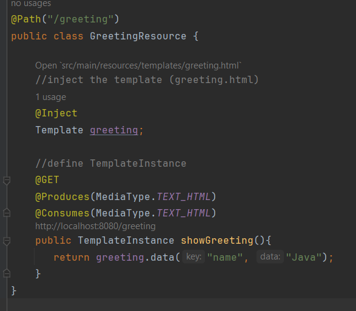
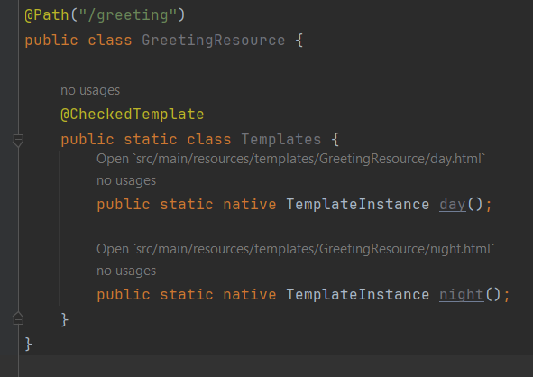
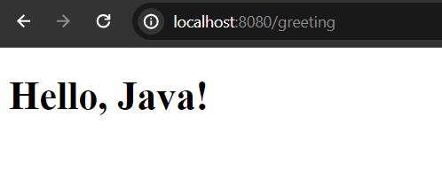
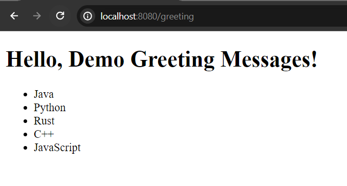

# Quarkus Qute View

Qute is a template engine specifically use in Quarkus Application framework. In this post we are going to explore how to render contents or data (usually backend data) from components to view. Here components usually refers the .java files and views are .html files located in resources/templates folder.

**Initial requirements**
    - JavaSE version: 17+
    - Maven or Gradle as a build tool or using CLI ([https://quarkus.io/get-started/](https://quarkus.io/get-started/))
    - Maven version: 3.6.3+ (for maven users)
    - Gradle version: 7.5+ (for gradle users)
    - And IDE that supports Java and maven/gradle: Like IntelliJ IDE, Eclipse or VS code.


## Bootstrap Your Quarkus Application

If you already have quarkus application ready to get started then add the Qute template engine extension or maven dependency in your application classpath, will be required for this project.


**pom.xml**

```
<!--jakarta rest with jackson support-->
<dependency>
    <groupId>io.quarkus</groupId>
    <artifactId>quarkus-rest-jackson</artifactId>
</dependency>

<!--compatible for quarkus-rest or quarkus-rest-jackson-->
<dependency>
    <groupId>io.quarkus</groupId>
    <artifactId>quarkus-rest-qute</artifactId>
</dependency>

<!--while your serving your templates over http, also works for rest-->
<dependency>
    <groupId>io.quarkiverse.qute.web</groupId>
    <artifactId>quarkus-qute-web</artifactId>
</dependency>
```

**Note:** I always use **quarkus-rest-qute** as my main task is to develop json rest api via quarkus/springBoot. Another thing to recall that, qute template files must be located in the **resources/templates** folder or subfolder.


In case if you don't have Quarkus application bootstrapped, use Quarkus initializer website to bootstrap a simple Quarkus application with required extensions. 

Visit: [https://quarkus.io/get-started/](https://quarkus.io/get-started/) in order to create a new Quarkus application and don't forget to add the above required dependencies.


## Open Your Project Into Your Favourite IDE

After downloading the zip file, unzip it to any directory and open it into your favourite IDE.

**IntelliJ:** File -> Open -> Select the project folder -> Ok (finish) It will now open your project in the current window or new window. Remember your project location you have just downloaded or extracted.

**Eclipse:** File -> Import -> Existing Maven Project -> Next -> Browse (you have just download and extracted) -> Select the project folder (spring-boot-example) -> Finish

**VS Code:** File > Open Folder > Browse the existing spring boot project > Select Folder.

**NetBeans:** File > Open Project > Browse the existing spring boot project (maven project) > Open project.

**Note:** After opening your project into your favourite IDE (in my case IntelliJ IDE) wait few seconds in order to resolve the maven dependencies. As Quarkus doesn't have main class file, thus you get compile time error - **ClassNotFoundException** while running your application for the first time. So, you have to install quarkus tools plugin if you use intelliJ Ide. **How to install Quarkus Tools plugin?** - File -> Settings -> Plugins -> Search Quarkus Tools (from the marketplace) -> Click on Quarkus Tools -> Click Apply -> As usual wait few seconds till completing the download (probably you have to restart your IDE)


## Create A Template File

Now, we will create a **greeting.html** template file in the templates folder. If there is not templates folder in the resources directory, please create a templates folder/package in the resources directory.


**greeting.html**

```
<!DOCTYPE html>
<html lang="en">
<head>
    <meta charset="UTF-8">
    <meta name="viewport" content="width=device-width, initial-scale=1.0">
    <title>title</title>
</head>
<body>
<h1>Hello, {name}!</h1>
</body>
</html>
```

Here {...} is the syntax of reading java data or variables content in Qute. Everything in between {...} are usually components data or inline variables. Such as here {name} - name is the variable name is the variable name that we will define in the resources class (look at the **GreetingResource.java** class).


## Create A Resource Class

In this step we will create a resource class and resolve the templates path. Note that, it is required to @Inject the Templates (template files like .html file) in the resource class. In our case, the resource class is **GreetingResource.java**.

**GreetingResource.java**

```
package com.company;

import io.quarkus.qute.Template;
import io.quarkus.qute.TemplateInstance;
import jakarta.inject.Inject;
import jakarta.ws.rs.*;
import jakarta.ws.rs.core.MediaType;

@Path("/greeting")
public class GreetingResource {

    //inject the template (greeting.html)
    @Inject
    Template greeting;

    //define TemplateInstance
    @GET
    @Produces(MediaType.TEXT_HTML)
    @Consumes(MediaType.TEXT_HTML)
    public TemplateInstance showGreeting(){
       return greeting.data("name", "Java");
    }
}
```

Here we have to inject the template file (greeting.html) and then register TemplateInstance (create a template-instance method). Note that, only one **TemplateInstance** method is allowed for each resource class. 




**Type-safe-templates**: It is possible define templates (.html template files) in a type-safe way. In this case, the template files must be located in: **templates/ResourceClass/template-name.html**. Such as, if our Resource class name is **GreetingResource.java** and templates are **day.html** and **night.html** and we use the type-safe templates convention, then the templates (usually .html) files should be located in: **templates/GreetingResource/day.html** and **templates/GreetingResource/night.html**. You can look at the below image shows it clearly.



Hence, One thing is to mention here, if you use type-safe template file approach, your folder structure will be nested much. Anyway, I use to use the first approach, but requirements are usually changed.


## Test The Application

Now run your application using the following command.

```
$ mvn quarkus: dev 
$ gradle --console=pain quarkusDev
```

But if you use quarkus tools for your ide (You can install Quarkus tools plugin in IntelliJ, Eclipse or VS Code) then, you can simply run your application from your ide too.

After running your application successfully, if you now open your browser and invoke the uri [http://localhost:8080/greeting](http://localhost:8080/greeting) you will see the following greeting message.



Just we have successfully rendered sample greeting message using Qute template engine. 

## How to render List of Greeting Message

Let's say, we want to show list of greeting message instead of rendering one greeting message. Then Qute template engine provides sections (you can say, syntax of list type) for iterating list or array and render them to the view. So our updated **GreetingResource.java** class and **greeting.template** files will be:


**GreetingResource.java** (updated one)

```
package com.company;

import io.quarkus.qute.Template;
import io.quarkus.qute.TemplateInstance;
import jakarta.inject.Inject;
import jakarta.ws.rs.*;
import jakarta.ws.rs.core.MediaType;

import java.util.List;

@Path("/greeting")
public class GreetingResource {

    //inject the template (greeting.html)
    @Inject
    Template greeting;

    //define TemplateInstance
    @GET
    @Produces(MediaType.TEXT_HTML)
    @Consumes(MediaType.TEXT_HTML)
    public TemplateInstance showGreeting(){

        String title = "Demo Greeting Messages";

        List<String> list = List.of(
                "Java",
                "Python",
                "Rust",
                "C++",
                "JavaScript"
        );

        return greeting.data
                (
                "title", title,
                "languages", list
                ); //define as many keys with values as you wish
    }
}
```

**greeting.html** (updated one)

```
<!DOCTYPE html>
<html lang="en">
<head>
    <meta charset="UTF-8">
    <meta name="viewport" content="width=device-width, initial-scale=1.0">
    <title>title</title>
</head>
<body>
<h1>Hello, {title}!</h1>
<div>
    <ul>
        {#for name in languages}
        <li>{name}</li> <!--if object type or hashes: product.name, product.price etc.-->
        {/for} <!--end can be written without for keyword-->
    </ul>
</div>
</body>
</html>
```

Note: In qute sections start {#name...} syntax. Such as, {#for..}, {#if..}, {#when...}, #{#each...} etc. Note that, end tag is required either {/for} or {/} approaches.

If you now again restart your application, though you don't have to restart your application as live reloading feature is enabled by default in quarkus, so open [http://localhost:8080/greeting](http://localhost:8080/greeting) uri again in your web browser, you will see the updated data as well.



Hope this tutorial is very helpful to get started with Qute template engine. You can also check out the Qute reference guide in order to know more: 

Qute get started guide: https://quarkus.io/guides/qute <br/>
Qute reference guide: https://quarkus.io/guides/qute-reference