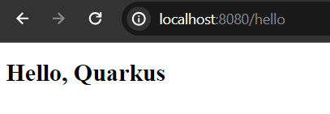
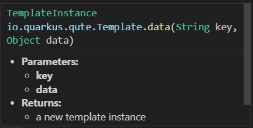
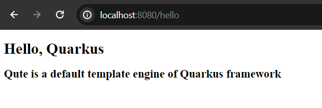

# Using Qute Template Engine with Quarkus

Qute is the default template engine for quarkus framework. In this post we are going to explore how to render component data (from java class) into the template (html files)

**Basic Requirements:**

**Java 17+**
**Maven or Gradle as a build tool**
**An Ide (I am using VS code, java extension required)**

1. Now, visit https://code.quarkus.io and bootstrap a simple quarkus powered application.

Include the following extension or maven dependencies. I am using maven as build tool.

```
<dependency>
    <groupId>io.quarkus</groupId>
    <artifactId>quarkus-resteasy-reactive-jackson</artifactId>
</dependency>

<dependency>
    <groupId>io.quarkus</groupId>
    <artifactId>quarkus-resteasy-reactive-qute</artifactId>
</dependency>
```

2. After adding the required dependencies click on download button and it will be a zip file. Unzip it in any directory and then import the project in your favorite ide. In my case, I am using VS code with java language pack extension.

As you have added restEasy and qute template engine, two sample java files have already been generated for you. **GreetingResource.java** and **SomePage.java** //If you mark the starter code when downloading the project

You can either keep those sample java files or delete them for the time being.

3. Open src\main\resources\templates folder.

Create a hello.html file, or keep the default one (name is: page.html)

Our hello.html file will look like the following:

```
<!DOCTYPE html>
<html lang="en">
<head>
    <meta charset="UTF-8">
    <meta name="viewport" content="width=device-width, initial-scale=1.0">
    <title>Using Qute Template Engine</title>
</head>
<body>

<h1>Hello, {name}</h1> 

</body>
</html>
```

Here **```{name}```** is the quite template expression or syntax to resolve the component data. Yes, the value of the name variable will come from the component (java file)

Note that, all the qute template files will be located here. There is no need to use ViewResolver, as quarkus will automatically handle them (though as a fresher, I never use viewResolver too.)

4. So, in **src\main\java\your_package_name** in my case **src\mian\java\com.codeinjar** create a java class. Name it **HelloController.java** or whatever.

**HelloController.java**

```
package com.codeinjar;

import io.quarkus.qute.Template;
import io.quarkus.qute.TemplateInstance;
import jakarta.inject.Inject;
import jakarta.ws.rs.Consumes;
import jakarta.ws.rs.GET;
import jakarta.ws.rs.Path;
import jakarta.ws.rs.Produces;
import jakarta.ws.rs.core.MediaType;

@Path("/hello")
public class HelloController {

    @Inject
    Template hello;

    @GET
    @Produces(MediaType.TEXT_HTML)
    @Consumes(MediaType.TEXT_HTML)
    public TemplateInstance get(){
        
        String name = "Quarkus";
        return hello.data("name", name);
    }
}

```

You can see, how we can inject the template html file. Here, hello is the name of your html file, and it must be same. Then, we use hello.data("key", data) method to resolve our template name variable. ```@GET``` ```@Produces(MediaType.TEXT_HTML)``` ```@Consumes(MediaType.TEXT_HTML)``` are the required jaxRS annotation to handle the incoming request. If you don't use MediaType.Text_HTML IN @Produces, possible to get json output instead of html.

**Note:** The root path is required annotation.

5. Run your application, buy default it listens port: 8080 in localhost.

Open **http://localhost:8080/hello** and you see the following screen.



Means, we have successfully, inject the name variable data from the java file to the template.

6. Yes, we can pass as many arguments as we want in the **template.data()** method.



```
String name = "Quarkus";
return hello.data("name", name, "data", "Qute is a default template engine of Quarkus framework");
```

Also, change modify your hello.html file.

```
<!DOCTYPE html>
<html lang="en">
<head>
    <meta charset="UTF-8">
    <meta name="viewport" content="width=device-width, initial-scale=1.0">
    <title>Using Qute Template Engine</title>
</head>
<body>

<h1>Hello, {name}</h1> 
<h3>{data}</h3>

</body>
</html>
```

Now, Open again http://localhost:8080/hello and you can see new component data has been added in this page.




Note: Probably you don't have to restart your project because quarkus hot reloading feature does that for you, When any modification occurs in your java or template files.

