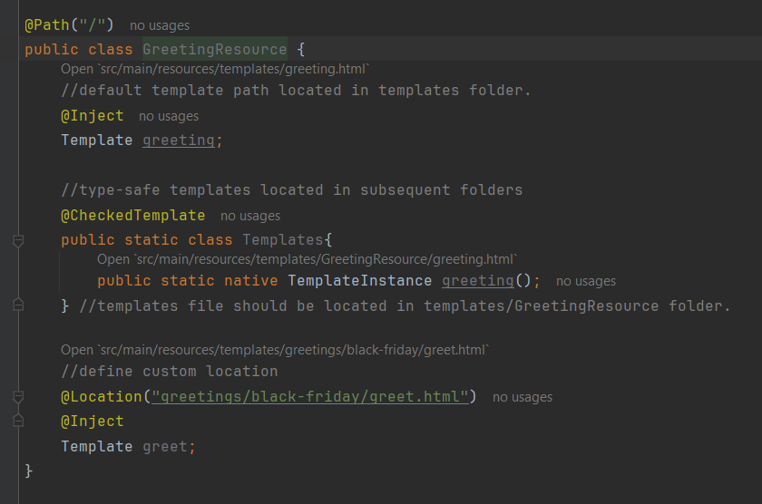
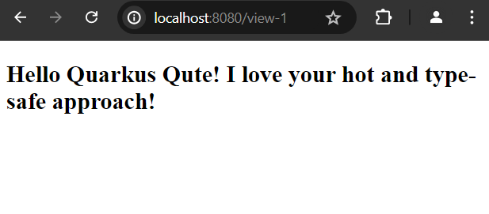
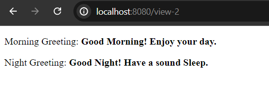

# How to Define Template Path in Qute

In Quarkus Qute, templates file (usually html files) located in resources/templates folder or subfolder by default. It is required that you keep all of your qute template files in the templates folder. But we can also define our template paths more concise and moderate way. Let's get into this topic in this simple post.

## Define Our Qute Template Path

Generally, we can define our template path three ways. Such as,

- **Default Path:** All of the template paths located in the templates folder or subsequent subfolder. Such as, if you have a ***GreetingResource.java*** file and you @Inject a template called greeting and you should have a template file ***greeting.html*** file in the templates folder. 

- **Type Safe Templates:** In this case, our template files must be located in: ***templates/ResourceClass/template-name.html*** and we have to create static native methods and it must be annotated by ***@io.quarkus.qute.CheckedTemplate*** annotation. Such as, if our Resource class name is ***GreetingResource.java*** and templates are ***day.html*** and ***night.html*** and we use the type-safe templates convention, then the templates (usually .html) files should be located in: ***templates/GreetingResource/day.html*** and ***templates/GreetingResource/night.html***.

- Using **@Locator** Annotation: We can also define custom templates using the @Locator annotation. Such as, ***@Location("/greetings/day.html)*** then, you template file must be located in ***templates/greetings/day.html*** file.


## Example Application

First of all, create a simple Resource class and name it ***GreetingResource.java*** in ***src/main/java/com.company*** package. In this resource class, we will see all the ways to define our template paths.


**GreetingResource.java**

```
package com.company;

//import required packages


@Path("/")
public class GreetingResource {

    //default template path located in templates folder.
    @Inject
    Template greeting;

    //type-safe templates located in subsequent folders
    @CheckedTemplate
    public static class Templates{
        public static native TemplateInstance greeting();

        //define other template files...
    } //templates file should be located in templates/GreetingResource folder.

    //define custom template location
    @Location("greetings/black-friday/greet.html")
    @Inject
    Template greet;


    //path for greeting.html template view
    @Path("/view-2")
    @GET
    @Produces(MediaType.TEXT_HTML)
    @Consumes(MediaType.TEXT_HTML)
    public TemplateInstance getGreetingView(){

        return greeting.data("greeting", "Hello, Quarkus Qute");
    }


    //path for GreetingResource/greeting.html template view
    @Path("/view-2")
    @GET
    @Produces(MediaType.TEXT_HTML)
    @Consumes(MediaType.TEXT_HTML)
    public TemplateInstance getAnotherView(){

        return Templates.greeting().data("greeting", "Hello, Quarkus Qute!");
    }


    //path for greetings/black-friday/greet.html template view
    @Path("/view-3")
    @GET
    @Produces(MediaType.TEXT_HTML)
    @Consumes(MediaType.TEXT_HTML)
    public TemplateInstance getBlackFridayView(){

        return greet.data("greeting", "Hello, Quarkus Qute");
    }
}
```




## Define Template Files

Now create three template files in the respective folders.

**greeting.html**
- located: ***resources/templates/greeting.html***

```
<!DOCTYPE html>
<html lang="en">
<head>
    <meta charset="UTF-8">
    <meta name="viewport" content="width=device-width, initial-scale=1.0">
    <title>Qute Template Engine</title>
</head>
<body>
<h2>Hello Quarkus Qute! I love your hot and type-safe approach!</h2>
</body>
</html>
```

**greeting.html**
- located: ***resources/templates/GreetingResource/greeting.html***

```
<!DOCTYPE html>
<html lang="en">
<head>
    <meta charset="UTF-8">
    <title>Qute Template Engine</title>
</head>
<body>
<p>Morning Greeting: <b>Good Morning! Enjoy your day.</b></p>
<p>Night Greeting: <b>Good Night! Have a sound Sleep.</b></p>
</body>
</html>
```

**greet.html**
- located: ***resources/templates/black-friday/greet.html***

```
<!DOCTYPE html>
<html lang="en">
<head>
    <meta charset="UTF-8">
    <title>Qute Template Engine</title>
</head>
<body>
<h1>Black Friday Greetings</h1>
<ul>
    <li>
        <h3>Happy Black Friday! BIG savings, one day only.</h3>
    </li>
    <li>
        <h3>Happy Black Friday! Exclusive Look at Black Friday Deals.</h3>
    </li>
    <li>
        <h3>Happy Black Friday! Time to dance and celebrate!</h3>
    </li>
    <li>
        <h3>Rise and shine, it's Friday!</h3>
    </li>
</ul>
</body>
</html>
```

## Test the Application

Now start your development server and invoke the following uri respectively in your favourite web browser.

- [http://localhost:8080/view-1](http://localhost:8080/view-1)



- [http://localhost:8080/view-2](http://localhost:8080/view-2)



- [http://localhost:8080/view-3](http://localhost:8080/view-3)


As our all path works fine and rendered the content as predicted, thus hope this post will be helpful to distinguish or elaborate the different approaches to define or set template paths in qute template engine.

**Note:** According to the actual use cases, the most adorable approach is the type-safe template path definition. Though, other approaches can be used according to your requirements.


