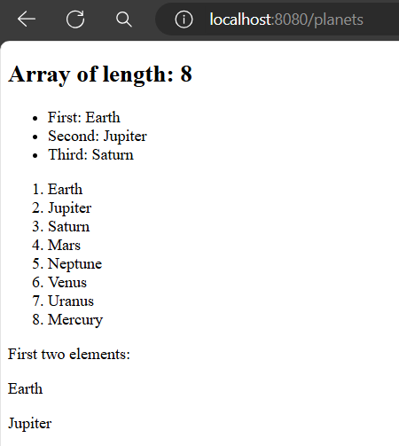

# Work with Arrays in Qute Template Engine

You can iterate over elements of an array with Loop Section (Like for or each section). Moreover, it’s also possible to get the length of the specified array and access the elements directly via an index value. Additionally, you can access the first/last n elements via the ***take(n)/takeLast(n)*** methods.

**Syntax**

```
PlanetResource.java
String [] myArray = {
    "Earth", "Jupiter", "Saturn", "Mars",
    "Neptune", "Venus", "Uranus", "Mercury"
};
return planet.data("planets", myArray);

planet.html //template html file located in templates folder

 <h1>Array of length: {planets.length}</h1>
    <ul>
        <li>First: {planets.0}</li> {!get the first element!}
        <li>Second: {planets[1]}</li> {!get the second element!}
        <li>Third: {planets.get(2)}</li> {!get the third element using get method!}
    </ul>
    <ol>
        {#for planet in planets} {!loop through the planets array!}
        <li>{planet}</li>
        {/for}
    </ol>
    First two elements: {#each planets.take(2)}{it}{/each} {!retrieve first two element using take method!}
</div>
```

Here,
- ***length*** method outputs the length of the array.
- ***planets.0***, ***planets[1]*** or ***planets.get(2)*** returns first, second or third element of this array respectively.
- also we use the ***take*** method to retrieve the first two element at a time.


Let's look at the following live example where we try to explore the built in methods that we can use with array in qute template engine.

## Create A Resource Class

First of all, we will create a simple Resource class in **src/main/java/com/company** package. Let's name the resource class **PlanetResource.java** and in it, we will create a planets array.

**PlanetResource.java**

```
package com.company;

//import respective packages 

@Path("/")
public class PlanetResource {

    @Inject
    Template planet;

    @GET
    @Path("/planets")
    @Produces(MediaType.TEXT_HTML)
    @Consumes(MediaType.TEXT_HTML)
    public TemplateInstance planetView(){
        List<String> planets = List.of(
                "Earth", "Jupiter", "Saturn", "Mars",
                "Neptune", "Venus", "Uranus", "Mercury"
        );

        String [] myArray = {"Earth", "Jupiter", "Saturn", "Mars",
                "Neptune", "Venus", "Uranus", "Mercury"
        };
        return planet.data("planets", myArray);
    }
}
```

## Define A Template File

Now create a html template file in **resources/templates** folder. It name must be ***planet.html*** file.

**planet.html**

```
<!DOCTYPE html>
<html lang="en">
<head>
    <meta charset="UTF-8">
    <meta name="viewport" content="width=device-width, initial-scale=1.0">
    <title>Qute Template Engine</title>

</head>
<body>
<div>
    
    <h2>Array of length: {planets.length}</h2>
    <ul>
        <li>First: {planets.0}</li> {!get the first element!}
        <li>Second: {planets[1]}</li> {!get the second element!}
        <li>Third: {planets.get(2)}</li> {!get the third element using get method!}
    </ul>
    <ol>
        {#for planet in planets} {!loop through the planets array!}
        <li>{planet}</li>
        {/for}
    </ol>
    First two elements: {#each planets.take(2)}<p>{it}</p>{/each} {!retrieve first two element using take method!}
</div>
</body>
</html>
```

## Test The Example Application

In this last step, please start your development server and if you invoke the uri [http://localhost:8080/planets](http://localhost:8080/planets) you will see the following response.



