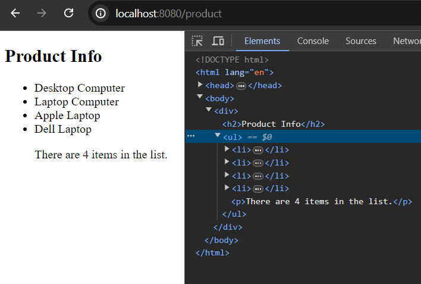

# Qute Built in Resolvers

In qute, the built in resolvers are useful features that can be used to execute certain functionally or handle side effects on the template side. 

The most common ***qute*** built in resolvers and their uses are described below:


<h2>Built in Resolvers</h2>
<ul style="list-style-type: lower-roman;">
    <li>
    <h2><a href="#elvis-operator">Elvis Operator</a></h2>
    <p>
        <b>Description:</b> Outputs the default value if the previous part
          cannot be resolved or resolves to null.
    </p>
    </li>
    <li>
        <h2><a href="#orEmpty">orEmpty</a></h2>
        <p>
          <b>Description:</b> Outputs an empty list if the previous part cannot be resolved or
          resolves to null.
        </p>
      </li>
      <li>
        <h2><a href="#ternary-operator">Ternary Operator</a></h2>
        <p>
          <b>Description:</b> Shorthand for if-then-else statement. Unlike in If Section nested
          operators are not supported.
        </p>
      </li>
      <li>
        <h2><a href="#logical-and">Logical AND Operator</a></h2>
        <p>
          <b>Description:</b> Outputs true if both parts are not falsy as described in the If
          Section. The parameter is only evaluated if needed.
        </p>
      </li>
      <li>
        <h2><a href="#logical-or">Logical OR Operator</a></h2>
        <p>
          <b>Description:</b> Outputs true if any of the parts is not falsy as described in the If
          Section. The parameter is only evaluated if needed.
        </p>
      </li>
    </ul>


<span id="elvis-operator"></span>

## Using Elvis Operator


```
//ProductService.java
Product p1 = new Product();
p1.setName("Laptop Computer");
p1.setPrice(200);

return product.data("product", p1);

//product.html
<div>
    <h2>Product Info</h2>
    <p>Name: {product.name}</p>
    <p>Price: {product.price}$</p>
</div>
```


Guess accidentally, we forget to set the value of the product name. Then, elvis operator helps us to set a default value in order to handle null value or the value that doesn't resolved (string only).

```
//ProductService.java
Product p1 = new Product();
p1.setName(null);
p1.setPrice(200);
return product.data("product", p1);

//product.html
<div>
    <h2>Product Info</h2>
    <p>Name: {product.name ?: 'Electronic Device'}</p>
    <p>Price: {product.price}$</p>
</div>
```


**Note:** Here, {product.name ?: 'Electronic Device'} can also be written via {person.name or 'John'} infix notation and that is translated to {person.name.or('John')} actually.


<span id="orEmpty"></span>

## Using orEmpty Operator

It returns an empty list if the previous part cannot be resolved or resolves to null, such as,

```
//ProductService.java
List<Product> productList = List.of(
    new Product("Desktop Computer", 700, true),
    new Product("Laptop Computer", 800, true),
    new Product("Apple Laptop", 1200, false),
    new Product("Dell Laptop", 1500, true)
);
return product.data("list", productList);

//product.html
<h2>Product Info</h2>
<ul>
    {#for item in list.orEmpty}
    <li>{item.name}</li>
    {/for}
    <p>There are {list.orEmpty.size} items in the list.</p>
</ul>
```



Now please empty the list and check out how the orEmpty method works

```
//ProductService.java
List<Product> productList = List.of(

); //the list is empty now

return product.data("list", productList);

//product.html
<h2>Product Info</h2>
<ul>
    {#for item in list.orEmpty}
    <li>{item.name}</li>
    {/for}
    <p>There are {list.orEmpty.size} items in the list.</p>
</ul>
```


<span id="ternary-operator"></span>

## Using Ternary Operator


It is shorthand for if-then-else statement. Like, if there is no product in the list we will show a temporary message or if there is product available in the list, we will show the price otherwise not.


```
//ProductService.java
List<Product> productList = List.of(
new Product("Desktop Computer", 700, true),
new Product("Laptop Computer", 800, true),
            new Product("Apple Laptop", 1200, false)
    );
return product.data("list", productList);

//product.html
 <ul>
    {#for item in list}
    <li>{item.isAvailable ? item.name : "Inactive Item"}</li>
    {/for}
</ul>
```


<span id="logical-and"></span>

## Using Logical AND Operator


```
//ProductService.java
List<Product> productList = List.of(
        new Product("Desktop Computer", 700, true),
        new Product("Laptop Computer", 800, true),
        new Product("Apple Laptop", 1200, false),
        new Product("Dell Laptop", 1500, true)
);
return product.data("list", productList);

//product.html
 <h2>Product Info</h2>
<ul>
    {#for item in list}
        {#if item.isAvailable && item.price < 1000}
            <li>Grab {item.name} for {item.price}</li>
        {/if}
    {/for}
</ul>
```


Here, in the if section, we have used logical ***AND*** operator to filter the product list. So, we only retrieve the products info that price is not only less than 1000 but also available.


<span id="logical-or"></span>

## Using Logical OR Operator


It only produces the result if one of the conditions meet up the requirements or prints truthy value. Such as,

```
//ProductService.java
List<Product> productList = List.of(
        new Product("Desktop Computer", 700, true),
        new Product("Laptop Computer", 800, true),
        new Product("Apple Laptop", 1200, false),
        new Product("Dell Laptop", 1500, true)
);
return product.data("list", productList);

//product.html
 <h2>Product Info</h2>
<ul>
    {#for item in list}
        {#if item.isAvailable || item.price < 1000}
            <li>Grab {item.name} for {item.price}</li>
        {/if}
    {/for}
</ul>
```


As none of the condition matched for apple laptop in the productList, thus it did't printed (above image).

