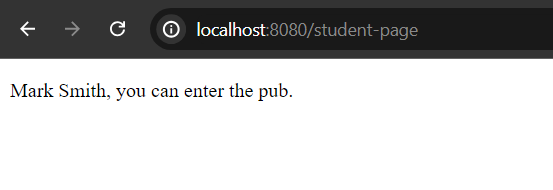
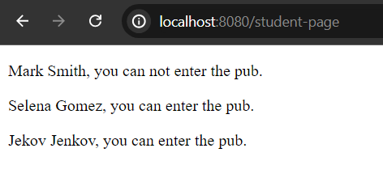

# Qute If and Else if Statement

In qute **if** or **else if** section is used to conditionally render elements specially the components data.


***Syntax:***

**some.html**

```
{#if condition}
    //code block
{/if}

//such as,
//only if block
{#if item.age > 10}
  This item is very old.
{/if}
//with additional else if block
{#if item.age > 10}
  This item is very old.
{#else if item.age > 5}
  This item is quite old.
{#else if item.age > 2}
  This item is old.
{/if}
//with optional else block (no end tag required)
{#if item.age > 10}
  This item is very old.
{#else if item.age > 5}
  This item is quite old.
{#else if item.age > 2}
  This item is old.
{/if}
```

Let's go with a simple example.

In your project, create a simple **Student.java** and **StudentResource.java** class.

**Student.java**

```
package com.company;

public class Student {
    public String name;
    public int age;

    public Student() {
    }

    public Student(String name, int age) {
        this.name = name;
        this.age = age;
    }
}
```

**StudentResource.java**

```
package com.company;

//respective packages are omitted

@Path("/")
public class StudentResource {

    @Inject
    Template student;

    @GET
    @Path("/student-page")
    @Produces
    @Consumes
    public TemplateInstance demoPage(){
        Student s1 = new Student("Mark Smith", 22);
        return student.data("student", s1);
    }
}
```

Now create a template file in **src/main/resources/templates** folder. It's name must be **student.html**.


**student.html**

```
<!DOCTYPE html>
<html lang="en">
<head>
    <meta charset="UTF-8">
    <meta name="viewport" content="width=device-width, initial-scale=1.0">
    <title>Qute Template Engine</title>
</head>
<body>
<div>
    {#if student.age >= 18}
    <p>{student.name}, you can enter the pub.</p>
    {#else if student.age lt 18} {!--lt means "<" and gt means ">"--!}
    <p>{student.name}, you can't enter the pub.</p>
    {#else}
    <p>{student.name}, you come to the wrong place.</p>
    {/if}
</div>
</body>
</html>
```

If you now start your development server and invoke the url [http://localhost:8080/student-page](http://localhost:8080/student-page) in your favourite web browser, you will see the following response, like - ***Mark Smith, you can enter the pub.***.



You can now, change the age value, yes, by doing this you will get different response based on condition.

## If Section Inside the For Section

It is overall possible to use one section into another section. Here, we are going to render list of elements conditionally.

**StudentResource.java**

```
package com.company;

//respective packages are omitted

@Path("/")
public class StudentResource {

    @Inject
    Template student;

    @GET
    @Path("/student-page")
    @Produces
    @Consumes
    public TemplateInstance demoPage(){

        List<Student> students = List.of(
                new Student("Mark Smith", 17),
                new Student("Selena Gomez", 25),
                new Student("Jekov Jenkov", 45)
        );

        return student.data("students", students);
    }
}
```

**student.html**

```
<div>
    {#for student in students}
        {#if student.age >= 18}
        <p>{student.name}, you can enter the pub.</p>
        {#else}
        <p>{student.name}, you can not enter the pub.</p>
        {/if}
    {/for}
</div>
```

If you again restart your development server and visit this url, [http://localhost:8080/student-page](http://localhost:8080/student-page) you will get the list of response conditionally, 




**Note: The following operators can also be used along side the if section.**

```
Operator	                Aliases	Precedence (higher wins)  Precedence
                            (higher wins)                     (higher wins)

logical complement                  !                              4

greater than                        gt, >                          3

greater than or equal to            ge, >=                         3

less than                           lt, <                          3

less than or equal to               le, <=                         3

equals                              eq, ==, is                     2

not equals                          ne, !=                         2

logical AND (short-circuiting)      &&, and                        1

logical OR (short-circuiting)       ||, or                         1
```

