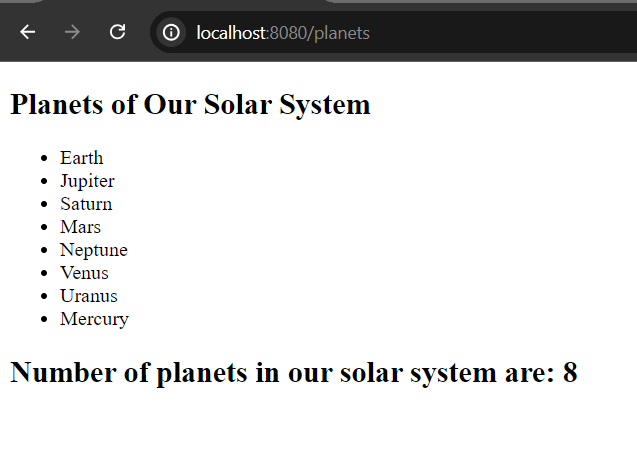

# Render List of Elements in Qute

In order to render collection of elements or iterate over elements in qute, we can use either qute for or each section.

***Using for section***

## Create Template and Resource File

First of all create a simple template file in the **resources/templates** folder. Let's name it **planet.html** file.


**planet.html**

```
<!DOCTYPE html>
<html lang="en">
<head>
    <meta charset="UTF-8">
    <meta name="viewport" content="width=device-width, initial-scale=1.0">
    <title>Qute Template Engine</title>
</head>
<body>
<div>
    <h2>Planets of Our Solar System</h2>
    <ul>
        {#for planet in planets}
            <li>{planet}</li>
        {/for}
    </ul>
    
    <h2>Number of planets in our solar system are: {planets.size}</h2>
</div>
</body>
</html>
```

Now, for resolving the template path, create a resource class and name it **PlanetResource.java** in **com.company** package. Please, don't forget to inject template path, in our case planet.html file.

**PlanetResource.java**

```
package com.company;

import io.quarkus.qute.Template;
import io.quarkus.qute.TemplateInstance;
import jakarta.inject.Inject;
import jakarta.ws.rs.Consumes;
import jakarta.ws.rs.GET;
import jakarta.ws.rs.Path;
import jakarta.ws.rs.Produces;
import jakarta.ws.rs.core.MediaType;

@Path("/")
public class PlanetResource {

    @Inject
    Template planet;

    @GET
    @Path("/planets")
    @Produces(MediaType.TEXT_HTML)
    @Consumes(MediaType.TEXT_HTML)
    public TemplateInstance planetView(){
        String [] planets = {
                "Earth", "Jupiter", "Saturn", "Mars",
                "Neptune", "Venus", "Uranus", "Mercury"
        };

        return planet.data("planets", planets);
    }
}
```

**Note:** Also true for collection type like ArrayList, Set or Map or interface like List.

## Test The Application

Now please start your development server and invoke the uri [http://localhost:8080/planets](http://localhost:8080/planets) and you will see the following response that collection of data is rendered.




***Using each section***

It is also possible to iterate collections or arrays using each section in Qute. Here, we will just update our html template file and for iterating planets array we will use each section instead of for section.

**planet.html**

```
<ul>
    {#each planets}
        <li>{it}</li>
    {/each}
</ul>
```

Note, in for section we have to define our alias like planet but in each section the alias or reference variable is already registered and that is "it".

**Syntax of for and each sections:**

```
//for section
{#for item in items}
    {item.name}
{/for} //end tag can be written: {/} only.
//each section
{#each items}
    {it.name}
{/each}
```

Okay, now if you restart your application, you will definitely get the same result. 


