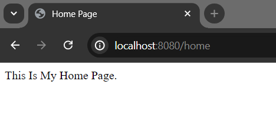
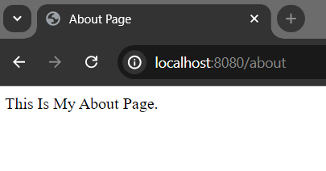
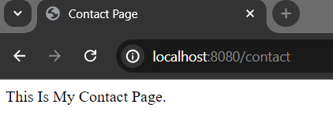
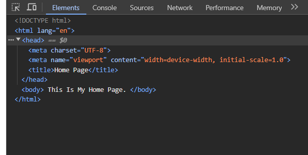

# Qute Include and Insert Section

The **include** and **insert** sections can be used to include another template and possibly override some parts of the template (see the template inheritance below). The benefit of using the include and insert sections are to reduce the repetitive code blocks or layouts and using user defined sections. Let's explore the following scenario, where we have defined a base.html template file and reuse the logic or layout across the some other template files.

**base.html**

```
<!DOCTYPE html>
<html lang="en">
<head>
    <meta charset="UTF-8">
    <meta name="viewport" content="width=device-width, initial-scale=1.0">
    <title>{#insert title} Default Title {/insert}</title>
</head>
<body>
{#insert body} Default Body {/insert} 
</body>
</html>
```

**Note:** Here, **base.html** will be used in **home**, **about** and **contact** template files respectively.


**home.html**

```
{#include base}
    {#title}Home Page{/title}
    {#body}This Is My Home Page.{/body}
{/include}

{!Note: You don't need to now use other html tags
like head, or body, they will be added automatically
!}
```
**about.html**

```
{#include base}
    {#title}About Page{/title}
    {#body}This Is My About Page.{/body}
{/include}

{!Note: You don't need to now use other html tags
like head, or body, they will be added automatically
!}
```

**contact.html**

```
{#include base}
{#title}Contact Page{/title}
{#body}This Is My Contact Page.{/body}
{/include}

{!Note: You don't need to now use other html tags
like head, or body, they will be added automatically
!}
```

Now, in order to resolve views or templates path, we have to define a resource class and inject the respective template files. Thus, create a java resource class in your project. Let's name it **ExampleResource.java**


**ExampleResource.java**

```
package com.company;

import io.quarkus.qute.Template;
import io.quarkus.qute.TemplateInstance;
import jakarta.inject.Inject;
import jakarta.ws.rs.Consumes;
import jakarta.ws.rs.GET;
import jakarta.ws.rs.Path;
import jakarta.ws.rs.Produces;
import jakarta.ws.rs.core.MediaType;

@Path("/")
public class ItemResource {

    @Inject
    Template home;
    @Inject
    Template about;
    @Inject
    Template contact;


    @GET
    @Path("/home")
    @Produces(MediaType.TEXT_HTML)
    @Consumes(MediaType.TEXT_HTML)
    public TemplateInstance getHomeView(){
        return home.data("title", "Home Page");
    }

    @GET
    @Path("/about")
    @Produces(MediaType.TEXT_HTML)
    @Consumes(MediaType.TEXT_HTML)
    public TemplateInstance getAboutView(){
        return about.data("title", "About Page");
    }

    @GET
    @Path("/contact")
    @Produces(MediaType.TEXT_HTML)
    @Consumes(MediaType.TEXT_HTML)
    public TemplateInstance getContactView(){
        return contact.data("title", "Contact Page");
    }
}
```

## Test Your Application

If you now start your development server and invoke the following urls respectively, home page - [http://localhost:8080/home](http://localhost:8080/home), about page - [http://localhost:8080/about](http://localhost:8080/about), and contact page - [http://localhost:8080/contact](http://localhost:8080/contact) you will get the following response:







One thing you probably notice here that, we reuse the base layout system across these three template files. Scenario will be shown clearly, if we access the developer console in our browser (specially - Inspect page)

So, after invoking the home url: [http://localhost:8080/home](http://localhost:8080/home) try to access the inspect page: ***right click -> click inspect***. 



You can see the, default base html layout (base.html) has been added (default html tag) automatically. It is true for about and contact page as well.

**Note:** You can also check out view source page through your browser.


## Display Title Variable 

Let's update template files so that they can access the title variable value.

**home.html**

```
{#include base}
    {#title}{title}{/title}
    {#body}This Is My Home Page.{/body}
{/include}

{!Note: You don't need to now use other html tags
like head, or body, they will be added automatically
!}
```

**about.html**

```
{#include base}
    {#title}{title}{/title}
    {#body}This Is My About Page.{/body}
{/include}

{!Note: You don't need to now use other html tags
like head, or body, they will be added automatically
!}
```

**contact**

```
{#include base}
{#title}{title}{/title}
{#body}This Is My Contact Page.{/body}
{/include}

{!Note: You don't need to now use other html tags
like head, or body, they will be added automatically
!}
```

You will get the same result like above if you again run your application.

