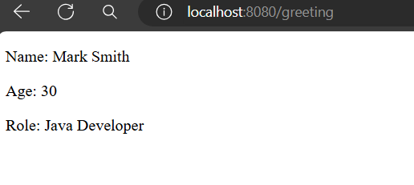

# Qute Let Section

Qute let section is used to define local variables.

**Syntax**

```
{#let name=value}
  //code block
{/let}
```

Let's define some local variables and render them using curly brackets in qute template files.

**demo.html**

```
<div>
    {#let name="Mark Smith" age=30 role="Java Developer"}
        <p>Name: {name}</p>
        <p>Age: {age}</p>
        <p>Role: {role}</p>
    {/let}
</div>
```

Output will be: 



It can also be used to create reference type local variables. Such as,

**DemoResource.java**

```
Person p1 = new Person("Mark Smith", 26, "Java Developer");
```

**demo.html**

```
<div>
    {#let name=person.name age=person.age role=person.role}
        <p>Name: {name}</p>
        <p>Age: {age}</p>
        <p>Role: {role}</p>
    {/let}
</div>
```

Yes, it will render the same result like the previous one.


**Note:** You can also use infix notation - with parenthesis, such as,

```
<div>
    {#let name=person.name age=(person.age + 10) role=person.role}
        <p>Name: {name}</p>
        <p>Age: {age}</p>
        <p>Role: {role}</p>
    {/let}
</div>
```

Now the age should be 36 than 26.


## Nested Sections

It is also possible to use other built in sections like ***if***, ***for*** sections inside let section. Such as,

**demo.html** (Updated one)

```
<div>
    {#let name=person.name age=(person.age + 10) role=person.role}
        <p>Name: {name}</p>
        <p>Age: {age}</p>
        <p>Role: {role}</p>

        {#if age >= 18}
            <p>{name}, you can vote</p>
        {#else}
            <p>{name}, you can not vote</p>
        {/if}
    {/let}
</div>
```

Now, the output would be: 


