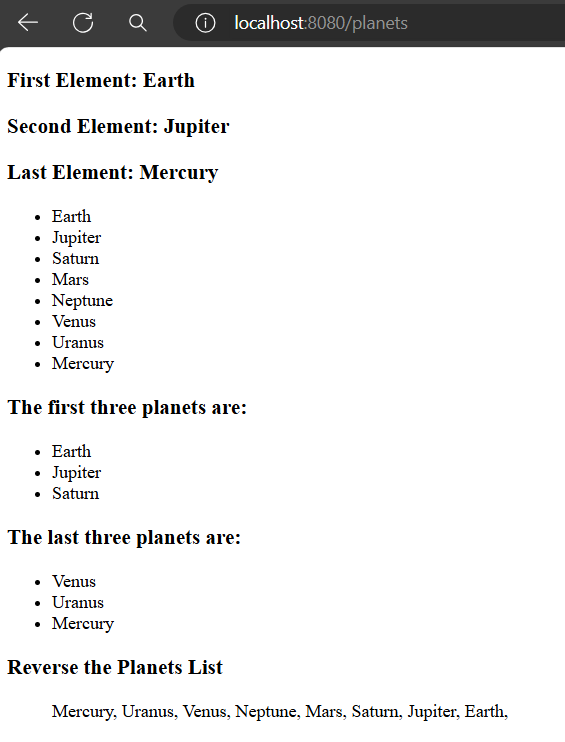

# How to work with List Type in Qute Template Engine

Similarly array or map, quarkus qute also provides built in extension methods to work with List type in the template side.

The built in list extension methods are described below:

- **get(index):** Returns the element at the specified position in a list ***{list.get(0)}***

- **reversed:** Returns a reversed iterator over a list ***{#for r in recordsList.reversed}***

- **take:** Returns the first n (natural number like: 1, 2, 3, 4,...) elements from the given list; throws an IndexOutOfBoundsException if n is out of range ***{#for r in recordsList.take(3)}***

- **takeLast:** Returns the last n elements from the given list; throws an
IndexOutOfBoundsException if n is out of range ***{#for r in recordsList.takeLast(3)}***

- **first:** Returns the first element of the given list; throws an NoSuchElementException if the list is empty ***{recordsList.first}***

- **last:** Returns the last element of the given list; throws an NoSuchElementException if the list is empty ***{recordsList.last}***
    - A list element can be accessed directly via an index: ***{list.10} or even {list[10]}***

Let's explore the above methods altogether in a simple example application.


**PlanetResource.java**

```
package com.company;

//import respective packages

@Path("/")
public class PlanetResource {

    @Inject
    Template planet;

    @GET
    @Path("/planets")
    @Produces(MediaType.TEXT_HTML)
    @Consumes(MediaType.TEXT_HTML)
    public TemplateInstance planetView(){
        
        List<String> planets = List.of(
                "Earth", "Jupiter", "Saturn", "Mars",
                "Neptune", "Venus", "Uranus", "Mercury"
        );
        
        return planet.data("planets", planets);
    }
}
```


**planet.html**

```
<!DOCTYPE html>
<html lang="en">
<head>
    <meta charset="UTF-8">
    <meta name="viewport" content="width=device-width, initial-scale=1.0">
    <title>Qute Template Engine</title>

</head>
<body>
<div>
    <h3>First Element: {planets.0}</h3> {!retrieve the first element!}
    <h3>Second Element: {planets.get(1)}</h3> {!retrieve the second element!}
    <h3>Last Element: {planets.last}</h3> {!first, last virtual method retrieve the first and last element from any list respectively!}
    {!Iterate over list using for or each section!}
    <ul>
        {#for element in planets}
        <li>{element}</li>
        {/for}
    </ul>
    {!retrieve the first n number of elements together using take(n) virtual method!}
    <h3>The first three planets are:</h3>
    <ul>
        {#for planet in planets.take(3)}
        <li>{planet}</li>
        {/for}
    </ul>

    {!retrieve the last n number of elements together using takeLast(n) virtual method!}
    <h3>The last three planets are:</h3>
    <ul>
        {#for planet in planets.takeLast(3)}
        <li>{planet}</li>
        {/for}
    </ul>

    {!using reversed method to reverse the list order!}
    <h3>Reverse the Planets List</h3>
    <ul>
        {#for planet in planets.reversed}
            {planet},
        {/for}
    </ul>
</div>
</body>
</html>
```

## Test The Application

If you start your development server and try to access the uri [http://localhost:8080/planets](http://localhost:8080/planets) in localhost, you see the implemented results,


