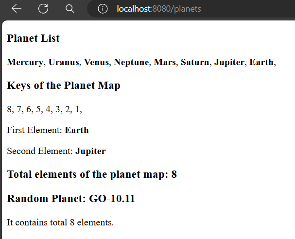

# Work with Map in Qute Template Engine

Similarly array or list collection type, quarkus qute also provides built in extension methods to work with Map collection type in the template side.

The built in Map extension methods are described below.

- **keys or keySet:** Returns a Set view of the keys contained in a map ***{#for key in map.keySet}***

- **values:** Returns a Collection view of the values contained in a map ***{#for value in map.values}***

- **size:** Returns the number of key-value mappings in a map ***{map.size}***

- **isEmpty:** Returns true if a map contains no key-value mappings ***{#if map.isEmpty}***

- **get(key):** Returns the value to which the specified key is mapped ***{map.get('foo')}***
    - A map value can be also accessed directly: ***{map.myKey}***. Use the bracket notation for keys that are not legal identifiers: ***{map['my key']}***.


Let's look at the following example application.

## Create A Resource Class

Let's name our java resource class ***PlanetResource.java*** and it is located in ***src/main/java.com.company*** package.


**PlanetResource.java**

```
package com.company;

import io.quarkus.qute.Template;
import io.quarkus.qute.TemplateInstance;
import jakarta.inject.Inject;
import jakarta.ws.rs.Consumes;
import jakarta.ws.rs.GET;
import jakarta.ws.rs.Path;
import jakarta.ws.rs.Produces;
import jakarta.ws.rs.core.MediaType;

import java.util.List;
import java.util.Map;

@Path("/")
public class PlanetResource {

    @Inject
    Template planet;

    @GET
    @Path("/planets")
    @Produces(MediaType.TEXT_HTML)
    @Consumes(MediaType.TEXT_HTML)
    public TemplateInstance planetView(){

        Map<Integer, String> map = Map.of(
                1, "Earth",
                2, "Jupiter",
                3, "Saturn",
                4, "Mars",
                5, "Neptune",
                6, "Venus",
                7, "Uranus",
                8, "Mercury"
        );
        return planet.data("planets", map);
    }
}
```

**Note:** Unlike Integer, the key can be any valid java wrapper type like, String, character or Double etc..

## Define A Template File

The template file should be located in ***resources/templates*** folder and it name must be ***planet.html*** unless you define your template path manually.


**planet.html**

```
<!DOCTYPE html>
<html lang="en">
<head>
    <meta charset="UTF-8">
    <meta name="viewport" content="width=device-width, initial-scale=1.0">
    <title>Qute Template Engine</title>

</head>
<body>
<div>
    {!get all the values using values method!}
    <h3>Planet List</h3>
    {#for value in planets.values}
    <b>{value}</b>,
    {/for}
    {!get all the keys containing in the map using keys/keySet method!}
    <h3>Keys of the Planet Map</h3>
    {#for key in planets.keySet}
        {key},
    {/for}
    {!access the values of the map using respective keys!}
    <p>First Element: <b>{planets.get(1)}</b></p>
    <p>Second Element: <b>{planets.get(2)}</b></p>
    {!Returns the number of key-value mappings in a map using size method!}
    <h3>Total elements of the planet map: {planets.size}</h3>
    {!when there is no key present set default value using getOrDefault(key, value) method!}
    <h3>Random Planet: {planets.getOrDefault(9, "GO-10.11")}</h3>
    {!how to use isEmpty method; if there is no element in the map, it returns true!}
    <div>
        {#if planets.isEmpty}
            <p>The map is empty.</p> {!just empty map, and see the difference!}
            {#else}
            <p>It contains total {planets.size} elements.</p>
        {/if}
    </div>
</div>
</body>
</html>
```

## Test the Application

Now it's time run our example application. Just click the run button from your ide (recommended to use VS Code or IntelliJ) and if everything is going well you can access your application using this port [http://localhost:8080](http://localhost:8080). Now invoke the uri [http://localhost:8080/planets](http://localhost:8080/planets) from your web browser and you will see the following result.



