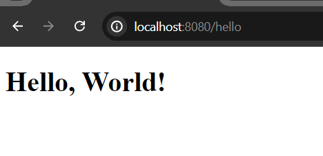
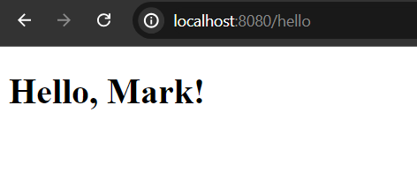

# Qute Simple Example

Qute is a template engine designed specifically to meet the Quarkus needs. The usage of reflection is minimized to reduce the size of native images. It helps to create dynamic java based database driven web applications. In this example, we will see how to integrate qute template dependency in our current quarkus application and render simple custom greeting message.

***Steps that we can follow:***

1. Open the Quarkus Current project in any Ide like IntelliJ Ide or VS Code.

2. Now click on **pom.xml** file or **gradle.build** file (in my case, **pom.xml** file) and add one of the following dependency based on compatibility and reload the project to resolve the newly added extensions.

**pom.xml**

```
<!--compatible for quarkus-rest or quarkus-rest-jackson (reactive)-->
<dependency>
    <groupId>io.quarkus</groupId>
    <artifactId>quarkus-rest-qute</artifactId>
</dependency>

<!--while your serving your templates over http, also works for rest-->
<dependency>
    <groupId>io.quarkiverse.qute.web</groupId>
    <artifactId>quarkus-qute-web</artifactId>
</dependency>
```

3. Qute template files actually located in **src/main/resources/templates** folder or nested folder. There are two ways you can define your template path definition. Raw template files located in templates folder, and the other one is **Type-safe-template** path is defined by the Template instance method. 

However, create a simple html template file in **src/main/resources/templates** folder and name it **hello.html** file. If there is no templates folder yet, please create templates folder in **src/main/resources** folder.

**hello.html**

```
<!DOCTYPE html>
<html lang="en">
<head>
    <meta charset="UTF-8">
    <meta name="viewport" content="width=device-width, initial-scale=1.0">
    <title>Qute Template Engine</title>
</head>
<body>
<h1>Hello, World!</h1>
</body>
</html>
```

4. Now we have to resolve the **hello.html** template path. So, create a simple **HelloResource.java** class file in **src/main/java/com.company** folder. Here, we have to **@Inject** Template and use the template path name (in our case, hello.html file). Additionally, we have to use the **TemplateInstance** method to create raw components data to use in template files. 


**HelloResource.java**

```
package com.company;

import io.quarkus.qute.Template;
import io.quarkus.qute.TemplateInstance;
import jakarta.inject.Inject;
import jakarta.ws.rs.Consumes;
import jakarta.ws.rs.GET;
import jakarta.ws.rs.Path;
import jakarta.ws.rs.Produces;
import jakarta.ws.rs.core.MediaType;

@Path("/hello")
public class HelloResource {

    //inject the template (hello.html)
    @Inject
    Template hello;

    //define TemplateInstance
    @GET
    @Produces(MediaType.TEXT_HTML)
    @Consumes(MediaType.TEXT_HTML)
    public TemplateInstance getGreeting(){
        return hello.data("name", "Mark");
    }
}
```

5. Now start your development server and it will run on port 8080 by default in localhost. So, open [http://localhost:8080/hello](http://localhost:8080/hello) in your favourite web browser and you will see a simple Hello, World! message.



6. Let's access the name variables. Qute has a built in variable expression or syntax that is like curly brackets.


```
//variable expression
{...}

//if you have a name variable in your components then you can access it's value
hello.data("name", "Mark");
Hello, {name} - //renders Hello, Mark
```

So, update your **hello.html** file to access the name variable.

**hello.html**

```
<h1>Hello, {name}!</h1>
```

Now if you again invoke the url [http://localhost:8080/hello](http://localhost:8080/hello) in your web browser, you will get the following response.



**Note:** Just reload or refresh page, don't have to restart your application to reflect the changes.

## How to Define Templates in Type-Safe Way

