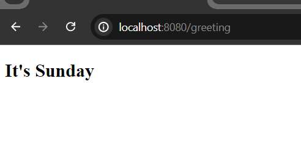
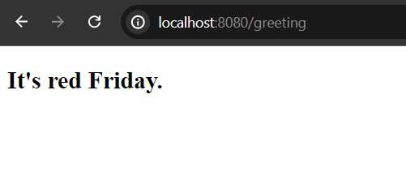

# Qute When Section

Qute when section is similar to Java’s switch or Kotlin’s when statements. It matches a tested value against all blocks sequentially until a condition is satisfied. The first matching block is executed. All other blocks are ignored (this behavior differs to the Java switch where a break statement is necessary).


**Syntax:**

```
{#when value}
    {#is case 1}
    //code block to render
    {#is case 2}
    //code block to render
    ...
    {#else} 
    //code block will always render if none matched
{/when}

//java's switch/case syntax is also supported
{#switch value}
    {#case case 1}
    //code block to render
    {#case case 2}
    //code block to render
    ...
{/switch}
```

**Note:** It is always recommended to use java's switch/case block inside the service or resources class instead of inside the template files. But, it depends on requirements.


Let's see an example of using qute when section.


**GreetingResource.java**

```
package com.company;

import io.quarkus.qute.Template;
import io.quarkus.qute.TemplateInstance;
import jakarta.inject.Inject;
import jakarta.ws.rs.Consumes;
import jakarta.ws.rs.GET;
import jakarta.ws.rs.Path;
import jakarta.ws.rs.Produces;
import jakarta.ws.rs.core.MediaType;


@Path("/")
public class GreetingResource {

    @Inject
    Template greeting;


    @GET
    @Path("/greeting")
    @Produces(MediaType.TEXT_HTML)
    @Consumes(MediaType.TEXT_HTML)
    public TemplateInstance greetingView(){

        String dayOfTheWeek = "Sunday";

        return greeting.data("day", dayOfTheWeek);
    }
}
```

Now in the templates folder create **greeting.html** template file.

**greeting.html**

```
<!DOCTYPE html>
<html lang="en">
<head>
    <meta charset="UTF-8">
    <meta name="viewport" content="width=device-width, initial-scale=1.0">
    <title>Qute Template Engine</title>
</head>
<body>
<div>
    {#when day}
        {#is "Sunday"}
        <h2>It's Sunday</h2>
        {#is "Friday"}
        <h2>It's Friday</h2>
        {#is "Wednesday"}
        <h2>It's Wednesday</h2>
        {#else}
        <h2>It's red Friday.</h2>
    {/when}
</div>
</body>
</html>
```

If you now start your development server and invoke the uri [http://localhost:8080/greeting](http://localhost:8080/greeting) you will see the following response.



As our value is, Sunday and it matched the first case block (here "is" block), so rest of the code block will not be checked.

What if we set the value something else than day name of the week? Now it will only print else block. Such as, I set

```
String dayOfTheWeek = "Hot Day";
```

So response will definitely be the following one -




**The following operators are supported in is/case block conditions:**

```
Operator	Aliases	            Example

not equal   !=, not, ne         {#is not 10},{#case != 10}

greater than    gt, >           {#case le 10}

greater than    ge, >=           {#is >= 10}
or equal to                      

less than      lt, <            {#is < 10}

less than      le, <=
or equal to                     {#case le 10}

in              in              {#is in 'foo' 'bar' 'baz'}

not in          ni,!in          {#is !in 1 2 3}
```

**Note:** There are few known limitations in when section, so better to use java's switch/case block.