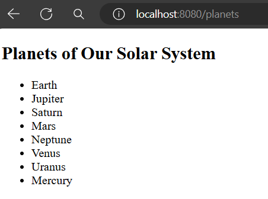
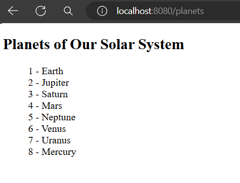

# Render Collection of Elements in Qute

In qute, we can use **for** or **each** loop sections in order to iterate arrays or collection types like list, set or map.

**Note:** An implicit alias ***it*** is registered always when you use **each** section instead of **for** section. Thus, no need to use any alias, such as

**Syntax:**

```
//when you use for
{#for item in items} //item is an alias
    {item.name}
{/for}
//when you use each
{#each items} //no alias required
    {it.name} //implicit it alias
{/each}
```

Let's see an example where we will try to display list of values using for section.

**PlanetResource**

```
package com.company;

//respective packages

@Path("/")
public class PlanetResource {

    @Inject
    Template planet;

    @GET
    @Path("/planets")
    @Produces(MediaType.TEXT_HTML)
    @Consumes(MediaType.TEXT_HTML)
    public TemplateInstance planetView(){
        List<String> planets = List.of(
            "Earth", "Jupiter", "Saturn", "Mars",
            "Neptune", "Venus", "Uranus", "Mercury"
        );
        
        return planet.data("planets", planets);
    }
}
```

**planet.html**

```
<!DOCTYPE html>
<html lang="en">
<head>
    <meta charset="UTF-8">
    <meta name="viewport" content="width=device-width, initial-scale=1.0">
    <title>Qute Template Engine</title>
</head>
<body>
<div>
    <h2>Planets of Our Solar System</h2>
    <ul>
        {#for planet in planets}
            <li>{planet}</li>
        {/for}
    </ul>
</div>
</body>
</html>
```

Now, start your development server and invoke the uri [http://localhost:8080/planets](http://localhost:8080/planets) in your favourite web browser. If everything is going well, you will see that the planets list has been rendered.



## Accessing Iteration Metadata

The following keys are valid to use in the loop as well in order to access the iteration metadata. Such as,


```
count - 1-based index

index - zero-based index

hasNext - true if the iteration has more elements

isLast - true if hasNext == false

isFirst - true if count == 1

odd - true if the element’s count is odd

even - true if the element’s count is even

indexParity - outputs odd or even based on the count value
```

**Note:** However, the keys cannot be used directly. Instead, a prefix is used to avoid possible collisions with variables from the outer scope. By default, the alias of an iterated element suffixed with an underscore is used as a prefix. For example, the hasNext key must be prefixed with it_ inside an **{#each}** section: **{it_hasNext}**.

Let's how to use **count** key method in for section.

**planet.html**

```
<h2>Planets of Our Solar System</h2>
<ul>
    {#for planet in planets}
        <li style="list-style: none">{planet_count} - {planet}</li>
    {/for}
</ul>
```

If you again access this uri [http://localhost:8080/planets](http://localhost:8080/planets) you will see planet list with one based index. 



Thanks.

