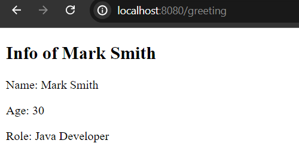
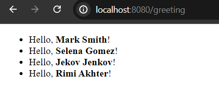

# Qute Variable Expression

In order to render simple variable value in qute template engine, we use curly brackets in the template side. Like,

```
{variable_name}
//guess, you have a variable called name
//and you want to render it's value
String name = "Mark Smith"; //reside in .java file
Hello, {name}! //reside in .html template file
//output: Hello, Mark Smith!
```

Let's explore a simple Example:

Create a simple **GreetingResource.java** file in your application and create a **greeting.html** template file in the **resources/templates** folder.


**GreetingResource.java**

```
package com.company;

import io.quarkus.qute.Template;
import io.quarkus.qute.TemplateInstance;
import jakarta.inject.Inject;
import jakarta.ws.rs.Consumes;
import jakarta.ws.rs.GET;
import jakarta.ws.rs.Path;
import jakarta.ws.rs.Produces;
import jakarta.ws.rs.core.MediaType;

@Path("/")
public class GreetingResource {

    @Inject
    Template greeting;


    @GET
    @Path("/greeting")
    @Produces(MediaType.TEXT_HTML)
    @Consumes(MediaType.TEXT_HTML)
    public TemplateInstance greetingView(){
        String name = "Mark Smith";
        int age = 30;
        String role = "Java Developer";

        return greeting.data(
                "name", name,
                "age", age,
                "role", role
        ); 
    }
}
```

Now create the template file named **greeting.html** and it must be located in **resources/templates** folder.

```
<!DOCTYPE html>
<html lang="en">
<head>
    <meta charset="UTF-8">
    <meta name="viewport" content="width=device-width, initial-scale=1.0">
    <title>Qute Template Engine</title>
</head>
<body>
<div>
    <h2>Info of {name}</h2>
    <div>
        <p>Name: {name}</p>
        <p>Age: {age}</p>
        <p>Role: {role}</p>
    </div>
</div>
</body>
</html>
```

Now, start your development server and if you now invoke the greeting uri from your favourite web browser you will see the following response.



Variable expression can also be used together with other built in expressions or syntax in qute part like if, for or each sections. Guess you want to print list of greeting messages and thus we will mix for section and variable expression together to display the greetings. Such as,

**GreetingResource.java** (updated)

```
package com.company;

//respective packages

import java.util.List;

@Path("/")
public class GreetingResource {

    @Inject
    Template greeting;


    @GET
    @Path("/greeting")
    @Produces(MediaType.TEXT_HTML)
    @Consumes(MediaType.TEXT_HTML)
    public TemplateInstance greetingView(){
        List<String> greetingList = List.of(
                "Mark Smith",
                "Selena Gomez",
                "Jekov Jenkov",
                "Rimi Akhter"
        );
        return greeting.data("greetings", greetingList);
    }
}
```

**greeting.html** (updated)

```
<div>
    <ul>
        {#for greeting in greetings}
        <li>Hello, <b>{greeting}</b>!</li>
        {/for}
    </ul>
</div>
```

Please restart your application now (though it is not required as hot reloaded service is added automatically) and if you invoke the uri [http://localhost:8080/greeting](http://localhost:8080/greeting) you will see list of greeting messages.



So, variable expression is very useful expression in qute template engine, that you will use most of the time to render content into the view.

Thanks.

