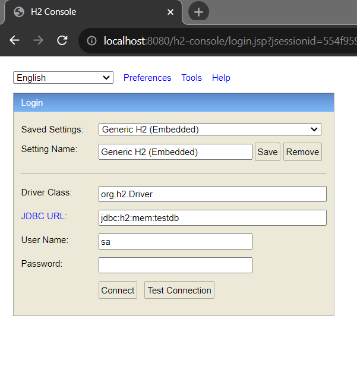
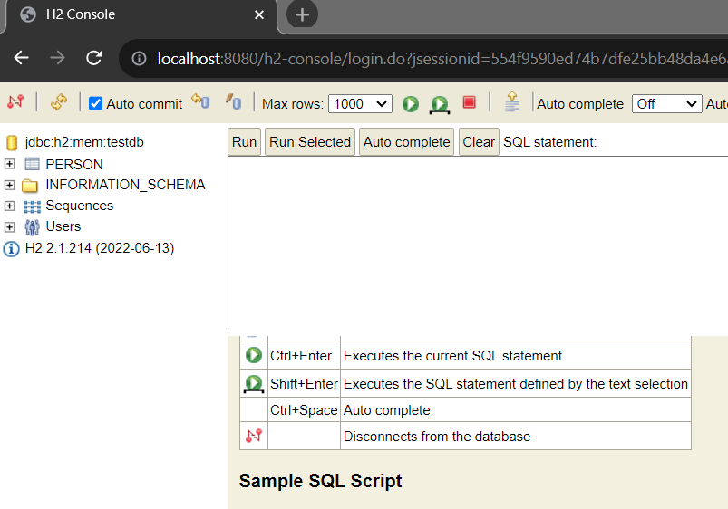
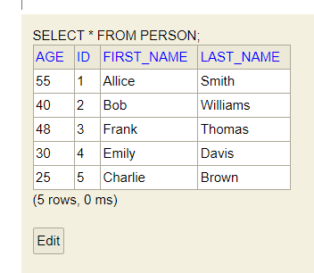

# Accesssing Data with Spring Data JPA

In this tutorial we are going to build a simple Spring data jpa applicaton that stores person data to the in-memory database (h2) and retrive the person data. For storing and retriving the person data we use here spring data jpa.

## What You Need to Build a simple Spring Boot Project

Initial Requirements:
    - JavaSE version: 8+
    - Maven or Gradle as a build tool
    - Maven version: 3.6.3+
    - Gradle version: 7.5+
    - And IDE that support Java and maven/gradle: Like Intellij Ide, Eclipse or VS code.


Let's follow the belew steps to bootstrap our simple Spring Boot application.

1. Open https://start.spring.io/ and provide necessary information to create spring boot project. The project will be a .zip file and we have to unzip it in a directory to work with it.

Now in this page, Select 
    - Maven as a build tool (you can select gradle too)
    - Java as a language
    - Spring Boot version 3.0.12 (or the latest version)
    - In the Project Metadata section, provide your application group, artifact, package name etc. Note: The group and package name will be same. Also the artifact and name of your project will be same as well (Not mendatory). 
    - Then, select jar for packaging (for simplicity) and select the java language version. The java language version I use is 17. You can choose 8, 11 or the latest LTS version.
    - The last step is to adding dependencies. As we create a spring data jpa application and use h2 in-memory database to store our person data, we need to add spring web, sprin data jpa and h2 database as dependency in our classpath. After adding the the required dependencies click on Generate button. It will create a simple zip file (the zip file name is your project name)

2. After generating the .zip file now unzip it to any director. 

3. Import the unzip spring-boot-example project into your favourite Ide.

Eclipse: Open your Eclipse (STS) ide. File > Import > Maven > Existing Maven projects > Next > Browse your spring boot project (Reside our example spring boot project) > Click Finish. Please wait few seconds to complete the whole process and resolving the maven dependencies.

Intellij Ide: Open your Intellij Ide, then File > Open > Browse the existing spring boot project > Clikc Ok. Likewise eclipse, wait few seconds to resolve maven/Gradle dependencies. 

4. After importing the project successfully, you will see the file structure like below


Here, the SpringBootExampleApplication.java is our root file where the main method resides.

5. Creating a Person.java model class in com.company.model pacakge. And it contains id, first name, last name and age properties and a public constructor, getter and setter methods as well. As the person class is the persistent class, we have to annotate it by @Entity annotation and the primary key id should be annotated with @Id annotation. Here the properties name will be the column name in our database table. We can override the column name by @Column(value) annotation. Remember entities must require pirmary key (id) and no-arg constructor.

```js
package com.company.model;

import jakarta.persistence.*;

@Entity
@Table(name = "person")
public class Person {
    @Id
    @GeneratedValue(strategy = GenerationType.AUTO)
    private int id;
    private String first_name;
    private String last_name;
    private int age;
    
    //no-arg constructor
      public Person() {
        super();
    }

    //constructor, getter and setter methods
}

```

Note: Creating constructor, getter and setter methods are very easy in Intellij Ide. Right clik on the Person.java class file > Generate > Constructor/Getter or Setter > Select All > Clik Ok or use the shortcut Alt+Insert to generate constructor, getter or setter methods for your pojo class. 

6. Now, create PersonRepository.java interface in com.company.repository package. The PersonRepository interface extends CrudRepository interface that will be responsible to store and the retrive the Person entity data. 

```js
package com.company.repository;

import com.company.model.Person;
import org.springframework.data.repository.CrudRepository;

public interface PersonRepository extends CrudRepository<Person, Integer> {
}

```
Here the Person is the domain name and integer is the type of the person domain.

Know more: 
    - CrudRepository
    - JpaRepository
    - PagingAndSortingRepository
    - ListCrudRepository

7. Now, create a PerosnPersistent.java class in com.company.persistence (or dao) package to create few demo person data and call the spring data jpa save(perist in jpa) to save our person demo data into h2 in-memory database. Alos here we will implemetn CommandLineRunner interface bean and invoke it's start method so that our person data has been stored to database when the application launces.

```js
package com.company.persistence;


import com.company.model.Person;
import com.company.repository.PersonRepository;
import org.springframework.beans.factory.annotation.Autowired;
import org.springframework.boot.CommandLineRunner;

import java.util.List;

@Component
public class PersonPersistent implements CommandLineRunner {

    @Autowired
    public PersonRepository personRepository;
    @Override
    public void run(String... args) throws Exception {

        Person p1 = new Person(1, "Allice", "Smith", 55);
        Person p2 = new Person(2, "Bob", "Williams", 40);
        Person p3 = new Person(3, "Frank", "Thomas", 48);
        Person p4 = new Person(4, "Emily", "Davis", 30);
        Person p5 = new Person(5, "Charlie", "Brown", 25);

        //save the person objects
        personRepository.save(p1);
        personRepository.save(p2);
        personRepository.save(p3);
        personRepository.save(p4);
        personRepository.save(p5);

        /* instead of writing save method for individual person object
        * invoke the saveAll(List.of(p1,p2,p3,p4,p5)); to save
        * all the person objects to database
        * */
    }
}

```

8. At last, we have to add our h2 in-memory database information in application.properties file. It is located in the resources folder in your application. Just add the folling database info. (Recall, we add our database info in persistence.xml file while developing jpa based application)

```js
spring.datasource.url=jdbc:h2:mem:testdb
spring.datasource.driverClassName=org.h2.Driver
spring.datasource.username=sa
spring.datasource.password=
spring.jpa.database-platform=org.hibernate.dialect.H2Dialect
#enabling the H2 console
spring.h2.console.enabled=true
```

Now, run the example application (stop the application if it already runs on port 8080 then, run it again) If the application runs succesfully, you will see the example applicaton runs on port 8080 

9. So, open your favourite web browser and invoke the url http://localhost:8080/h2-console. And then a new login window will appear. 



Click on connect button. And you see then the following window



Here you can see in the left side Perosn table has been created. If you now write the folling commnand 

```js
SELECT * FROM PERSON ;
```
You will get the folling output:



It means, our Person data has been successfully persisted into h2 in-memory database. 

One more thing, let's use logger to output the peroson data into console. We will just add logger in PersonPersistent.java class and call the Spring data jpa built-in findById and findByLastName query mehtods. Also we have to add the findByLastName and findById built-in query methods in the repository class.

Open your PersonRepository.java class and add these two lines 

```js
List<Person> findByLastName(String last_name);
Person findById(int id);
```

Then, open PersonPersistent.java class and create Logger and invoke the query methods you have just created. Let's look over the updated PersonPersistent.java class belwo

```js
package com.company.persistence;


import com.company.SpringBootExampleApplication;
import com.company.model.Person;
import com.company.repository.PersonRepository;
import org.slf4j.Logger;
import org.slf4j.LoggerFactory;
import org.springframework.beans.factory.annotation.Autowired;
import org.springframework.boot.CommandLineRunner;
import org.springframework.stereotype.Component;

@Component
public class PersonPersistent implements CommandLineRunner {

    @Autowired
    public PersonRepository personRepository;

    private static final Logger logger = LoggerFactory.getLogger(SpringBootExampleApplication.class);
    @Override
    public void run(String... args) throws Exception {

        Person p1 = new Person(1, "Allice", "Smith", 55);
        Person p2 = new Person(2, "Bob", "Williams", 40);
        Person p3 = new Person(3, "Frank", "Thomas", 48);
        Person p4 = new Person(4, "Emily", "Davis", 30);
        Person p5 = new Person(5, "Charlie", "Brown", 25);

        //save the person objects
        personRepository.save(p1);
        personRepository.save(p2);
        personRepository.save(p3);
        personRepository.save(p4);
        personRepository.save(p5);

        /* instead of writing save method for individual person object
        * invoke the saveAll(List.of(p1,p2,p3,p4,p5)); to save
        * all the person objects to database
        * */

        //fetch all Person data
        logger.info("Fetch All person data using findAll()");
        logger.info("------------------------------");
        personRepository.findAll().forEach(person -> {
            logger.info(person.toString());
        });
        logger.info(" ");
        //fetch person by id
        logger.info("Fetch Individual Person data using findById()");
        logger.info("------------------------------");
        Person person1 = personRepository.findById(1);
        logger.info(person1.toString());
        logger.info(" ");

        //fetch person by lastName
        logger.info("Fetch person using findByLastName()");
        logger.info("------------------------------");
        personRepository.findByLastName("Brown").forEach(lastName ->{
            logger.info(lastName.toString());
        });

        logger.info(" ");
    }
}

```

In the console you will get like this after running the application again 

```js
: Fetch All person data using findAll()
: ------------------------------
: Person[id=1, first_name='Allice', lastName='Smith', age=55]
: Person[id=2, first_name='Bob', lastName='Williams', age=40]
: Person[id=3, first_name='Frank', lastName='Thomas', age=48]
: Person[id=4, first_name='Emily', lastName='Davis', age=30]
: Person[id=5, first_name='Charlie', lastName='Brown', age=25]
:  
: Fetch Individual Person data using findById()
: ------------------------------
: Person[id=1, first_name='Allice', lastName='Smith', age=55]
:  
: Fetch person using findByLastName()
: ------------------------------
: Person[id=5, first_name='Charlie', lastName='Brown', age=25]
:  
```

You have successfully console the person data using LoggerFactory.

Note: Litttle bug I have faced when calling findLastName() method. It resolves when I change the property last_name to LastName; 
So, it will be better to create all of your string properties camelCase like fistName, lastName or vice varsa.

