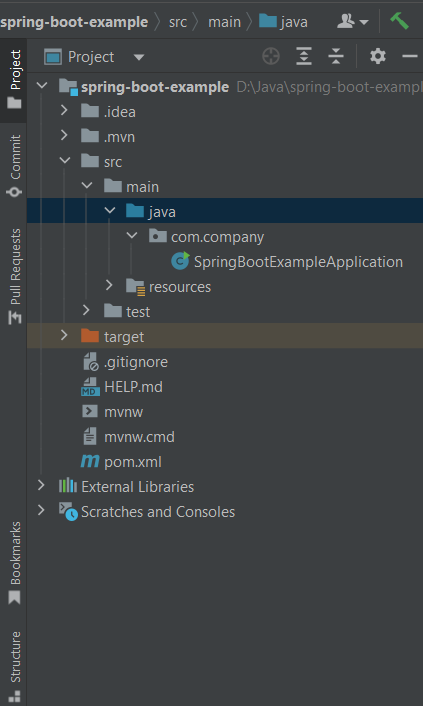

# Spring Boot Rest Api Example Application

In this tutorial we we will demonstrate how to create a simple rest api application using Spring Boot. For creating this application we need spring-boot-starter-web dependency in our classpath.

**Initial Requirements:**

    - JavaSE: 8+
    - Maven : 3.3.9+
    - An IDE: (Eclipse or Intellij ide, You can use STS too)
    - Spring Boot: 3.1.2

Let's use the following steps to develop a simple Customer rest application.

**Step 1:** Open Spring Initializer. Visit here: [https://start.spring.io/](https://start.spring.io/) for creating spring boot application.


**Step 2:** As it will be a Maven based project and we use Java as a language. Spring Boot version should be 3.1.2 or vice versa.

**Step 3:** In the Project Metadata section provide Group and Artifact name. 
<b>Group: com.javaondemand</b>
<b>Artifact: spring-boot-example</b> (at the end Application will be added)

Here, Group name will be the package name and Artifact name will be the name of your project. We use jar as a packaging and java version 17. You can use java 8, 11 too.


**Step 4:** Now we add dependency. As we create a simple rest api, just add **Spring Web** dependency.

**Step 5:** Click on Generate button. It will generate your a zip file. Then, unzip or extract the spring-boot-example.zip file to any directory, remember the location. Later we will import it into our IDE.

**Step 6:** Open your favourite Ide. In my case Intellij Ide. Import the spring-boot-example application into your favourite Ide. 

**IntelliJ:** File -> Open -> Select the project folder -> Ok (finish) It will now open your project in the current window or new window. Remember your project location you have just downloaded or extracted.

**Eclipse:** File -> Import -> Existing Maven Project -> Next -> Browse (you have just download and extracted) -> Select the project folder (spring-boot-example) -> Finish 

**Note:** When you Generate the spring-boot-example project, it is a .zip file. The file name should be **spring-boot-example.zip** file. You must unzip or extract it to somewhere in order to import it into your ide okay. 


**Step 7:** After successfully importing the spring boot example project, please wait few seconds to resolve the maven dependencies. Then, you see the following project directory in your ide. 



**Step 8:** Run the **SpringBootExampleApplication.java** class. And see the application is running or not. 

If the application runs successfully, you see the following console message:

```

2023-08-26T10:49:58.494+06:00  INFO 1640 --- [           main] o.s.b.w.embedded.tomcat.TomcatWebServer  : Tomcat started on port(s): 8080 (http) with context path ''
2023-08-26T10:49:58.503+06:00  INFO 1640 --- [           main] c.j.SpringBootExampleApplication         : Started SpringBootExampleApplication in 4.012 seconds (process running for 4.812)
2023-08-26T10:50:11.796+06:00  INFO 1640 --- [nio-8080-exec-1] o.a.c.c.C.[Tomcat].[localhost].[/]       : Initializing Spring DispatcherServlet 'dispatcherServlet'
```

Okay, please terminate(stop) the the application and now we will implement our rest api.

**Step 9:** Create a package called model in the **src/main/java/com/javaondemand** folder. 

**Step 10:** Create a model class **Customer.java** in the **src/main/java/com/javaondemand/model** folder.


**Step 11:** Now, in **Customer.java** class provide few properties, customer id, first_name, last_name and city. It also contains no-arg constructor, getter and setter methods. You can generate constructor, getter and setter methods by right clicking on your mouse-> Generate or use Alt+Insert shortcut.


```
package com.javaondemand.model;

public class Customer {
    private int id;
    private String first_name;
    private String last_name;
    private String city;

    public Customer() {
    }

    public Customer(int id, String first_name, String last_name, String city) {
        this.id = id;
        this.first_name = first_name;
        this.last_name = last_name;
        this.city = city;
    }

    public int getId() {
        return id;
    }

    public void setId(int id) {
        this.id = id;
    }

    public String getFirst_name() {
        return first_name;
    }

    public void setFirst_name(String first_name) {
        this.first_name = first_name;
    }

    public String getLast_name() {
        return last_name;
    }

    public void setLast_name(String last_name) {
        this.last_name = last_name;
    }

    public String getCity() {
        return city;
    }

    public void setCity(String city) {
        this.city = city;
    }
}

```

**Step 12:** Create a Customer service class **CustomerService.java** in the **src/main/java/com/javaondemand/service** (com.javaondemand.service) package. 

Here, we annotate the **CustomerService.java** class by @Service annotation and create findAll() method. Here we have added few customer details. 


```
package com.javaondemand.service;

import com.javaondemand.model.Customer;
import org.springframework.stereotype.Service;

import java.util.ArrayList;
import java.util.List;


@Service
public class CustomerService {

    public List<Customer> findAll(){
        //create a list interface
        List<Customer> customers = new ArrayList<>();

        //add list of customers
        customers.add(new Customer(101, "Shakil", "Ahmed", "Dhaka"));
        customers.add(new Customer(102, "Edanur", "Giesler", "Braunau"));
        customers.add(new Customer(103, "Raphael", "Wackm", "Gampem"));
        customers.add(new Customer(104, "Tamina", "Muncher", "Hintertal"));
        customers.add(new Customer(105, "Jannis", "Arcilla", "Deba Habe"));
        customers.add(new Customer(106, "Lino", "Bozovich", "El Alto"));
        customers.add(new Customer(106, "Vanesa", "Lukach", "Dunadee"));

        //return customers
        return customers;
    }

}

```

**Step 13:** Now create controller class in the <b>src/main/java/com/javaondemand/controller</b> package <b>CustomerController.java</b> and annotate this class by @RestController annotation. 

We have to Autowired (somehow Inject) the <b>CustomerService.java</b> class here.

We also use rest api related verbs **@GetMapping** annotation to provide the url where we get all the customer details. The output will be json format. And, getCustomers method returns all the customer details.

```

package com.javaondemand.controller;

import com.javaondemand.model.Customer;
import com.javaondemand.service.CustomerService;
import org.springframework.beans.factory.annotation.Autowired;
import org.springframework.web.bind.annotation.GetMapping;
import org.springframework.web.bind.annotation.RestController;

import java.util.List;

@RestController
public class DemoController {

    @Autowired
    private CustomerService customerService;

    @GetMapping("/customers")
    public List<Customer> getCustomers(){
        return customerService.findAll();
    }
}

```

**Step 14:** Run the **SpringBootExample.java main class file. And your application should run on port 8080. Open your favourite browser and type [http://localhost/customers](http://localhost/customers) url and you see the following output.

//image

If you invoke the GET request in postman, cURL or using apiDog you will get the same result as well.

Open postman (if you have already installed it) 

Configure the Body and invoke the url: [http://localhost/customers](http://localhost/customers) and use GET request.

You will get the same result: (json format)


```
[
    {
        "id": 101,
        "first_name": "Shakil",
        "last_name": "Ahmed",
        "city": "Dhaka"
    },
    {
        "id": 102,
        "first_name": "Edanur",
        "last_name": "Giesler",
        "city": "Braunau"
    },
    {
        "id": 103,
        "first_name": "Raphael",
        "last_name": "Wackm",
        "city": "Gampem"
    },
    {
        "id": 104,
        "first_name": "Tamina",
        "last_name": "Muncher",
        "city": "Hintertal"
    },
    {
        "id": 105,
        "first_name": "Jannis",
        "last_name": "Arcilla",
        "city": "Deba Habe"
    },
    {
        "id": 106,
        "first_name": "Lino",
        "last_name": "Bozovich",
        "city": "El Alto"
    },
    {
        "id": 106,
        "first_name": "Vanesa",
        "last_name": "Lukach",
        "city": "Dunadee"
    }
]
```


Thanks for reading this article.

Talk Soon,<br/>