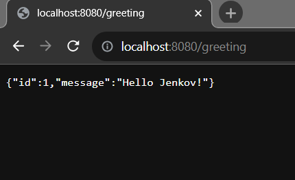
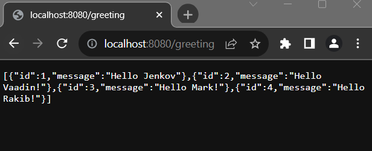

# Developing a Simple Greeting Restful web service in Spring Boot

## What You Need to Build a simple Spring Boot Project

Initial Requirements:
    - JavaSE version: 8+
    - Maven or Gradle as a build tool
    - Maven version: 3.6.3+
    - Gradle version: 7.5+
    - And IDE that support Java and maven/gradle: Like Intellij Ide, Eclipse or VS code.


Let's follow the belew steps to bootstrap our simple Spring Boot application.

1. Open https://start.spring.io/ and provide necessary information to create spring boot project. The project will be a .zip file and we have to unzip it in a directory to work with it.

Now in this page, Select 
    - Maven as a build tool (you can select gradle too)
    - Java as a language
    - Spring Boot version 3.0.12 (or the latest version)
    - In the Project Metadata section, provide your application group, artifact, package name etc. Note: The group and package name will be same. Also the artifact and name of your project will be same as well (Not mendatory). 
    - Then, select jar for packaging (for simplicity) and select the java language version. The java language version I use is 17. You can choose 8, 11 or the latest LTS version.
    - The last step is adding dependencies. As we create a simple Greeting restful web service, we just need to add spring web dependency in our classpath. After adding the spring web dependency click on Generate button. It will create a simple zip file (the zip file name is your project name)

2. After generating the .zip file now unzip it to any director. 

3. Import the unzip spring-boot-example project into your favourite Ide.

Eclipse: Open your Eclipse (STS) ide. File > Import > Maven > Existing Maven projects > Next > Browse your sping boot project (Reside our example spring boot project) > Click Finish. Please wait few seconds to complete the whole process and resolving the maven dependencies.

Intellij Ide: Open your Inellij Ide, then File > Open > Browse the existing spring boot project > Clikc Ok. Likewise eclipse, wait few seconds to resolve maven/Gradle dependencies. 

4. The project folder structure should be like this.


The SpringBootExampleApplication is our main class file and it contains the main mehtod.

5. Now create a simple Greeting.java pojo class in the com.company.model package. The Greeting class contains id and message property. We then add constructor, getter and seetter methods as well.

```js
package com.company.model;

import java.util.StringJoiner;

public class Greeting {
    private int id;
    private String message;

    public Greeting(int id, String message) {
        this.id = id;
        this.message = message;
    }

    public int getId() {
        return id;
    }

    public void setId(int id) {
        this.id = id;
    }

    public String getMessage() {
        return message;
    }

    public void setMessage(String message) {
        this.message = message;
    }

    @Override
    public String toString() {
        return new StringJoiner(", ", Greeting.class.getSimpleName() + "[", "]")
                .add("id=" + id)
                .add("message='" + message + "'")
                .toString();
    }
}

```

6. Now create GreetingController.java file in com.company.controller package. The spring boot approach is that to handle rest requests (like get or post) we create controller class to handle rest requests.
In this class, we create a method printGreeting and annotate it by GetMapping annotation thus we can handle get request and can able to set the uri like GetMapping("/greeting"). We can also write @RequestMapping(value = "/greeting", method = RequestMethod.GET) it means the GetMapping is the simpliest approach to the @RequestMapping(...). Additionally, as we handle rest request and want to build Greeting restful web service that produces simple greeing message when you invoke or send the request to the server, thus we have to annotahe the GreetingController class by @RestController class. 

```js
package com.company.controller;

import com.company.model.Greeting;
import org.springframework.web.bind.annotation.RequestMapping;
import org.springframework.web.bind.annotation.RequestMethod;
import org.springframework.web.bind.annotation.RestController;

@RestController
public class GreetingController {
    @RequestMapping(value = "/greeting", method = RequestMethod.GET)
    public Greeting printGreeting(){
        return new Greeting(1, "Hello Jenkov!");
    }
}

```

7. Now open you root or main class file and run the application. IF you use Intellij ide, Shift+F10 is the shorthand command to run the spring boot application.

8. If your application runs succesfully, you see it runs on port 8080 (localhost:8080). Open your favourite web browser and reside the url - http://localhost:8080/greeting and you result is - 



If you get the above json response after invoking the url - http://localhost:8080/greeting, it means you have successfully created a simple rest api that producess json greeting response. 

Let's modify our GreetingController class little bit. We want to get specific dynamic response when we invoke http://localhost:8080/greeting?name=Jenkov then the rest response will be "Hello jenkov!" and if you invoke localhost:8080/greeting?name=Vaadin then the rest response will be updated as well and it is "Hello Vaadin!". It means, the restful web service will interect with our name parameter. Let's look over the updated GreetingController class. 

```js
package com.company.controller;

import com.company.model.Greeting;
import org.springframework.web.bind.annotation.*;

@RestController
public class GreetingController {

    @GetMapping("/greeting")
    public Greeting printGreeting(
            @RequestParam(value = "name", defaultValue = "World")
            String name
    ){ 
        return new Greeting(1, String.format("Hello %s!", name));
    }
}
```
Here we use @RequestParam web binding annotaion that reads the name parameter value. Aslo we set defaultValue to World so that if we don't set any name value, then the response will be "Hello World!

Please run the your application againg. Make sure you have haulted the previous one. Otherwise you get an error like, you have an application running on port 8080.

After running the application, invoke the url - http://localhost:8080/greeting and the you will get the response "Hello World!" but if you write like http://localhost:8080/greeting?name=Jenkov the respone would be "Hello Jenkov!". Menas, the RequestParam can listen our name parameter value.

## How to create List of Greeting restfull web service?

Instead of creating single Greeting object method method, create List<Greeting> method. Look over the updated example again.

```js
package com.company.controller;

import com.company.model.Greeting;
import org.springframework.web.bind.annotation.*;

import java.util.List;

@RestController
public class GreetingController {

    @GetMapping("/greeting")
  public List<Greeting> printGreeting(){
        return List.of(
                new Greeting(1, "Hello Jenkov"),
                new Greeting(2, "Hello Vaadin!"),
                new Greeting(3, "Hello Mark!"),
                new Greeting(4, "Hello Rakib!")
        );
    }
}

```

Now the /greeting uri will produce list of greeting message. 




## Packagin Your Spring Boot Application.


