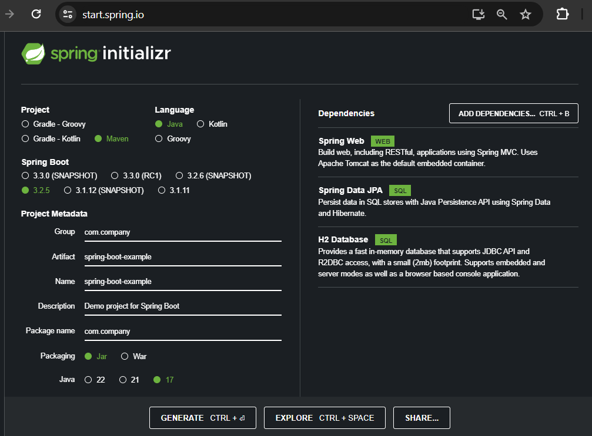
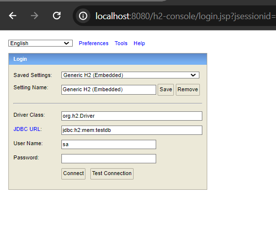
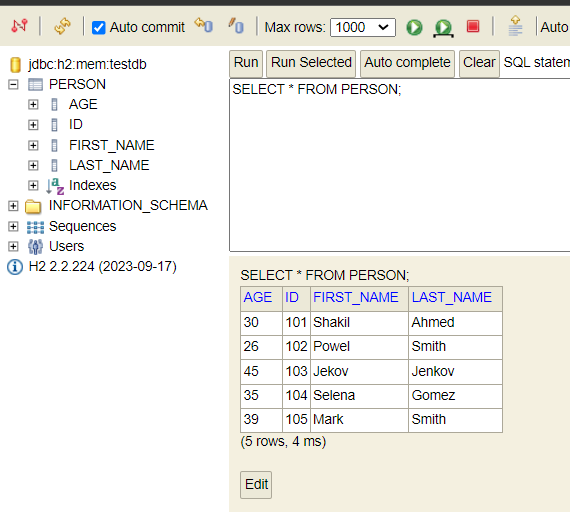
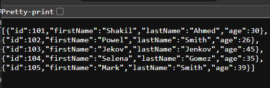
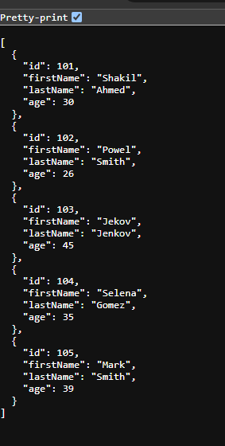

# Spring Boot with H2 Database

In this sample post, we are going to explore how to create a simple application using spring boot and mySQL database.

**Initial Requirements:**

In order to create a simple Spring Boot Application, you must have to following tools already installed in your system:

Java: 8+ (Better to use 17+)<br/>

Maven: v3.6.3 or better<br/>

An Ide: Intellij, Eclipse or VS Code<br/>

## Bootstrap Your Spring Boot Application

We will use here spring boot starter to bootstrap our simple spring powered application. Thus, open [text](https://start.spring.io/) and configure the following requirements to create our spring boot application.



**Note**: Package name and groupId name should be same.


## Open Your Project in Your Favourite Ide

After extracting the zip file, you can open you example spring boot project into your favourite ide. Such as, Intellij, VS code or Eclipse etc.

**How to open your project in your favourite IDE:**

**Eclipse**: File > Import > Maven > Existing Maven projects > Next > Browse your spring boot project (you have just downloaded)> Click Finish. Please wait few seconds to complete the whole process and resolving the maven dependencies.

**Intellij Ide**: File > Open > Browse the existing spring boot project > Click Ok. Likewise eclipse, wait few seconds to resolve maven/Gradle dependencies.

**VS Code**: File > Open Folder > Browse the existing spring boot project > Select Folder.

**NetBeans**: File > Open Project > Browse the existing spring boot project (maven project) > Open project.


## Create an Entity 

Let's create an entity called **Person.java** in **com.company/person** folder or package. An entity is a persistent class, that is a table of a database in other words, and all the properties are the column name  of that table. So, it is required that you annotate your java pojo class by **@Entity** annotation when it will be used as persistent class.

**Person.java**

```
package com.company.model;

import jakarta.persistence.*;
@Entity(name = "Person")
@Table(name = "person")
public class Person {
    @Id
    @GeneratedValue(strategy = GenerationType.AUTO)
    private int id;
    private String firstName;
    private String lastName;
    private int age;

    public Person() {
    }

    //constructors, getter and setter methods
}
```

**Note**: One of the property must be annotated by **@Id** annotation in order to make it primary key of the database table.


## Create a Repository Interface

In order work with relational database or handling database operations, we have to define the repository interface and implements one of the spring data jpa interfaces to work with mySQL database. Here, create an interface in **com.company/repository** package and name it **PersonRepository.java**

**PersonRepository.java**

```
package com.company.repository;

import com.company.model.Person;
import org.springframework.data.jpa.repository.JpaRepository;
import org.springframework.stereotype.Repository;

@Repository
public interface PersonRepository extends JpaRepository<Person, Integer> {
    //custom query methods
}
```

## Create a Service Class

Defining business logic for the **Person.java** entity class, we have to create the service class. Let's say our service class resides in **com.company/service** package. Please don't forget to autowired or inject the **PersonRepository.java** interface.


**PersonService.java**

```
package com.company.service;

import com.company.model.Person;
import com.company.repository.PersonRepository;
import org.springframework.beans.factory.annotation.Autowired;
import org.springframework.stereotype.Service;
import org.springframework.web.bind.annotation.PathVariable;

import java.util.List;
import java.util.NoSuchElementException;


@Service
public class PersonService {

    @Autowired //works like @Inject annotation
    private PersonRepository personRepository;

    //method to retrieve all person records
    public List<Person> getAllPerson() {
        return personRepository.findAll();
    }
}
```

**Note**: We have to annotate this class by **@Service** annotation.


## Create a Controller Class

In order to handle the mapping uri or incoming request, we have to define the controller class as well. So, create a controller class in **com.company/controller** and name it **PersonController.java**. You have to annotate this class by either **@Controller** or **@RestController** annotation. As, we try to create a simple backend rest api type application, thus use the **@RestController** annotation. 


**PersonController.java**

```
package com.company.controller;

import com.company.model.Person;
import com.company.service.PersonService;
import org.springframework.beans.factory.annotation.Autowired;
import org.springframework.web.bind.annotation.*;

@RestController
public class PersonController {

    @Autowired
    private PersonService personService;

    //getMapping for retrieving all person records
    @GetMapping("/api/persons")
    public Iterable<Person> getAll(){
        return personService.getAllPerson();
    }
}
```

Here we only defined one get-mapping method to retrieve all the person records from mySQL database, but with spring mvc, we can use other useful http verbs such as, post, put or delete mappings to create a standalone application.


## Map the Database Configuration

As we have added the mySQL driver dependency in our **pom.xml** file, thus we have to provide the database metadata in order to work with mySQL database. So, open **application.properties** file and define the h2 database configurations.

**application.properties**

```
spring.application.name=spring-boot-example

## For H2 database configuration
spring.datasource.url=jdbc:h2:mem:testdb
spring.datasource.driver-class-name=org.h2.Driver
spring.datasource.username=sa
spring.datasource.password=
spring.jpa.database-platform=org.hibernate.dialect.H2Dialect
#enabling the H2 console
spring.h2.console.enabled=true

# in order to work with data.sql file
spring.jpa.defer-datasource-initialization=true
```

**Note**: Don't forget to enable the h2 console and set database-initialize property to true.


## Set Up Few Initial Data For our Person Entity

Create Data.sql file in the in the resources folder. While your application runs, the person initial data will be extracted from here. But, it is not the only option to load initial data into the database.

**data.sql**

```
-- populate the person table
INSERT INTO person (id, first_name, last_name, age) VALUES(101, 'Shakil', 'Ahmed', 30);
INSERT INTO person (id, first_name, last_name, age) VALUES(102, 'Powel', 'Smith', 26);
INSERT INTO person (id, first_name, last_name, age) VALUES(103, 'Jekov', 'Jenkov', 45);
INSERT INTO person (id, first_name, last_name, age) VALUES(104, 'Selena', 'Gomez', 35);
INSERT INTO person (id, first_name, last_name, age) VALUES(105, 'Mark', 'Smith', 39);
```

**Note**: firsName is our person entity property and it should be first_name while using in database.


## Test the Project

Let's see our initial data has been stored in our h2 in-memory database or not. First of all run the application and if everything is going well, your application runs on port 8080 in localhost.

So, open your favourite web browser and type the following url in the search bar: [text](http://localhost:8080/h2-console) it will now open a new interface or window.



Click on Connect. And you can now see, a person table has been added in the left side in your h2 console. Click on the person table and write the sql select command to retrieve all the populated person records.

```
SELECT * FROM PERSON;
```



## Rest Api Call

As we have defined the @GetMapping to retrieve all the person records, thus if you now open your favourite web browser and type: [text](http://localhost:8080/api/persons) you will all the persons info as json format.






Thanks for reading this article.

