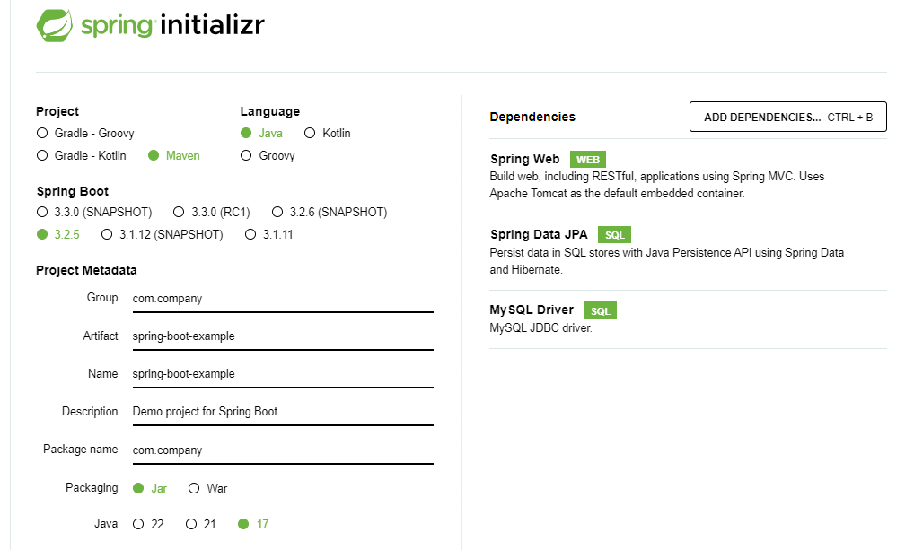

# Spring Boot Crud Application with MySQL Database

In this sample post, we are going to explore how to create a simple crud application using Spring Boot, Spring Data JPA and MySQL database.


Basically, CRUD means Create, read, update and delete operations that helps to create and organize a dynamic application.


**Initial Requirements**:

JavaSE: 17+ (Or latest LTS version)<br/>
Maven: v3.6.3 or better <br/>
An IDE: IntelliJ, VS Code or Eclipse<br/>
MySQL Database

**Note**: The above tools must be installed in your system.


Before dive into the actual project, we have to know, creating a simple spring boot crud application is a multi step process. Such as, We have to


1. Define an Entity model
2. Create a Repository interface,
3. Create a Service class
4. Create a controller class
5. Create an error handling class
6. Provide the database configuration in **application.properties** file etc.


So, let's get into the project.


## Bootstrap Spring Boot Application with Required Dependencies

We will use spring initializer to bootstrap our spring boot project. So, visit in [https://start.spring.io/](https://start.spring.io/) and provide the project information such as spring boot version, build tool (maven), project name, groupId, artifactId etc. and add the required dependencies such as spring web, spring data jpa and mysql database driver for this project.



After providing the necessary info and adding the required dependencies, click on the generate button. It will then generate a zip file for you and the file name is spring-boo-example. Unzip it and then open it in your favourite ide.


## Open Your Project in Your Favourite IDE

After generating the project through spring initializer, now it's time to open your project into your favourite IDE. Let's see how to open your project in your favourite IDE. Such as,

**Eclipse**: File > Import > Maven > Existing Maven projects > Next > Browse your spring boot project (you have just downloaded)> Click Finish. Please wait few seconds to complete the whole process and resolving the maven dependencies.

**Intellij Ide**: File > Open > Browse the existing spring boot project > Click Ok. Likewise eclipse, wait few seconds to resolve maven/Gradle dependencies.

**VS Code**: File > Open Folder > Browse the existing spring boot project > Select Folder.

**NetBeans**: File > Open Project > Browse the existing spring boot project (maven project) > Open project.


## Create An Entity

In your Spring Boot project, now create a **Customer.java** entity class in **com.company/model** package. Probably you have to create package called model in **com.company** folder.


**Customer.java**

```
package com.company.model;

import jakarta.persistence.*;

@Entity(name = "Customer")
@Table(name = "customer")
public class Customer {
    @Id
    @GeneratedValue(strategy = GenerationType.AUTO)
    @Column(name = "customer_id", nullable = false)
    private Integer id;

    @Column(name = "first_name", nullable = false)
    private String firstName;
    @Column(name = "last_name", nullable = false)
    private String lastName;
    @Column(name = "email", nullable = false)
    private String email;
    @Column(name = "phone_number", length = 15)
    private int phone;
    @Column(name = "address")
    private String address;

    //constructors, getter and setter methods
}
```


**Note**: An entity class is nothing but a database table and all the properties of it are database column name. Every entity or model class must be annotated by **@Entity** annotation and at least one property must be annotated by **@Id** annotation that defines the primary key of this table in the database. Later it is possible to customize the entity class based on requirements.


## Create A Repository Interface

Now create a repository interface to handle the database operations in **com.company/repository** package.


**CustomerRepository.java**

```
package com.company.repository;

import com.company.model.Customer;
import org.springframework.data.jpa.repository.JpaRepository;
import org.springframework.stereotype.Repository;

@Repository
public interface CustomerRepository extends JpaRepository<Customer, InternalError> {

    //custom query methods
}
```

**Note**: The repository interface will handle the database operations such as, saving, retrieving entity or updating entity objects. But we have to extend one of the spring data jpa repository interface like **CrudRepository** or **ListCrudRepository** that provides pre built methods to handle crud operations easily. Here I have used JpaRepository that also inherits CrudRepository and ListCrudRepository.


## Create A Service Class

Now create a service class in **com.company/service** package. We also have to annotate this class by **@Service** annotation


**CustomerController.java**

```
package com.company.service;

import com.company.model.Customer;
import com.company.repository.CustomerRepository;
import org.springframework.beans.factory.annotation.Autowired;
import org.springframework.stereotype.Service;

import java.util.List;

@Service
public class CustomerService {

    @Autowired
    private CustomerRepository customerRepository;


    //method for getting all the customers
    public List<Customer> getAllCustomers(){
        return customerRepository.findAll();
    }

    //method for getting customer by id
    public Customer getCustomerById(int id){
        return customerRepository.findById(id)
                .orElseThrow(() -> new RuntimeException("Entity not found with id "+id));
    }

    //method for creating new customer records
    public Customer createCustomer(Customer customer){
        return customerRepository.save(customer);
    }

    //method for updating customer (other approaches available too)
    public Customer updateCustomer(int id, Customer customer){

        Customer entity = customerRepository.findById(id)
                        .orElseThrow(()-> new RuntimeException("Entity not found with id "+id));

        entity.setFirstName(customer.getFirstName());
        entity.setLastName(customer.getLastName());
        entity.setEmail(customer.getEmail());
        entity.setPhone(customer.getPhone());
        entity.setAddress(customer.getAddress());

        return entity;
    }

    //method for deleting entity based on id
    public void deleteCustomer(int id){
         customerRepository.findById(id)
                .orElseThrow(() -> new RuntimeException("Entity not found with id "+id));
        /*
         * Or write like this for simplicity: without using orElseThrow
         * customerRepository.deleteById(id);
         */
    }
}
```

**Note**: The role of the service class is to define the logical information for the model or entity class. But don't forget to autowired or inject the **CustomerRepository** interface. Additionally, it is required to annotate the service class by **@Service** annotation.


## Create A Controller Class

Now create a **CustomerController.java** class in **com.company/controller** package. And don't forget to annotate this class by **@RestController** annotation. The role of the controller class is to handle the mapping uri or incoming requests and after processing them return appropriate response.


**CustomerController.java**

```
package com.company.controller;

import com.company.model.Customer;
import com.company.service.CustomerService;
import org.springframework.beans.factory.annotation.Autowired;
import org.springframework.web.bind.annotation.*;

import java.util.List;

@RestController
public class CustomerController {

    @Autowired
    private CustomerService customerService;


    //mapping for retrieving all customers
    @GetMapping("/api/customers")
    public List<Customer> getAllCustomers(){
        return customerService.getAllCustomers();
    }

    //mapping for retrieving each customer record by id
    @GetMapping("/api/customers/{id}")
    public Customer getCustomerById(@PathVariable("id") int id){
        return customerService.getCustomerById(id);
    }

    //mapping for saving new customer records
    @PostMapping("/api/customers")
    public Customer saveCustomer(@RequestBody Customer customer){
        return customerService.createCustomer(customer);
    }

    //mapping for updating existing customer record
    @PutMapping("/api/customers/{id}")
    public Customer updateCustomer(@PathVariable("id") int id, Customer customer){
        return customerService.updateCustomer(id, customer);
    }

    //method for deleting existing customer based on id
    @DeleteMapping("/api/customers/{id}")
    public void deleteCustomer(@PathVariable("id") int id){
        customerService.deleteCustomer(id);
    }
}
```

**Note**: Please, don't forget to annotate this class by **@RestController** annotation that is used to create rest api in spring boot as well as you have to autowired the **CustomerService** class here too.


## Map the Database Configurations

Open **application.properties** file and configure the MySQL database information so that entity records have been saved in correct endpoint.

```
spring.application.name=spring-boot-example

## MySql database configuration

spring.datasource.url=jdbc:mysql://localhost:3306/testdb
spring.datasource.username=root
spring.datasource.password=root

spring.datasource.driver-class-name=com.mysql.cj.jdbc.Driver
spring.jpa.show-sql=true

## use either create, create-drop, update, none, validate
spring.jpa.hibernate.ddl-auto=update

```

**Note**: Here testdb is the name of my mysql database. You can use yours. At the same time, please use your mysql username and password, not mine.


## Test The Application

Now, run your application from your ide - there is a run button, top upper right corner in IntelliJ IDE or use shortcut like (shift + F10) to run your spring boot application. Additionally you can run your spring boot application by commandLine tool. Just open your application in any terminal (integrated terminal or windows command prompt) and run the following command:

```
$ mvn spring-boot:run
```

If your application runs successfully, it listens port 8080 in localhost by default. So, open your favourite web browser and invoke the uri [text](http://localhost:8080/api/customers) and you will see an empty array. Because we don't save any initial customer entity records. 

Now we can use postman, apiDog or cURL like software or rest api management tool to make POST requests to the customer endpoints. 

In my case, I am using apiDog. So either open apiDog, postman or use cURL to save few customer records into the MySQL database.

So, now make some post requests into this endpoint [text](http://localhost:8080/api/customers) using either cURL, postman or apiDog.


```
{
    "firstName": "Powel",
    "lastName": "Smith",
    "email": "powel99@gmail.com",
    "phone": 48870901,
    "address": "Kuivakuja 99, Lavia"
}

//like the above, add few more customers (one after another)

{
    "firstName": "Kevin",
    "lastName": "Rayan",
    "email": "kevin77@gmail.com",
    "phone": 45886879,
    "address": "Inkereentie 41, Rauma"
}

{
    "firstName": "David",
    "lastName": "Morison",
    "email": "david001@gmail.com",
    "phone": 47588709,
    "address": "Kuivakuja 43, Rovaniemi"
}

{
    "firstName": "Shakil",
    "lastName": "Ahmed",
    "email": "itsshakilmith@gmail.com",
    "phone": 45887097,
    "address": "Calea Victoriei 118, Romani"
}

{
    "firstName": "Jerry",
    "lastName": "Reed",
    "email": "jerry55@gmail.com",
    "phone": 47887093,
    "address": "IImalakuja 27, Pori, Finland"
}
```

After saving the above demo customer data using your favourite rest api management tool, now if you visit again [text](http://localhost:8080/api/customers) this endpoint in your browser, you will see list of customer records there in json format.


**Note**: Click on pretty-print checkbox and see the formatted json data.

You can also see the customer table in your mysql database.  


## Get Entity Record By It's ID

We can now retrieve entity records by it's id or primary key as we have defined **getCustomerById** mapping method in the controller class. So, if you now invoke the uri [text](http://localhost:8080/api/customers/1) you will see the json data of first customer. Similarly, this uri [text](http://localhost:8080/api/customers/5) will retrieve the api of customer which id is 5.


## Update and Delete Entity Records

Open postman or apiDog and create a PUT request on this uri - [text](http://localhost:8080/api/customers/1) with the updated data. Then you can see, the entity records which id is 1 has been updated.


Before Updating:
```
{
    "firstName": "Powel",
    "lastName": "Smith",
    "email": "powel99@gmail.com",
    "phone": 48870901,
    "address": "Kuivakuja 99, Lavia"
}
```

After Updating:


Similarly, if you make the DELETE request on any mapping uri like [text](http://localhost:8080/api/customers/1), then this entity record will be deleted as well.


As we have deleted the entity which id is 1, thus you can see the error message "Entity not found with id 1" in this uri.


So, through this tutorial, we have learned how to create a simple CRUD application using spring boot. Hope, this tutorial was very helpful for you.

Talk soon,

Shakil Ahmed.