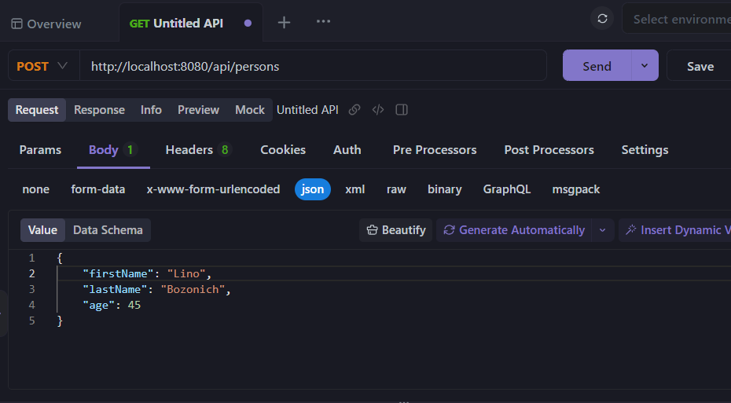
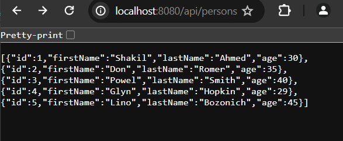
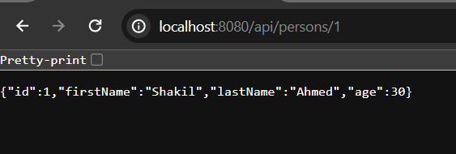
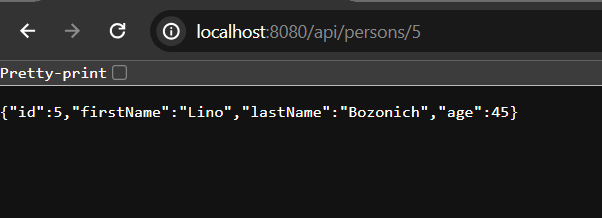
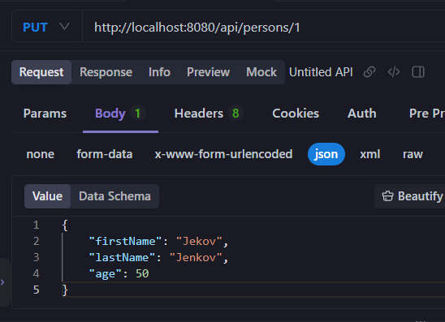

# Spring Boot Rest Api Example Application

In this sample application, we are going to build a sample rest api with spring boot that can handle simple crud operations.

**CRUD**: In application development **CRUD** refers - Create, Read, Update and Delete operations. These are the http verbs, commonly used in application development that helps to create dynamic database driven applications.


**Initial Requirements:**

Java: 17 or upgraded version<br/>

Maven: v3.6.3 or better<br/>

An ide: Intellij, Eclipse or VS Code<br/>


## Bootstrap Your Spring Boot Maven Application

I don't want to make this post lengthy. Thus, here is a simple post where I described how to create or bootstrap your first spring boot application.

[create-your-first-spring-boot-application](https://codeinjar.com/first-spring-boot-application)


But, make sure, you add the following dependencies when you bootstrap your spring boot application.


**required dependencies:**

```
<!--spring web-->
<dependency>
	<groupId>org.springframework.boot</groupId>
    <artifactId>spring-boot-starter-web</artifactId>
</dependency>
<!--Spring Data JPA-->
<dependency>
<groupId>org.springframework.boot</groupId>
	<artifactId>spring-boot-starter-data-jpa</artifactId>
</dependency>
<!--H2 in-memory database-->
<dependency>
    <groupId>com.h2database</groupId>
	<artifactId>h2</artifactId>
	<scope>runtime</scope>
</dependency>
```

## Open your Project in Your Favourite Ide

In order to complete this project, we need an ide (integrated development environment). You can use any ide, like Intellij Ide, VS Code, or Eclipse. But here I am going to use Intellij ide (better to use intellij ide as it provides more features and sophisticated environment while developing enterprise application). 

**How to open your project in your favourite IDE:**

**Eclipse**: File > Import > Maven > Existing Maven projects > Next > Browse your spring boot project (you have just downloaded)> Click Finish. Please wait few seconds to complete the whole process and resolving the maven dependencies.

**Intellij Ide**: File > Open > Browse the existing spring boot project > Click Ok. Likewise eclipse, wait few seconds to resolve maven/Gradle dependencies.

**VS Code:** File > Open Folder > Browse the existing spring boot project > Select Folder.

**NetBeans:** File > Open Project > Browse the existing spring boot project (maven project) > Open project.


**Note:** Eclipse, Intellij, and NetBeans support java out of the box. But, in order to work in vs code, you must download the required extension.


## Folder Structure

As it is a simple project and we are going to work with only one entity model. Thus, we will not go into many nested folders, but we will create few folders for their specific purposes.

**model folder**: domain type will reside here. Like, Customer, Person etc.

**repository**: We will create spring data jpa specific repository in this folder. It is for handling database operations.

service: We will create our service class in this folder (we can also skip this step) and we write here business logic for the entity model.

controller: The project specific, controller class will reside in this folder, used for handing the mapping requests.


**Note**: But, in real application, we create domain specific folders. Such as, all the classes related to Customer entity resides in Customer folder or all the classes related to Order entity resides in Order folder etc.


## Create an Entity class

Now create an entity class in **com.company/model** folder in your spring boot example application. Let's say, the entity name is **Person.java**

**person.java** (entity class)

```
package com.company.model;

import jakarta.persistence.*;
@Entity(name = "Person")
@Table(name = "person")
public class Person {
    @Id
    @GeneratedValue(strategy = GenerationType.AUTO)
    private int id;
    private String firstName;
    private String lastName;
    private int age;

    public Person() {}

    //constructors, getter and setter methods
}
```

Here we must annotate the **Person.java** class by **@Entity** annotation to make it persistent object. A class in java is a simple pojo class, but if we annotate it by **@Entity** annotation then it becomes a database table. Here, **@Id** annotation is required property, the primary key of the database table. We will explain the annotations used here at the end of this tutorial.

## Create a PersonRepository Interface

Now we will create a **PersonRepository** interface in **com.company/repository** package that will implement the Spring Data JPA specific CrudRepository interface, that provides built in methods to work with **CRUD** (create, read, update and delete) operations.

**PersonRepository.java** (interface)

```
package com.company.repository;

import com.company.model.Person;
import org.springframework.data.repository.CrudRepository;
import org.springframework.stereotype.Repository;

@Repository
public interface PersonRepository extends CrudRepository<Person, Integer> {
    //custom query methods
}
```

Note: Instead of using CrudRepository, we can also use ListCrudRepository. The only differences between CrudRepository and ListCrudRepository, CrudRepository returns Iterable and ListCrudRepository returns List. But, in this post, we will use CrudRepository interface, you always implements **JpaRepository** that extends all of the top level interfaces, spring data jpa provides.


## Create a Service class 

Service class is not required for this type of sample application, unless you are developing production grade applications. We basically write business logic (methods) to create, read, update or delete database records.

So, create a Service class **PersonService.java** in **com.company/service** package in your spring boot application and define all the crud related methods to perform the following operations:


**PersonService.java** (annotated by @Service annotation)

```
package com.company.service;

import com.company.model.Person;
import com.company.repository.PersonRepository;
import org.springframework.beans.factory.annotation.Autowired;
import org.springframework.stereotype.Service;
import org.springframework.web.bind.annotation.PathVariable;

import java.util.NoSuchElementException;


@Service
public class PersonService {

    @Autowired //works like @Inject annotation
    private PersonRepository personRepository;

    //method to retrieve all person records
    public Iterable<Person> getAllPerson() {
        return personRepository.findAll();
    }

    //method to get a person record by its id
    public Person getPersonById(@PathVariable("id") int id{
        return personRepository.findById(id).orElseThrow(NoSuchElementException::new);
    }

    //method to save new person record in the database
    public int saveNewPerson(Person person){
       return personRepository.save(person).getId();
    }

    //method to update an existing record
    public Person updateEmployee(Person person, int id){

        Person entity = personRepository.findById(id).get(); //not a realistic use

        entity.setFirstName(person.getFirstName());
        entity.setLastName(person.getLastName());
        entity.setAge(person.getAge());

        return personRepository.save(entity);
    }
    
    //method to delete a person record by it
    public void deleteEmployee(@PathVariable("id") int id){
        personRepository.deleteById(id);
    }
}
```

**Note:** None of the methods specified here usually used in production grade applications. Please, do you a favour by researching first.


## Create a Controller Class

In this step we will create a controller class that will use spring web to build a rest api for us. There are few spring mvc related mapping annotations we will use. Such as, **GetMapping**, **PostMapping** or **DeleteMapping** etc.


**PersonController.java**

```
package com.company.controller;

import com.company.model.Person;
import com.company.service.PersonService;
import org.springframework.beans.factory.annotation.Autowired;
import org.springframework.web.bind.annotation.*;

@RestController
public class PersonController {

    @Autowired
    private PersonService personService;


    //getMapping for retrieving all person records

    @GetMapping("/api/persons")
    public Iterable<Person> getAll(){
        return personService.getAllPerson();
    }

    //getMapping for retrieving person by id (single person details)
    @GetMapping("/api/persons/{id}")
    public Person getOne(@PathVariable("id") int id){
        return personService.getPersonById(id);
    }

    //postMapping for saving new person records into the database
    @PostMapping("/api/persons")
    public int savePerson(@RequestBody Person person){
        return personService.saveNewPerson(person); //it returns int (the id of the saved persons)
    }

    //putMapping for updating existing records by id
    @PutMapping("/api/persons/{id}")
    public Person person(@RequestBody Person person, @PathVariable("id") int id){

        Person entity = personService.updatePerson(person, id); //required two arguments
        entity.setFirstName(person.getFirstName());
        entity.setLastName(person.getLastName());
        entity.setAge(person.getAge());

        return entity;
    }

    //deleteMapping for deleting specific person record by its id
    @DeleteMapping("/api/persons/{id}")
    public void deletePerson(@PathVariable("id") int id){
        personService.deletePerson(id);
    }
}
``` 

**Note**: While using @PostMapping and @PutMapping, in the method level, you must use the @RequestBody annotations. Otherwise, the data will not be saved or updated.


## Map the Database Configuration

In order to save your person entity details into the h2 in-memory database, we have to configure the database information. So, open **application.properties** file located in resources folder and write the following, and don't forget to enable h2 console.

**application.properties** 

```
spring.application.name=spring-boot-example

## For H2 database configuration
spring.datasource.url=jdbc:h2:mem:testdb
spring.datasource.driver-class-name=org.h2.Driver
spring.datasource.username=sa
spring.datasource.password=
spring.jpa.database-platform=org.hibernate.dialect.H2Dialect
#enabling the H2 console
spring.h2.console.enabled=true

# Only add this in order to load initial data from data.sql file
# spring.jpa.defer-datasource-initialization=true
```

## Now Test the Rest Api

Firstly, run your application. If it runs successfully, it listens port 8080 in localhost. Now, Let's use a tool to handle the crud operations. You can use, **postMan** or **apiDoc** (I use it) or curl etc. Make sure, in your system, one of them installed.

So, open your desired rest api management tool and make few post requests.



```
 {
    "id": 1,
    "firstName": "Shakil",
    "lastName": "Ahmed",
    "age": 30
  }

//like the above add new person details (one at a time)

{
    "id": 2,
    "firstName": "Don",
    "lastName": "Romer",
    "age": 35
  },
  {
    "id": 3,
    "firstName": "Powel",
    "lastName": "Smith",
    "age": 40
  },
  {
    "id": 4,
    "firstName": "Glyn",
    "lastName": "Hopkin",
    "age": 29
  },
  {
    "id": 5,
    "firstName": "Lino",
    "lastName": "Bozonich",
    "age": 45
  }
```

Now, open your browser and invoke the url: [text](http://localhost:8080/api/persons) you will see list of person details there.



Now in order to get individual person records, you can type this url in localhost too:

[text](http://localhost:8080/api/persons/1) retrieves first person details and if you type [text](http://localhost:8080/api/persons/5) it will return last person details.

Shows person details which id is 1: (first person in our case)



Shows person details which id is 5: (last person in our case)



Using postman or apiDoc, you can do the same thing like, saving new records (what we did now), retrieve list of person records, getting person records based on id. Even we can now delete records or updating existing records etc.


## Updating the First Person Record

We can update our resources based on id. Here, the first person id is 1. So, open postman or apiDoc and use the **PUT** http verbs to update the first person details

Our first person was:

```
{
    "id": 1,
    "firstName": "Shakil",
    "lastName": "Ahmed",
    "age": 50
}
```

Now update with the following info:

```
{
    "firstName": "Jekov",
    "lastName": "Jenkov",
    "age": 50
}
```

In postman or apiDoc, execute the PUT api request



Yes, your person details has been updated. Additionally, you can delete a specific person records executing the delete mapping.

Thanks for reading this article.

**Note**: This is a simple demo article, just for learning purposes. Not recommended for production grade applications.
