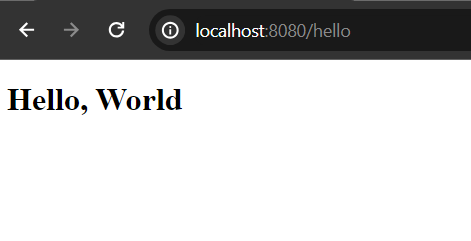
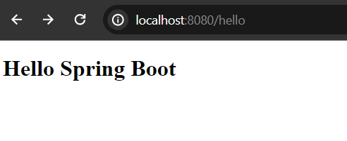
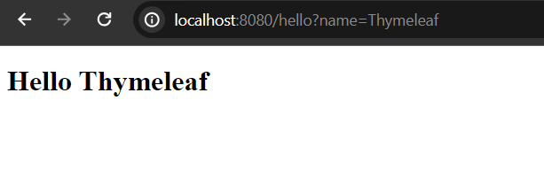

# Spring Boot and Thymeleaf Template Engine

In this simple post we are going to explore how to create a simple simple Hello World application in spring boot using thymeleaf template engine.

**Thymeleaf**: Thymeleaf is a server side template engine based on java programming language and it works on both web and standalone environments. We can use thymeleaf as an alternative of frontend frameworks like react or angular. But the role of thymeleaf is to use in server side than frontend side.

## Bootstrap Your Spring Boot Application

First of all, we have to create a simple spring boot application and add the thymeleaf dependency in our classpath. If you already have a spring boot application in your system, open it in your favourite ide. Now click on **pom.xml** file and add the thymeleaf spring boot starter dependency in the dependencies section. 

```
<dependency>
    <groupId>org.springframework.boot</groupId>
    <artifactId>spring-boot-starter-thymeleaf</artifactId>
</dependency>
```

In case if you don't have spring boot application bootstrapped yet, here is a simple tutorial, how to create a spring boot application. <a href="https://codeinjar.com/spring-boot-start/" target="_blank">Create Your First Spring Boot Application</a>


## Create a Html Template File

Let's now create a html template file in **resources/templates** folder.

**hello.html**

```
<!DOCTYPE html>
<html lang="en">
<head>
    <meta charset="UTF-8">
    <title>Hello...</title>
</head>
<body>
<h1>Hello, World</h1>
</body>
</html>
```

Now handling the template file hello.html, create a controller class and we must annotate this class by **@Controller** annotation. So, now create a controller class **HelloController.java** in **com.company/controller** package.

HelloController.java

```
package com.company.controller;

import org.springframework.stereotype.Controller;
import org.springframework.web.bind.annotation.GetMapping;

@Controller
public class HelloController {

    @GetMapping("/hello")
    public String helloPage(){
        return "hello"; //hello.html
    }
}
```

Now, run the application, if it runs successfully, then your application by default listens port 8080 in localhost. So, invoke the uri [spring boot](http://localhost:8080/hello) and you will see a simple Hello, World text message in this page.



## Update the HelloController.java Class

Let's update the code of **HelloController.java** class so that it can do more.

**HelloController.java**

```
package com.company.controller;

import org.springframework.stereotype.Controller;
import org.springframework.ui.Model;
import org.springframework.web.bind.annotation.GetMapping;
import org.springframework.web.bind.annotation.RequestParam;

@Controller
public class HelloController {

    @GetMapping("/hello")
    public String helloPage(@RequestParam(defaultValue = "Spring Boot") String name, Model page){

        String result = "Hello "+ name;

        page.addAttribute("greeting", result); //name is the attribute will be used in the template
        return "hello"; //hello.html
    }
}
```

Changes are required in **hello.html** file too.

**hello.html** 

```
<!DOCTYPE html>
<html lang="en" xmlns:th="http://www.w3.org/1999/xhtml">
<head>
    <meta charset="UTF-8">
    <title>Hello...</title>
</head>
<body>
<h1 th:text="${greeting}"></h1>
</body>
</html>
```

Now if you invoke the url [text](http://localhost:8080/hello) in your favourite web browser, you will see Hello, Spring Boot (with the @RequestParam default message).

 

But, you will get overall dynamic response if you customize your uri. For achieving this, write in your browser like - [text](http://localhost:8080/hello?name=Thymeleaf) now your response will be Hello, Thymeleaf.



Thanks for reading this tutorial.

------

