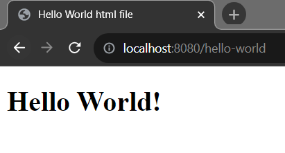
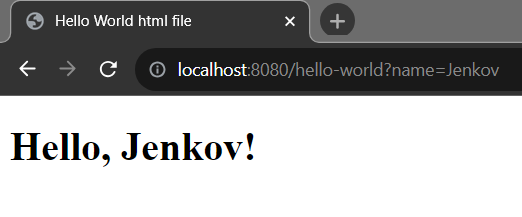

## Building a Hello World website Using Spring Boot. 

In this article we are going to create a simple static site or web page that will interect with spring boot.


## What You Need to Build a simple Spring Boot Project

Initial Requirements:
    - JavaSE version: 8+
    - Maven or Gradle as a build tool
    - Maven version: 3.6.3+
    - Gradle version: 7.5+
    - And IDE that support Java and maven/gradle: Like Intellij Ide, Eclipse or VS code.


Let's follow the belew steps to create a simple Spring Boot application.

1. Open https://start.spring.io/ and provide necessary information to create spring boot project. The project will be a .zip file and we have to unzip it in a directory to work with it.

Now in this page, Select 
    - Maven as a build tool (you can select gradle too)
    - Java as a language
    - Spring Boot version 3.0.12 (or the latest version)
    - In the Project Metadata section, provide your application group, artifact, package name etc. Note: The group and package name will be same. Also the artifact and name of your project will be same as well (Not mendatory). 
    - Then, select jar for packaging (for simplicity) and select the java language version. The java language version I use is 17. You can choose 8, 11 or the latest LTS version.
    - The last step is to adding dependencies. As we create a simple HelloWorld srpring boot application, we just need to add spring web dependency in our classpath. After adding the spring web dependency click on Generate button. It will create a simple zip file (the zip file name is your project name)

2. After generating the .zip file now unzip it to any director. 

3. Import the unzip spring-boot-example project into your favourite Ide.

Eclipse: Open your Eclipse (STS) Ide. File > Import > Maven > Existing Maven projects > Next > Browse your sping boot project (Reside our example spring boot project) > Click Finish. Please wait few seconds to complete the whole process and resolving the maven dependencies.

Intellij Ide: Open your Inellij Ide, then File > Open > Browse the existing spring boot project > Clikc Ok. Likewise eclipse, wait few seconds to resolve maven/Gradle dependencies.  

//Actual steps start from here.

4. Create a controller class called HelloWorldController.java in com.company.controller package. We annotate our HelloWorldController class by @Controller annotation. In spring or spring boot we use @Controller annotation to serve HTTPS web requests and @RestController annotaion to serve https rest (json) requests. Hence we are going to serve http get request from the frontend thus we have to annotate our controller class by @Controller annotaion.

```js
package com.company.controller;

import org.springframework.stereotype.Controller;
import org.springframework.ui.Model;
import org.springframework.web.bind.annotation.GetMapping;

@Controller
public class HelloWorldController {
    @GetMapping("/hello-world")
    public String printHelloWorld(Model model){
        //creating a String variable
        String message = "Hello World!";
        //creating model
        model.addAttribute("message", message); //message inside "" is the attribute name
        // and will be parsed in html file (templates folder)

        return "hello-world"; //static html file resides in templates folder
    }
}

```

The HelloWorldController class contains a method printHelloWorld and it is binding with Modle attribute and we use the attribute name to print "Hello World!" message in the html file. The attribute name will be parsed by template engine. Make sure, you have templating engine like thymeleaf in your classPath. 

5. Create a Html file 

In resources/templates folder we have created hello-world.html file and it must be same of return statement of printHelloWorld() method.

hello-world.html file: 

```js
<!DOCTYPE html>
<html lang="en" xmlns:th="http://www.thymeleaf.org">
<head>
    <meta charset="UTF-8" http-equiv="Content-Type" content="text/html" />
    <meta name="viewport" content="width=device-width, initial-scale=1.0" />
    <title>Hello World html file</title>
</head>
<body>
<div>
    <h1 th:text="${message}"></h1>
</div>
</body>
</html>
```

You have to add thymeleaf based name space in your html file xmlns:th="http://www.thymeleaf.org". Here, we have used the message attribute name to parse the value of message attribute. Thymeleaf uses th:text to parse the attribute variable comes from the application. 

6. Now run the application

In this last step, run the application (Shift+F10). If the application already runs on port 8080, please stop running application usgin ctrl+F2 short-cut or, change the default port from application.properties file.

After running the application successfully, please visit the url http://localhost:8080/hello-world and you will see now the "Hello World!" message.



## Let's modify our printHelloWorld() method to read the external property value.

Now our Hello World string message will be changed dynamically. The updated HelloWorldController class: 

```js
package com.company.controller;

import org.springframework.stereotype.Controller;
import org.springframework.ui.Model;
import org.springframework.web.bind.annotation.GetMapping;
import org.springframework.web.bind.annotation.RequestParam;

@Controller
public class HelloWorldController {
    @GetMapping("/hello-world")
    public String printHelloWorld(
            Model model,
            @RequestParam(name = "name", required = false, defaultValue = "World")
            String name
            ){

         String message = String.format("Hello, %s!", name);

        //creating model
        model.addAttribute("message", message);
        return "hello-world";
    }
}

```

If you run the application now, and invoke the url: http://localhost:8080/hello-world you will see a String message: "Hello World!". As we have added @RequestParam attribute that will bind the value of the String name parameter and can be handled through the url of the @GetMapping path. So, if you now add the name parameter in the url like http://localhost:8080/hello-world?name=Shakil the the  "Hello World!" message will be changed to "Hello Shakil!" Let's do it by yourselft. 

Invoke the url: http://localhost:8080/hello-world?name=Jenkov The response will be 

