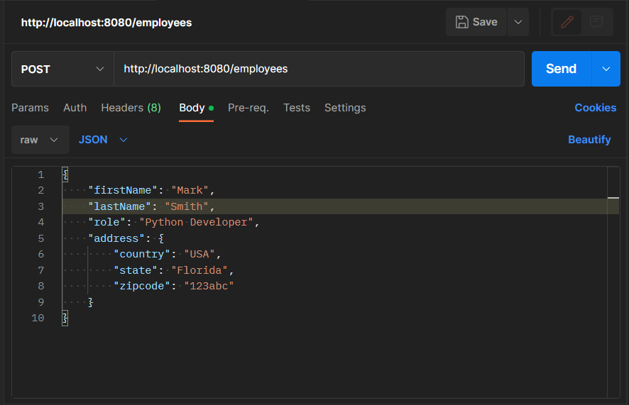
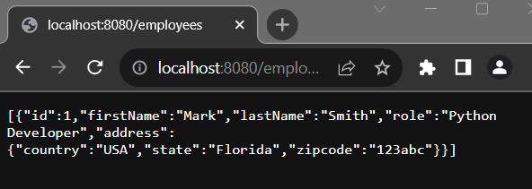
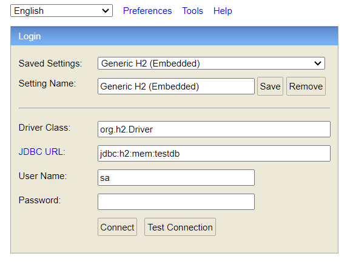
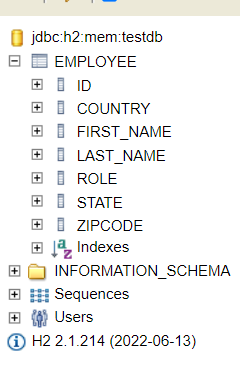
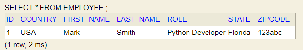

Guess, every employee have their spcific Address. Like, country, city, state and zip_Code. 

So, achieving this feature, we create embeddable class called Address. And the Address class contains, Employee country, state and zip_code. 

The Address class: 

```js
package com.company.model;

import jakarta.persistence.Embeddable;

@Embeddable
public class Address {
    private String country;
    private String state;
    private String zipcode;

    public Address() {
    }

    public Address(String country, String state, String zipcode) {
        this.country = country;
        this.state = state;
        this.zipcode = zipcode;
    }

    public String getCountry() {
        return country;
    }

    public void setCountry(String country) {
        this.country = country;
    }

    public String getState() {
        return state;
    }

    public void setState(String state) {
        this.state = state;
    }

    public String getZipcode() {
        return zipcode;
    }

    public void setZipcode(String zipcode) {
        this.zipcode = zipcode;
    }
}

```

Note: The address class isn't entity itself but, it is an Embedded class that will be used in Employee class. Thus, there will be no table for Address class.

Now, add the Embeddable Address class in the Employee entity class with getter and setter methods. All the members of Address class will be accessable by Employee. 

The modified Employee class: 

```js
package com.company.model;

import jakarta.persistence.*;

@Entity
public class Employee {

    @Id
    @GeneratedValue(strategy = GenerationType.AUTO)
    private int id;

    private String firstName;
    private String lastName;

    private String role;

    //embedded Address class
    @Embedded
    private Address address;

    public Address getAddress() {
        return address;
    }

    public void setAddress(Address address) {
        this.address = address;
    }


    public Employee() {
    }

    public Employee(int id, String firstName, String lastName, String role) {
        this.id = id;
        this.firstName = firstName;
        this.lastName = lastName;
        this.role = role;
    }

    public int getId() {
        return id;
    }

    public void setId(int id) {
        this.id = id;
    }

    public String getFirstName() {
        return firstName;
    }

    public void setFirstName(String firstName) {
        this.firstName = firstName;
    }

    public String getLastName() {
        return lastName;
    }

    public void setLastName(String lastName) {
        this.lastName = lastName;
    }

    public String getRole() {
        return role;
    }

    public void setRole(String role) {
        this.role = role;
    }
}

```

That's all.

Now, run the Example Application. And add one Employee details like this: 

```js
{
    "firstName": "Mark",
    "lastName": "Smith",
    "role": "Python Developer",
    "address": {
        "country": "USA",
        "state": "Florida",
        "zipcode": "123abc"
    }
}
```


Open your favourite web browser and invoke the url: http://localhost:8080/employees and you will get employee details with json format. See the image below:



Let's see the same response in the h2-console in a tabular format.

Invoke the url: http://localhost:8080/h2-console and clik enter. You will see a window like this: 


Clikc Connect. There will be Employee table in the left side. If you clik on it, you see Employee firstName, lastName and Address details.



Now run the following command in the right run dialog box: SELECT * FROM EMPLOYEE ; and click run.

The response will be: 



But if you use postman, the response would be like this:

```js
[
    {
        "id": 1,
        "firstName": "Mark",
        "lastName": "Smith",
        "role": "Python Developer",
        "address": {
            "country": "USA",
            "state": "Florida",
            "zipcode": "123abc"
        }
    }
]
```

Thanks for reading this article. The modified Employee rest service will be added soon.

