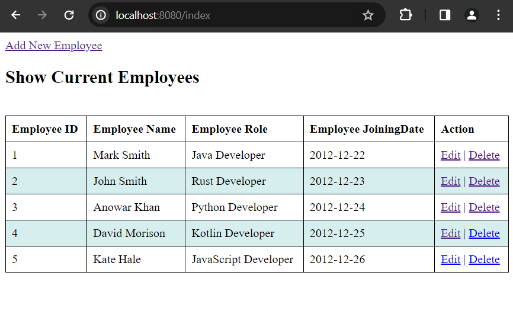

# Spring Boot Crud Application with Spring Data JPA and Thymeleaf

In this simple tutorial we are going to create a simple Spring Boot Crud Application with thymeleaf view.

First of all bootstrap a simple spring boot application with the following dependencies.

    - Spring Web
    - Spring Data JPA
    - Thymeleaf as a template engine and 
    - H2 in-memory database dependency

Here is a tutorial to create a simple hello world spring boot application:  

[How to Create Your First Hello World Spring Boot Application](https://javaondemand.com/spring-boot-hello-world-example-application/)

After bootstrapping your spring boot application open it into your ide. Now, we are going to follow the below steps to create a simple crud application.


Note: Please, open application.properties file and add the following h2 in-memory database configuration so that your entity record will be saved in h2 database.

application.properties file:

```
spring.datasource.url=jdbc:h2:mem:testdb
spring.datasource.driverClassName=org.h2.Driver
spring.datasource.username=sa
spring.datasource.password=
spring.jpa.database-platform=org.hibernate.dialect.H2Dialect
#enabling the H2 console
spring.h2.console.enabled=true

```

But if you use, mysql or postgresql as a database system, the database configuration would be different: 

application.properties file: (when you use mysql/postgresql)

```
## When MySql
spring.datasource.url=jdbc:mysql://localhost:3306/sample
spring.datasource.username=root
spring.datasource.password=root
spring.datasource.driver-class-name=com.mysql.cj.jdbc.Driver
spring.jpa.hibernate.ddl-auto=update
spring.jpa.show-sql: true
## Additional dialects can be added

## When PostgreSQL
spring.datasource.url=jdbc:postgresql://localhost5432/sample
spring.datasource.username=root
spring.datasource.password=password

spring.jpa.hibernate.ddl-auto=update 
spring.jpa.properties.hibernate.dialect=org.hibernate.dialect.PostgreSQLDialect
```


1. Create an entity class called Employee in com.company.entity package or (src/main/java/your-package-name/entity folder)

For simplicity, I have only added four properties in the Employee entity.

Note: All the properties of employee entity are the column name of your database table and the name of the table is the entity name itself.

**Employee.java** entity class:

```
package com.company.controller;


import jakarta.persistence.Entity;
import jakarta.persistence.GeneratedValue;
import jakarta.persistence.GenerationType;
import jakarta.persistence.Id;

import java.time.LocalDate;


@Entity
public class Employee {
    @Id
    @GeneratedValue(strategy = GenerationType.AUTO)
    private int id;
    private String name;
    private String role;
    private LocalDate joiningDate;

    public Employee() {
    }

    public Employee(int id, String name, String role, LocalDate joiningDate) {
        this.id = id;
        this.name = name;
        this.role = role;
        this.joiningDate = joiningDate;
    }

    public int id() {
        return id;
    }

    public void setId(int id) {
        this.id = id;
    }

    public String name() {
        return name;
    }

    public void setName(String name) {
        this.name = name;
    }

    public String role() {
        return role;
    }

    public void setRole(String role) {
        this.role = role;
    }

    public LocalDate joiningDate() {
        return joiningDate;
    }

    public void setJoiningDate(LocalDate joiningDate) {
        this.joiningDate = joiningDate;
    }
    
}

```

Note: By default the class name will the table name (employee) and each properties will be the column name of this table. Though, we can also use external **@Table** or **@Column** annotations to specify the table and column name.

2. Now, create a repository interface called **EmployeeRepository.java** in **com.company.repository** package (src/main/java/your-package-name/repository folder) and extends **CrudRepository** or **ListCrudRepository** interface.

**EmployeeRepository.java**

```
package com.company.repostiory;

import com.company.controller.Employee;
import org.springframework.data.repository.CrudRepository;
import org.springframework.stereotype.Repository;

@Repository
public interface EmployeeRepository extends CrudRepository<Employee, Integer> {
    
    //custom query methods
}

```

**CrudRepository:** Provides custom methods for create, read, update and delete resources.

3. Now create a controller class called **EmployeeController.java** in **com.company.controller** package. This controller class will be responsible to handle the thymeleaf view requests.

Note: We will skip the service class.


**EmployeeController.java**

```
@Controller
public class EmployeeController {

    @Autowired
    private EmployeeRepository employeeRepository;

    //show the index page for the list of employees

    @GetMapping("/index")
    public String showIndexPage(Model model){
        model.addAttribute("employees", employeeRepository.findAll());
        return "index";
    }
}
```


So, create a template file called index.html in templates folder:

**index.html:** (src/main/resources/templates/index.html)

```
<!DOCTYPE html>
<html lang="en" xmlns:th="http://www.w3.org/1999/xhtml">
<head>
    <meta charset="UTF-8">
    <title>Index Page</title>

  <style>
  *{
  box-sizing: border-box;
  }

  table, th, td{
  border: 1px solid black;
  border-collapse: collapse;
 }
  th, td{
  text-align: left;
  padding: 8px;
 }
 tr:nth-child(even){
 background-color: #D6EEEE;
}

</style>
</head>
<body>
<div>
  <a href="/add-employee">Add New Employee</a>
</div>
<div>
  <h2>Show Current Employees</h2>
  <br/>
  <table style="width: 100%">
    <thead>
    <tr>
      <th>Employee ID</th>
      <th>Employee Name</th>
      <th>Employee Role</th>
      <th>Employee JoiningDate</th>
      <th>Action</th>
    </tr>
    </thead>

    <tbody>
    <tr th:each="employee : ${employees}">
      <td th:text="${employee.id}">Employee ID</td>
      <td th:text="${employee.name}">Employee Name</td>
      <td th:text="${employee.role}">Employee Role</td>
      <td th:text="${employee.joiningDate}">Employee JoiningDate</td>

      <!--edit and delete uri (edit by id and delete by id)-->
      <td>
        <a th:href="@{/edit/{id}(id=${employee.id})}">Edit</a> |
        <a th:href="@{/delete/{id}(id=${employee.id})}">Delete</a>
      </td>
    </tr>
    </tbody>
  </table>
</div>
</body>
</html>
```

Here, we have created a simple table where we can add new employee details, edit or delete employees as well. Remember that, we have to resolve all the URI from our controller class or component what URL we have used here.


4. Now, we are going to create the employee form page so that new employee details can be added to the database. For making this happen, we will create two handler methods in our **EmployeeController.java** class. One is for resolving the add-employee template page and another one is save the employee to the database.

**EmployeeController.java** class

```
  @GetMapping("/add-employee") //used in th:object attribute
    public String showAddEmployeeForm(Model model){

        Employee employee = new Employee(); //create new Employee constructor
        model.addAttribute("employee", employee);

        return "add-employee"; //it's the name of the html template
    }

    @PostMapping("/save-employee") //used in th:action attribute
    public String saveNewEmployee(Employee employee, Model model){

        model.addAttribute("employee", employeeRepository.save(employee)); //save in the database

        //redirect to the index page after saving the employee in the database
        return "redirect:/index";
    }
```

The above code is very simple to make sense. The first GetMapping handler method resolve the uri of add-employee.html template file. In index page, if you click on the add-new-employee button, then you will redirect to this page. Then, we have created another handler method to save our input data to the database.

Note: The "/save-employee" mapping URI should be added in ```[th:action="@{/save-employee}"]``` attribute in template (in our case the add-employee.html file) because when you click on the submit button, it works just fine and save your input records to the right path.

5. If you now run application and invoke the URL in localhost, [http://localhost:8080/index](http://localhost:8080/index) you will see the following page.


You see there are no employee records yet, but, fortunately we can add new employee records using add-new-employee button which is shown top of this page.

6. Let's add few demo employee records using the add-new-employee button. When you click on the button, the following page will be displayed: [http://localhost:8080/add-employee](http://localhost:8080/add-employee)


From here, you can add new employee records. When you click on the save button, new employee records will be saved in the H2 in memory database and you will be redirected to the index page, [http://localhost:8080/index](http://localhost:8080/index)

7. After adding new demo employee records using the add-new-employee form and if you visit the index page, the page will look like: [http://localhost:8080/index](http://localhost:8080/index)



Also, check that the new employee records are saved in h2 in memory database or not.

Invoke the URL in localhost: http://localhost:8080/h2-console you will be redirected to the h2-console login page.


And then click on connect button > Click Employee > Click Run; that's all. You will see all employee records in the database table. (look at the image below)


8. In this step, we are going to work on edit and delete button. If you click on the edit or delete button in index page, you will be redirected to the **Whitelabel Error Page**. (as we don't have yet any custom error page)


Or, 


It mean's we haven't created any handler mapping for handling edit or delete request. 

So, open EmployeeController.java class and add two more methods for handling edit and delete request.


**EmployeeController.java** class

```
//handling the edit or update request
    @GetMapping("/edit/{id}") //here we will use post mapping uri too. (We skip rest @PutMapping)
    public String editEmployee(@PathVariable("id") int id, Model model){

        Employee employee = employeeRepository.findById(id).orElseThrow(()->{
            throw new IllegalArgumentException("Invalid person id "+id);
        });

        model.addAttribute("employee", employee);
        return "edit-employee"; //edit-employee.html file
    }


    //handling the delete mapping
    @GetMapping("/delete/{id}") //(we skip rest @DeleteMapping)
    public String deleteEmployee(@PathVariable("id") int id, Model model){

        Employee person = employeeRepository.findById(id).orElseThrow(()->
                new IllegalArgumentException("Invalid person id "+id));

        //delete by id
        employeeRepository.deleteById(id);

        //delete by entity: employeeRepository.delete(employee);

        return "redirect:/index";
    }

```

The edit-employee.html file will look like:

**edit-employee.html:**

```
<!DOCTYPE html>
<html lang="en" xmlns:th="http://www.w3.org/1999/xhtml">
<head>
    <meta charset="UTF-8">
    <title>Edit Employee Record</title>
</head>
<body>
<div>
    <h2>Edit Employee Record</h2>
</div>

<div>
    <form action="#"
          th:action="@{/save-employee}"
          th:object="${employee}"
          method="post">


        <label for="id">Employee ID</label>
        <input type="text" id="id" th:field="*{id}" readonly="readonly" />

        <label for="name">Employee Name</label>
        <input type="text" id="name" th:field="*{name}" />

        <label for="role">Employee Role</label>
        <input type="text" id="role" th:field="*{role}" />

        <label for="joiningDate">Employee JoiningDate</label>
        <input type="text" id="joiningDate" th:field="*{joiningDate}">

        <br/>
        <button type="submit">Update</button>
    </form>
</div>
</body>
</html>
```

If you look at the form action URI, you can see we have used the post-mapping URI here. It is possible that you can create new URI for updating the employee record.

Now, if you invoke uri: [http://localhost:8080/index](http://localhost:8080/index) and click on update button, you will come to the edit-employee template from page.


Let's assume that we have five employee records in our database and we want to edit the first employee and delete the last employee record.


After editing the first employee record using the edit button, and deleting last employee from the database table using the delete button, your index page will look like now:


Note: It is possible that, all of the previous data has been erased when you restart your application. So, re-enter the employee records and check out the whole example again.


# The whole program step by step is displayed below:

9. **The EmployeeController.java** class


**EmployeeController.java**

```
package com.company.controller;

import com.company.entity.Employee;
import com.company.repostiory.EmployeeRepository;
import org.springframework.beans.factory.annotation.Autowired;
import org.springframework.stereotype.Controller;
import org.springframework.ui.Model;
import org.springframework.web.bind.annotation.GetMapping;
import org.springframework.web.bind.annotation.PathVariable;
import org.springframework.web.bind.annotation.PostMapping;

@Controller
public class EmployeeController {

    @Autowired
    private EmployeeRepository employeeRepository;

    //show the index page for the list of employees

    @GetMapping("/index")
    public String showIndexPage(Model model){
        model.addAttribute("employees", employeeRepository.findAll());
        return "index";
    }

    //create a method that display the add-employee page.

    @GetMapping("/add-employee") //used in th:object attribute
    public String showAddEmployeeForm(Model model){

        Employee employee = new Employee();
        model.addAttribute("employee", employee);

        return "add-employee"; //it's the name of html template
    }

    @PostMapping("/save-employee") //used in th:action attribute
    public String saveNewEmployee(Employee employee, Model model){

        model.addAttribute("employee", employeeRepository.save(employee));

        //redirect index page after saving the employee in the database
        return "redirect:/index";
    }


    //handling the edit or update request
    @GetMapping("/edit/{id}") //here we will use post mapping uri too. (We skip rest @PutMapping)
    public String editEmployee(@PathVariable("id") int id, Model model){

        Employee employee = employeeRepository.findById(id).orElseThrow(()->{
            throw new IllegalArgumentException("Invalid person id "+id);
        });

        model.addAttribute("employee", employee);
        return "edit-employee"; //edit-employee.html file
    }


    //handling the delete mapping
    @GetMapping("/delete/{id}") //(we skip rest @DeleteMapping)
    public String deleteEmployee(@PathVariable("id") int id, Model model){

        Employee person = employeeRepository.findById(id).orElseThrow(()->
                new IllegalArgumentException("Invalid person id "+id));

        //delete by id
        employeeRepository.deleteById(id);

        //delete by entity: employeeRepository.delete(employee);

        return "redirect:/index";
    }


}
```

10. **index.html** file

```
<!DOCTYPE html>
<html lang="en" xmlns:th="http://www.w3.org/1999/xhtml">
<head>
    <meta charset="UTF-8">
    <title>Index Page</title>

  <style>
  *{
  box-sizing: border-box;
  }

  table, th, td{
  border: 1px solid black;
  border-collapse: collapse;
 }
  th, td{
  text-align: left;
  padding: 8px;
 }
 tr:nth-child(even){
 background-color: #D6EEEE;
}

</style>
</head>
<body>
<div>
  <a th:href="@{/add-employee}">Add New Employee</a> <!--must be same as handler mapping uri -->
</div>
<div>
  <h2>Show Current Employees</h2>
  <br/>
  <table style="width: 100%">
    <thead>
    <tr>
      <th>Employee ID</th>
      <th>Employee Name</th>
      <th>Employee Role</th>
      <th>Employee JoiningDate</th>
      <th>Action</th>
    </tr>
    </thead>

    <tbody>
    <tr th:each="employee : ${employees}">
      <td th:text="${employee.id}">Employee ID</td>
      <td th:text="${employee.name}">Employee Name</td>
      <td th:text="${employee.role}">Employee Role</td>
      <td th:text="${employee.joiningDate}">Employee JoiningDate</td>

      <!--edit and delete uri (edit by id and delete by id)-->
      <td>
        <a th:href="@{/edit/{id}(id=${employee.id})}">Edit</a> |
        <a th:href="@{/delete/{id}(id=${employee.id})}">Delete</a>
      </td>
    </tr>
    </tbody>
  </table>
</div>
</body>
</html>
```

11. Add Employee Template Html File

**add-employee.html**

```
<!DOCTYPE html>
<html lang="en" xmlns:th="http://www.w3.org/1999/xhtml">
<head>
    <meta charset="UTF-8">
    <title>Add New Employee</title>
</head>
<body>
<div>
    <h1>Add New Employee Record</h1>
</div>

<div>
    <form action="#"
          th:action="@{/save-employee}"
          th:object="${employee}"
          method="post"> <!--Note: You can also create another URI for handling the edit request-->


        <label for="id">Employee ID</label>
        <input type="text" id="id" th:field="*{id}" />

        <label for="name">Employee Name</label>
        <input type="text" id="name" th:field="*{name}" />

        <label for="role">Employee Role</label>
        <input type="text" id="role" th:field="*{role}" />

        <label for="joiningDate">Employee JoiningDate</label>
        <input type="text" id="joiningDate" th:field="*{joiningDate}">

        <br/>
        <button type="submit">Save</button>
    </form>
</div>
</body>
</html>
```

3. Edit Employee Template Html File

**edit-employee.html**
```
<!DOCTYPE html>
<html lang="en" xmlns:th="http://www.w3.org/1999/xhtml">
<head>
    <meta charset="UTF-8">
    <title>Edit Employee Record</title>
</head>
<body>
<div>
    <h2>Edit Employee Record</h2>
</div>

<div>
    <form action="#"
          th:action="@{/save-employee}"
          th:object="${employee}"
          method="post">


        <label for="id">Employee ID</label>
        <input type="text" id="id" th:field="*{id}" readonly="readonly" />

        <label for="name">Employee Name</label>
        <input type="text" id="name" th:field="*{name}" />

        <label for="role">Employee Role</label>
        <input type="text" id="role" th:field="*{role}" />

        <label for="joiningDate">Employee JoiningDate</label>
        <input type="text" id="joiningDate" th:field="*{joiningDate}">

        <br/>
        <button type="submit">Update</button>
    </form>
</div>
</body>
</html>
```

If you don't mind, you can copy-paste complete code from here and run it in your development environment.

D:\BLOGS\documentaion\spring-boot\crud-applications\sb-crud-application-with-h2-and-thymeleaf


