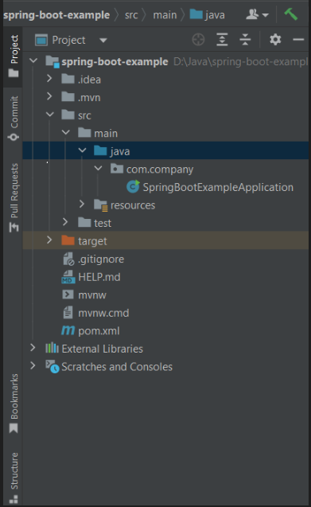
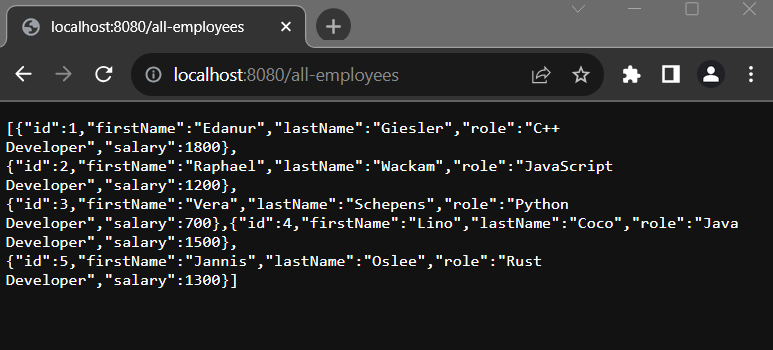
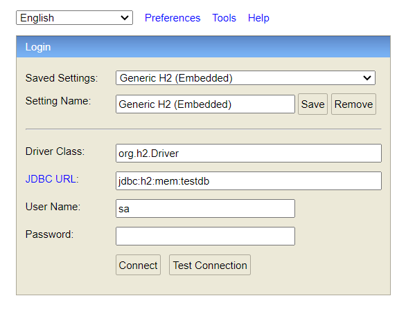
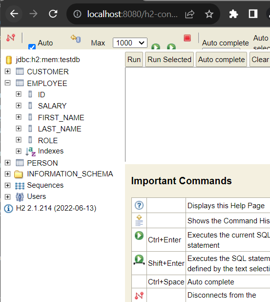
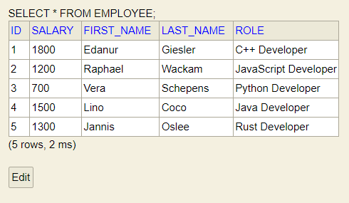

## Develop a Simple Spring Boot Crud Application

Crud stands for Create, Read, Upade and Delete operations. These are the very essential component for software development where you allow your user to create, read, update or delete any resource from your data store.

For creating simple Crud Applicaton using Spring Boot, we use Spring MVC framework (model, view, controller approach) and for database access we use Spirng data jpa. Spring data jpa provides built in methods like CrudRepository or ListCrudRepository that can handle CRUD Operations very smoothly.

Let's first of all create an example application using Spring Boot.

Initial Requirements:
    - JavaSE version: 8+
    - Maven or Gradle as a build tool
    - Maven version: 3.6.3+
    - Gradle version: 7.5+
    - And IDE that support Java and maven/gradle: Like Intellij Ide, Eclipse or VS code.


Bootstrap your applicaton: Or simply clone the complete Spring data jpa crud application from github: //link

1. Open https://start.spring.io/ and provide necessary information to create spring boot project. The project will be a .zip file and we have to unzip it in a directory to work with it.

Now in this page, Select 
    - Maven as a build tool (you can select gradle too)
    - Java as a language
    - Spring Boot version 3.0.12 (or the latest version)
    - In the Project Metadata section, provide your application group, artifact, package name etc. Note: The group and package name will be same. Also the artifact and name of your project will be same as well. (Not mendatory). 
    - Then, select jar for packaging (for simplicity) and select the java language version. The java language version I use is 17. You can choose 8, 11 or the latest LTS version.
    - The last step is to adding dependencies. As we develop spring boot crud applican and for data persistent we use spring data jpa, thus we need to add spring web, spring data jpa, h2 dependency in our classpath. After adding all the required dependencies  click on Generate button. It will create a simple zip file (the zip file name is your project name)

2. After generating the .zip file now unzip it to any directory. 

3. Import the unzip spring-boot-example project into your favourite Ide.

Eclipse: Open your Eclipse (STS) Ide. File > Import > Maven > Existing Maven projects > Next > Browse your sping boot project (Reside our example spring boot project) > Click Finish. Please wait few seconds to complete the whole process and resolving the maven dependencies.

Intellij Ide: Open your Inellij Ide, then File > Open > Browse the existing spring boot project > Clikc Ok. Likewise eclipse, wait few seconds to resolve maven/Gradle dependencies. 

4. After opening your example application, You will see a folder structure like this



5. Create an entity class called Employee.java in com.company.model package. It is a entity class and it contains id (primary key), fistName, lastName, role and salary properties. We here annotate the Employee class by @Entity annotaion as it is a persistent class. Also we externally use @Column annotation to generate column name in our database table. If you don't externally use @Column annotaion on attributes/properties than the name of the property will be the column name in database table.

Employee.java class: 

```js
package com.company.model;

import jakarta.persistence.*;

import java.util.StringJoiner;

@Entity
@Table(name = "employee")
public class Employee{
    @Id
    @GeneratedValue(strategy = GenerationType.AUTO)
    private int id;
    @Column(name = "firstName")
    private String firstName;
    @Column(name = "lastName")
    private String lastName;
    @Column(name = "role")
    private String role;
    @Column(name = "salary")
    private int salary;

    public Employee() {
        super();
    }

    public Employee(int id, String firstName, String lastName, String role, int salary) {
        this.id = id;
        this.firstName = firstName;
        this.lastName = lastName;
        this.role = role;
        this.salary = salary;
    }

    public int getId() {
        return id;
    }

    public void setId(int id) {
        this.id = id;
    }

    public String getFirstName() {
        return firstName;
    }

    public void setFirstName(String firstName) {
        this.firstName = firstName;
    }

    public String getLastName() {
        return lastName;
    }

    public void setLastName(String lastName) {
        this.lastName = lastName;
    }

    public String getRole() {
        return role;
    }

    public void setRole(String role) {
        this.role = role;
    }

    public int getSalary() {
        return salary;
    }

    public void setSalary(int salary) {
        this.salary = salary;
    }

    @Override
    public String toString() {
        return new StringJoiner(", ", Employee.class.getSimpleName() + "[", "]")
                .add("id=" + id)
                .add("firstName='" + firstName + "'")
                .add("lastName='" + lastName + "'")
                .add("role='" + role + "'")
                .add("salary=" + salary)
                .toString();
    }

}

```

Exp: Here, we annotate the Employee class by @Entity annotation as it is a persistent class. The Employee entity class requires an id (primary key in database table). So, we create an customer id and annotate it by @Id annotation. We also make the id generation process automatically by using  @GeneratedValue(strategy = GenerationType.AUTO) annotation. The other properties are Employee firstName, lastName, role and salary. Remembere, all the properties are column name of your database table. Yet, we use @Column annotaion externally for better controll.

6. Now in this stepe, create EmployeeRepository.java interface in com.company.repository package. Spring data jpa provies CrudRepository interface that handles basic CRUD (cread, read, update, delete) operations smoothly. So, we here extends the Spring data jpa CrudRepository interface with the domain and type.

EmployeeRepository.java 

```js
package com.company.repository;

import com.company.model.Employee;
import org.springframework.data.repository.CrudRepository;

public interface EmployeeRepository extends CrudRepository<Employee, Integer> {
    //query methods
}
```

Note: Later we describe spring data jpa query method generation process.

7. Create EmployeeService.java class in com.company.service package (create service package/folder in com.company if you did't yet). And annotate the class by @Service annotaion. We also have to Inject the CustomerRepository interface in this service class using @Autowired annotation. Then we will create methods to operate basic CRUD operations.

EmployeeService.java 

```js
package com.company.service;

import com.company.model.Employee;
import com.company.repository.EmployeeRepository;
import org.springframework.beans.factory.annotation.Autowired;
import org.springframework.stereotype.Service;

import java.util.ArrayList;
import java.util.List;

@Service
public class EmployeeService {

    @Autowired
    public EmployeeRepository employeeRepository;

    public EmployeeService(EmployeeRepository employeeRepository) {
        this.employeeRepository = employeeRepository;
    }

    //method for getting all employees
    public List<Employee> getEmployList(){
        List<Employee> employees = new ArrayList<>();
        employeeRepository.findAll().forEach(employees::add);
        return employees;
    }

    //method for getting specific employee record with id
    public Employee getEmployeeById(int id){
        return employeeRepository.findById(id).get();
    }

    //method for saving new employee record
    public Employee saveEmployee(Employee employee){
        return employeeRepository.save(employee);
    }

    //method for deleting existing employee record
    public void deleteEmployee(int id){
        employeeRepository.deleteById(id);
    }
}

```

So, you can see we have created methods for getting all Employees, get single Employee details by id, save Employee details and delete/update Employee details.

8. Create EmployeeController.java class in com.company.controller pacakge. We annotate this class by @RestController annotation so that the class can handle rest requests.

```js
package com.company.controller;

import com.company.model.Employee;
import com.company.service.EmployeeService;
import org.springframework.beans.factory.annotation.Autowired;
import org.springframework.web.bind.annotation.*;

import java.util.List;

@RestController
public class EmployeeController {
    @Autowired
    public EmployeeService employeeService;

    //getMapping for getting all employees
    @GetMapping("/all-employees")
    public List<Employee> findAllEmployees(){
       return employeeService.getEmployList();
    }

    //getMapping for getting individual employee record
    @GetMapping("/employee/{id}")
    public Employee findEmployeeById(@PathVariable("id") int id){
       return employeeService.getEmployeeById(id);
    }

    //getMapping for saving new employee record
    @PostMapping("/employee")
    public int saveNewEmployee(@RequestBody Employee employee){
        return employeeService.saveEmployee(employee).getId();
    }

    //deleteMapping for deleting existing employee record
    @DeleteMapping("/employee/{id}")
    public void deleteEmployee(@PathVariable("id") int id){
        employeeService.deleteEmployee(id);
    }
}

```

Exp: First of all we annotate the class @RestController annotation so that it treat as restfull web servie. Next, we Inject the EmployService class by @Autowired annotation. 
Then, we have used spring MVC methods. We use @GetMapping("/all-employees") annotation for getting all the employeess on "/all-employees" url


9. Now open your main class SpringBootExampleApplication.java file and run the application. If everything is going well, your application now runs on port 8080. 

10. Open your favourite web browser and invoke the url: http://localhost:8080/customers and you will see: [] an empty array sign. It means, we don't have any actual data to stored in our h2-database.

11. In this step we will use Postman, a popular rest client to work with rest APIs. If, in your system postman is already installed do the follwoing 
    - Open it (if Postman is already installed)
    - Invoke the url: http://localhost:8080/employee
    - Select Body and row then JSON as content-type
    - Insert the below demo data (one by one)
    - At last, click on send button 

Or, if Postman is not installed, you can install it from here: //link

Demo Employee data: You can store one Employee record at a time. Like this, we will store fe Employee record one after anoteher.


```js
{
    "id": "1",
    "firstName": "Edanur",
    "lastName": "Giesler",
    "role": "C++ Developer",
    "salary": 1800
}
```
Click on Send button. If you get a status code: 200 OK. It means, your data has been sent successfully to the server. Like the above step, add few more Employee records. 

```js
//note: store one after another

//second customer
{
    "id": "2",
    "firstName": "Raphael",
    "lastName": "Wackam",
    "role": "JavaScript Developer",
    "salary": 1200
}

//third customer
{
    "id": "3",
    "firstName": "Vera",
    "lastName": "Schepens",
    "role": "Python Developer",
    "salary": 700
}

//fourth customer
{
    "id": "4",
    "firstName": "Lino",
    "lastName": "Coco",
    "role": "Java Developer",
    "salary": 1500
}

//fifth customer
{
    "id": "5",
    "firstName": "Jannis",
    "lastName": "Oslee",
    "role": "Rust Developer",
    "salary": 1300
}

```

Note: All are fake names. You can use your own.


Menes, you have successfully post/save 5 Employee details to the h2 in-memory database. 

12. Now, if you if you open your browser again and invoke the url: http://localhost:8080/all-employees you will get json response like this: 



But if you invoke the url: http://localhost:8080/employee/1 You will get the first first employee detail. And if you invoke http://localhost:8080/employee/5 you will get an Employee details that id is 5. Insead of using getById built in query methods, you can alos create getFirstName(), getByLastName() etc. query methods in your repository.


## See the Employee data in your h2-inmemory database console:

13. Open your favourite web browser and invoke the url: http://localhost:8080/h2-console and click enter. You will see a window like below and click connect. 



If you don't see any window like the above or get whitelevel error message, you have to do one more thing to connect your application with h2 database. 

Open application.properties file whcih is located in resources folder in your application.

Then add the following database information:

```js
spring.datasource.url=jdbc:h2:mem:testdb
spring.datasource.driverClassName=org.h2.Driver
spring.datasource.username=sa
spring.datasource.password=
spring.jpa.database-platform=org.hibernate.dialect.H2Dialect
#enabling the H2 console
spring.h2.console.enabled=true
```

Now again do the step 14 and you will definitely see the h2 console window. Click on the  connect button and you will see the below interface:



And if you click on Employee table you will see there are total 5 columns have been generated. The id column is considered as Employee table primary key.

14. Click on Employee or (Write this sql command: SELECT * FROM EMPLOYEE ) and then click on Run button. You will see the folliwnd response in the console 

 

----
So, in this simple tutorial we have learnt how to build a simple Crud (rest) application using spring data jpa. Hope you find this tutorial very helpful.


