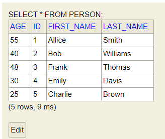

## Sping Boot and H2 Database

H2 is an in-memory, embedded and open source database management system that stores application data in the system memory rather than physical storage. Popular in-memory, embedded databases are H2, Apache Derby, HSQLDB (HyperSQL Database). And Popular Physical databases are Mysql, Postgresql, Oracle etc. 

Here, Sping Boot provides extra support for h2 embedded database for storing, retrieving sample data. Note that h2 database data will be stored in your system memeory rather than in your server or actual storage. We use embedded database when we don't plan to persiste the data or make our application production ready and remember the data has been lost when you restart your application.

## How to add h2 embedded database in your Spring boot application

If you have already spring boot aplication you can add the h2 dependency in your pom.xml file or gradle.build file.

For Maven User:

```js
<dependency>
	<groupId>com.h2database</groupId>
	<artifactId>h2</artifactId>
	<scope>runtime</scope>
</dependency>
```

For Gradle User:

```js
dependencies {
    runtimeonly 'com.h2database:h2'
}
```

After adding the h2 embedded database dependency in your classpath (pom.xml file), you may have to reload the pom.xml file. If you are in intellij ide open your your pom.xml file -> Right click -> Maven -> Reload Project

Now H2 in-memory database is set in your classpath. Now you have to provide few metadata regarding your h2 database. Open your application.properties file located in resources folder and add the following info -

```js
spring.datasource.url=jdbc:h2:mem:testdb
spring.datasource.driverClassName=org.h2.Driver
spring.datasource.username=sa
spring.datasource.password=
spring.jpa.database-platform=org.hibernate.dialect.H2Dialect
#enabling the H2 console
spring.h2.console.enabled=true

```

Here you actually provide database related info or configuration like database url, password, username, plaform info etc. Make sure you add the "spring.h2.console.enabled=true" so that you can access the database from your localhost.

## If you don't have Spirng Boot appliacation yet let's create one

## What You Need to Build a simple Spring Boot Project

Initial Requirements:
    - JavaSE version: 8+
    - Maven or Gradle as a build tool
    - Maven version: 3.6.3+
    - Gradle version: 7.5+
    - And IDE that support Java and maven/gradle: Like Intellij Ide, Eclipse or VS code.


Let's follow the belew steps to bootstrap our simple Spring Boot application.

1. Open https://start.spring.io/ and provide necessary information to create spring boot project. The project will be a .zip file and we have to unzip it in a directory to work with it.

Now in this page, Select 
    - Maven as a build tool (you can select gradle too)
    - Java as a language
    - Spring Boot version 3.0.12 (or the latest version)
    - In the Project Metadata section, provide your application group, artifact, package name etc. Note: The group and package name will be same. Also the artifact and name of your project will be same as well (Not mendatory). 
    - Then, select jar for packaging (for simplicity) and select the java language version. The java language version I use is 17. You can choose 8, 11 or the latest LTS version.
    - The last step is to adding dependencies. As we create database related application and use h2 in-memory database thus add the following dependecies in your classpath
        - Spring Web
        - H2 
        - Spring Data JPA
    - After adding spring web, h2 and spring data jpa dependencies click on Generate button. It will create a simple zip file (the zip file name is your project name)

2. After generating the .zip file now unzip it to any directory. 

3. Import the unzip spring-boot-example project into your favourite Ide.

Eclipse: Open your Eclipse (STS) Ide. File > Import > Maven > Existing Maven projects > Next > Browse your sping boot project (Reside our example spring boot project) > Click Finish. Please wait few seconds to complete the whole process and resolving the maven dependencies.

Intellij Ide: Open your Inellij Ide, then File > Open > Browse the existing spring boot project > Clikc Ok. Likewise eclipse, wait few seconds to resolve maven/Gradle dependencies. 

4. You appliation structure should be like this


5. Add the following h2 database related metadata in your appliacation.properties file located in resources folder. 

```js
spring.datasource.url=jdbc:h2:mem:testdb
spring.datasource.driverClassName=org.h2.Driver
spring.datasource.username=sa
spring.datasource.password=
spring.jpa.database-platform=org.hibernate.dialect.H2Dialect
#enabling the H2 console
spring.h2.console.enabled=true

```

<b>spring.h2.console.enabled=true</b> this propery will enable the h2 database in localhsot. 

5. Now run your application and open your favourite web browser and invoke the url: 

http://localhost:8080/h2-console You will now immediately see the follwing window 


6. Now create a Person entity class in com.company.model package. We have to annotate this class by @Entity annotation and it contains person id, firstName, lastName and age properties. All the properties are valid table name in h2 database. 

```js
package com.company.model;

import jakarta.persistence.*;

import java.util.StringJoiner;

@Entity
@Table(name = "person")
public class Person {
    @Id
    @GeneratedValue(strategy = GenerationType.AUTO)
    private int id;
    private String first_name;
    private String lastName;
    private int age;


    //no-arg constructor
    public Person() {
        super();
    }

    public Person(int id, String first_name, String lastName, int age) {
        this.id = id;
        this.first_name = first_name;
        this.lastName = lastName;
        this.age = age;
    }

    public int getId() {
        return id;
    }

    public void setId(int id) {
        this.id = id;
    }

    public String getFirst_name() {
        return first_name;
    }

    public void setFirst_name(String first_name) {
        this.first_name = first_name;
    }

    public String getLastName() {
        return lastName;
    }

    public void setLast_name(String last_name) {
        this.lastName = lastName;
    }

    public int getAge() {
        return age;
    }

    public void setAge(int age) {
        this.age = age;
    }

    @Override
    public String toString() {
        return new StringJoiner(", ", Person.class.getSimpleName() + "[", "]")
                .add("id=" + id)
                .add("first_name='" + first_name + "'")
                .add("lastName='" + lastName + "'")
                .add("age=" + age)
                .toString();
    }
}

```

Note: Primary key and no-argument construtor are required by default.


6. Create PersonRepository.java interface class in com.company.reposiitory package. And it extends CrudRepositroy interface.

```js
package com.company.repository;

import com.company.model.Person;
import org.springframework.data.repository.CrudRepository;


public interface PersonRepository extends CrudRepository<Person, Integer> {

    //query methods
}

```

Here the Person is the domain name and Integer is the type of domain.

7. Create PersonPersistent.java class in com.company.persistence pacakge.

```js
package com.company.persistence;


import com.company.SpringBootExampleApplication;
import com.company.model.Person;
import com.company.repository.PersonRepository;
import org.springframework.beans.factory.annotation.Autowired;
import org.springframework.boot.CommandLineRunner;
import org.springframework.stereotype.Component;

@Component
public class PersonPersistent implements CommandLineRunner {

    @Autowired
    public PersonRepository personRepository;

    private static final Logger logger = LoggerFactory.getLogger(SpringBootExampleApplication.class);
    @Override
    public void run(String... args) throws Exception {

        Person p1 = new Person(1, "Allice", "Smith", 55);
        Person p2 = new Person(2, "Bob", "Williams", 40);
        Person p3 = new Person(3, "Frank", "Thomas", 48);
        Person p4 = new Person(4, "Emily", "Davis", 30);
        Person p5 = new Person(5, "Charlie", "Brown", 25);

        //save the person objects
        personRepository.save(p1);
        personRepository.save(p2);
        personRepository.save(p3);
        personRepository.save(p4);
        personRepository.save(p5);

        /* instead of writing save method for individual person object
        * invoke the saveAll(List.of(p1,p2,p3,p4,p5)); to save
        * all the person objects to database
        * */

    }
}

```

Note: You have to annotate the PersonPersistent class by @Component annotation and we here implement the CommnadLine interface in order to save our Person table records when the application starts.

8. Run the applicaton. 

9. If you don't change server url, then your application should run on port 8080 in localhost. So, invoke the url: http://localhost:8080/h2-console/ and click connect.

10. Run this command in the command dialog box (right side): SELECT * FROM PERSON; 

You can now see the folloing response: 



That's all. You have successfully added h2 database in your applicaton classpath and also populate few demo Person table data in h2 in-memory database.

