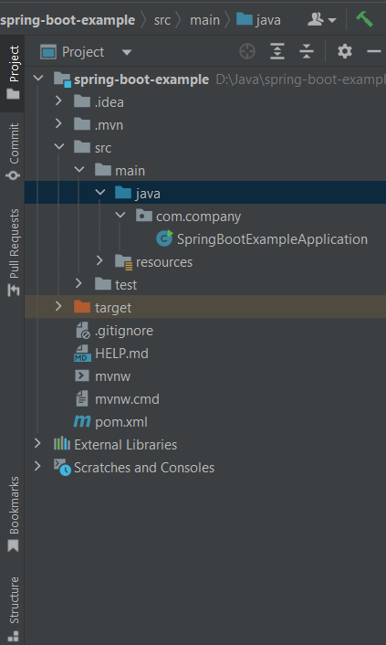
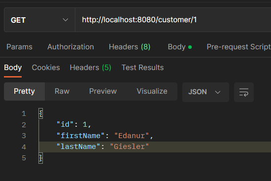
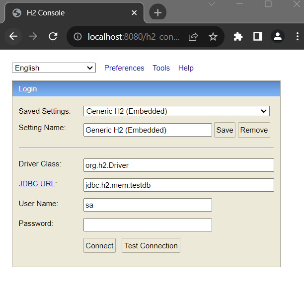
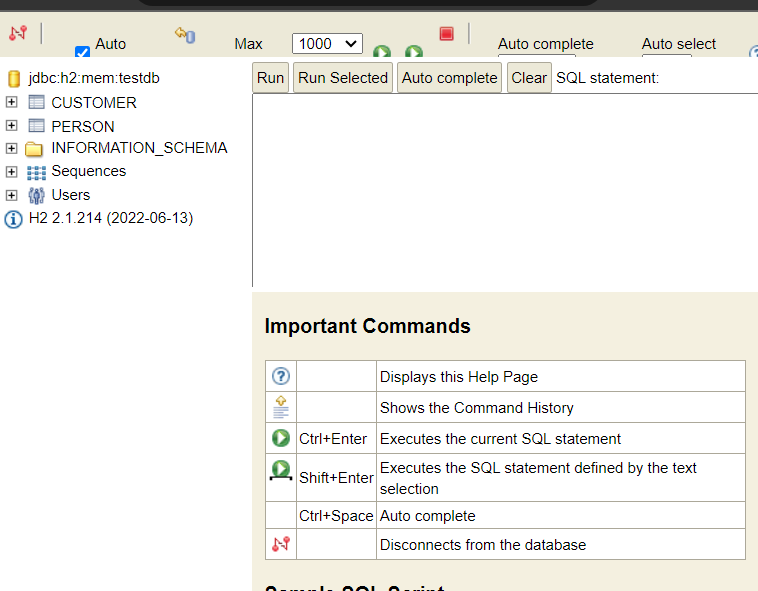
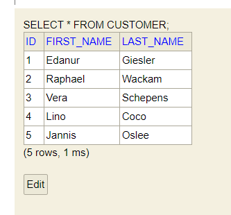

## Devoloping a Simple Crud Application using Sping Boot

Crud stands for Create, Read, Upade and Delete operations. These are the very essential component for software development. Where you allow your user to create, read, update or delete any resource. 

For creating simple Crud Applicaton using Spring Boot, we use Spring MVC framework (model, view, controller approach) and for database access we use Spirng data jpa. Spring data jpa provides built in methods like CrudRepository that can handle Crud Operation very smoothly.

Let's first of all create an example application using Spring Boot.


Initial Requirements:
    - JavaSE version: 8+
    - Maven or Gradle as a build tool
    - Maven version: 3.6.3+
    - Gradle version: 7.5+
    - And IDE that support Java and maven/gradle: Like Intellij Ide, Eclipse or VS code.


Bootstrap your applicaton: Or simply clone the complete Spring data jpa crud application from github: //link

1. Open https://start.spring.io/ and provide necessary information to create spring boot project. The project will be a .zip file and we have to unzip it in a directory to work with it.

Now in this page, Select 
    - Maven as a build tool (you can select gradle too)
    - Java as a language
    - Spring Boot version 3.0.12 (or the latest version)
    - In the Project Metadata section, provide your application group, artifact, package name etc. Note: The group and package name will be same. Also the artifact and name of your project will be same as well (Not mendatory). 
    - Then, select jar for packaging (for simplicity) and select the java language version. The java language version I use is 17. You can choose 8, 11 or the latest LTS version.
    - The last step is to adding dependencies. As we develop spring boot crud applican and for data persistent we use spring data jpa, thus we need to add spring web, spring data jpa, h2 dependency in our classpath. After adding all required dependencies  click on Generate button. It will create a simple zip file (the zip file name is your project name)

2. After generating the .zip file now unzip it to any director. 

3. Import the unzip spring-boot-example project into your favourite Ide.

Eclipse: Open your Eclipse (STS) Ide. File > Import > Maven > Existing Maven projects > Next > Browse your sping boot project (Reside our example spring boot project) > Click Finish. Please wait few seconds to complete the whole process and resolving the maven dependencies.

Intellij Ide: Open your Inellij Ide, then File > Open > Browse the existing spring boot project > Clikc Ok. Likewise eclipse, wait few seconds to resolve maven/Gradle dependencies. 

4. After opening your example application, You will see a folder structure like this



5. Create an entity class called Customer.java in com.company.model package. It is a persistent class and it contains id, fistName, lastName properties. We here annotathe the the Customer class by @Entity annotaion as it is a persistent class and the properties in it will be persisted to the database. 

Customer.java class: 

```js
package com.company.model;


import jakarta.persistence.Entity;
import jakarta.persistence.GeneratedValue;
import jakarta.persistence.GenerationType;
import jakarta.persistence.Id;

@Entity
public class Customer {
    @Id
    @GeneratedValue(strategy = GenerationType.AUTO)
    private int id;
    private String firstName;
    private String lastName;

    public Customer() {
        super();
    }

    public Customer(int id, String firstName, String lastName) {
        this.id = id;
        this.firstName = firstName;
        this.lastName = lastName;
    }

    public int getId() {
        return id;
    }

    public void setId(int id) {
        this.id = id;
    }

    public String getFirstName() {
        return firstName;
    }

    public void setFirstName(String firstName) {
        this.firstName = firstName;
    }

    public String getLastName() {
        return lastName;
    }

    public void setLastName(String lastName) {
        this.lastName = lastName;
    }
}

```

Exp: Here, we annotate the Customer class by @Entity annotation as it is a persistent class. We can externally use @Table annotation to give the table a specific name. Otherwise the class name will be the table name. The customer class requires an id. So, we create an customer id and annotate it by @Id annotation. We also make the id generation process automatically by using  @GeneratedValue(strategy = GenerationType.AUTO) annotation. The other properties are customer firstName and lastName. Remembere, all the properties are valid column name of your database table. You can use @Column() annotation on property label to give the columns a specific name and provides other matadata too.

6. Now in this stepe, create CustomerRepository.java interface in com.company.repository package. Spring data jpa provies CrudRepository interface that handles basic CRUD (cread, read, update, delete) operations smoothly. So, we here extends the Spring data jpa CrudRepository interface with the domain and type.

```js
package com.company.repository;

import com.company.model.Customer;
import org.springframework.data.repository.CrudRepository;

public interface CustomerRepository extends CrudRepository<Customer, Integer> {

    //other query methods
}
```
Note: Later we describe spring data jpa query method generation process.

7. Create CustomerService.java class in com.company.service package (create service package/folder in com.company if you did't yet). And annotate the class by @Service annotaion. We also have to Inject the CustomerRepository interface in this service class using @Autowired annotation. Then we have created methods to operate crud coperations.

Look over the CustomereService.java class: 

```js
package com.company.service;

import com.company.model.Customer;
import com.company.repository.CustomerRepository;
import org.springframework.beans.factory.annotation.Autowired;
import org.springframework.stereotype.Service;

import java.util.ArrayList;
import java.util.List;

@Service
public class CustomerService {

    @Autowired
    CustomerRepository customerRepository;

    //method for getting all customer list
    public List<Customer> getAllCustomer(){

        List<Customer> customers = new ArrayList<>();
        customerRepository.findAll().forEach(customers::add); //method reference
        return customers;
    }

    //method for getting individual customer
    public Customer getCustomerById(int id){
        return customerRepository.findById(id).get(); // for simplicity I avoid to use isPresent method
    }

    //method for storing each customer
    public Customer saveCustomer(Customer customer){
       return customerRepository.save(customer);
    }

    //method for deleting customer record
    public void deleterCustomer(int id){
        customerRepository.deleteById(id);
    }

    //method for updating customer record
    public void updateCustomer(Customer customer){
        customerRepository.save(customer);
    }
}

```

So, you can see we have created methods for getting all customers, get each customer by id, save customer details and delete customer details by id. 

8. Create CustomerController.java class in com.company.controller pacakge. We annotate this class by @RestController annotation so that the class can handle rest requests. 

```js
package com.company.controller;

import com.company.model.Customer;
import com.company.service.CustomerService;
import org.springframework.beans.factory.annotation.Autowired;
import org.springframework.web.bind.annotation.*;

import java.util.List;

@RestController
public class CustomerController {

    @Autowired
    public CustomerService customerService;

    //let's propagate get, post, save and delete mapping within the methods

    //gatMapping for retrieving list of customers
    @GetMapping("/customers")
    List<Customer> findAllCustomers(){
        return customerService.getAllCustomer();
    }

    //getMapping for getting specific customer
    @GetMapping("/customer/{id}")
    public Customer findCustomer(@PathVariable("id") int id){
        return customerService.getCustomerById(id);
    }

    //postMapping for saving customer
    @PostMapping("/customer")
    public int save(@RequestBody Customer customer){
        return customerService.saveCustomer(customer).getId(); //it returns id
    }

    //deleteMapping for deleting customer
    @DeleteMapping("/customer/{id}")
    public void delete(@PathVariable("id") int id){
        customerService.deleterCustomer(id);
    }
}

```

9. Now open your main class SpringBootExampleApplication.java file and run the application. If everything is going well, your application now runs on port 8080. 

10. Open your favourite web browser and invoke the url: http://localhost:8080/customers and you will see: [] array symbal. It means, we don't have any actual yet data to retirve.

11. In this step we will use Postman, a popular rest client to work with rest apis. If, in your system postman is already installed do the follwoing 
    - Open it (if Postman is already installed)
    - Invoke the url: http://localhost:8080/customer
    - Select Body and row then JSON as content-type
    - Insert the below demo data (one by one)
    - At last, click on send button 

Demo Customer data: You can send one customer record at time. Like this, we will send Five customer data okay.

```js
{
    "id": "1",
    "firstName": "Edanur",
    "lastName": "Giesler"
}
```
Click on send button. Like the above step, add few more customer records. 

```js
//noete: send one after another

//second customer
{
    "id": "2",
    "firstName": "Raphael",
    "lastName": "Wackam"
}

//third customer
{
    "id": "3",
    "firstName": "Vera",
    "lastName": "Schepens"
}

//fourth customer
{
    "id": "4",
    "firstName": "Lino",
    "lastName": "Coco"
}

//fifth customer
{
    "id": "5",
    "firstName": "Jannis",
    "lastName": "Oslee"
}

```
Note: All are fake names. You can use your own.


Menes, you have successfully post/save 5 customer details to the h2 in-memory database. 

12. Now again open Postman. Select GET and invoke the url: http://localhost:8080/customers you will see 5 customer records as a response.


Menes, you have successfully post/save 5 customer details to the h2 in-memory database. 

Now for getting individual customer details by id, invoke the url: http://localhost:8080/customer/1 with GET http verbs. Clik on send button you will now get the customer record whose id is 1.




Also you can able to delete, update or retirve customer records through Postman client application.


## See the customer data in h2-inmemory database console:

13. Open your favourite web browser and invoke the url: http://localhost:8080/h2-console and click enter. You will see a window like below and click connect. 



If you don't see any window like the above or get whitelevel error message, you have to do one more thing to connect your application with h2 database. 

Open application.properties file whcih is located in resources folder in your application.

Then add the following database information:

```js
spring.datasource.url=jdbc:h2:mem:testdb
spring.datasource.driverClassName=org.h2.Driver
spring.datasource.username=sa
spring.datasource.password=
spring.jpa.database-platform=org.hibernate.dialect.H2Dialect
#enabling the H2 console
spring.h2.console.enabled=true
```

Now againg do the step 14 and you will difinately see the h2 console window. Click connect and you will see the below interface:



14. Click on customer and then click on Run command. You will see the folliwnd response in the console 




