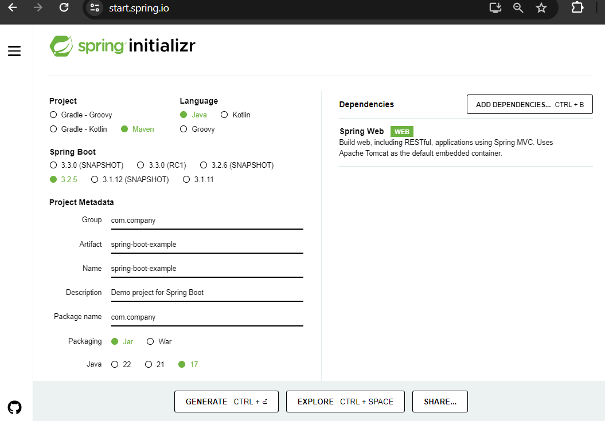
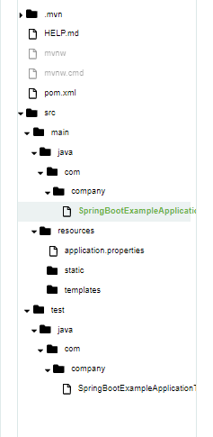
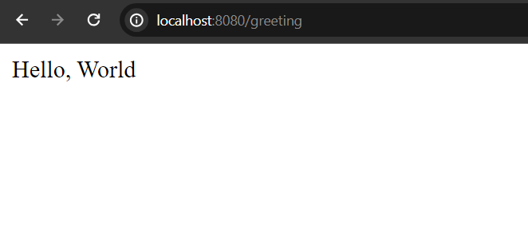
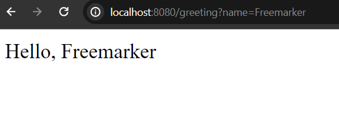

## Spring Boot Hello World Application

In this simple post, we age going to explore how to bootstrap a simple Spring Boot Hello World Application. For boot strapping this project, we will use [text](http://start.spring.io/) website.

Initial Requirements:

Java 8+ (Will be better if you use 17+)
Maven v3.6.3+ (it will be used as a build tool)
An Ide: Like Intellij or VS Code.

Let's start building our First Spring Boot Hello World Application.

## Bootstrap Our Application

First of all we will use [text](http://start.spring.io/) website to bootstrap our spring boot maven application. So visit here: [text](http://start.spring.io/) and follow the below instructions.

1. Select Maven as a build tool and Java as a language.

2. Select latest spring boot version. In my case it is 3.2.5 (then you must need java 17+)

3. Project Metadata Section:
    - GroupId: com.company (or your organization name - domain reverse order)
    - artifact: spring-boot-example
    - package-name: com.company
    - packaging: jar
    - java version: 17

4. In the dependency section add-
    - spring web dependency (later you can add more dependencies if required)

5. Click on Generate Button and it will be zip file.



Now unzip the zip file and open it in your favourite ide. In my case, I will use use Intellij ide (community edition).

After opening the spring-boot-example application, your file structure will be



If you open pom.xml file (a file that will manage our spring boot dependencies) you will see the dependencies we have added while bootstrapping the project.

pom.xml (you just skip this project)

```
<?xml version="1.0" encoding="UTF-8"?>
<project xmlns="http://maven.apache.org/POM/4.0.0" xmlns:xsi="http://www.w3.org/2001/XMLSchema-instance"
	xsi:schemaLocation="http://maven.apache.org/POM/4.0.0 https://maven.apache.org/xsd/maven-4.0.0.xsd">
	<modelVersion>4.0.0</modelVersion>
	<parent>
		<groupId>org.springframework.boot</groupId>
		<artifactId>spring-boot-starter-parent</artifactId>
		<version>3.2.5</version>
		<relativePath/> <!-- lookup parent from repository -->
	</parent>
	<groupId>com.company</groupId>
	<artifactId>spring-boot-example</artifactId>
	<version>0.0.1-SNAPSHOT</version>
	<name>spring-boot-example</name>
	<description>Demo project for Spring Boot</description>
	<properties>
		<java.version>17</java.version>
	</properties>
	<dependencies>
		<dependency>
			<groupId>org.springframework.boot</groupId>
			<artifactId>spring-boot-starter-web</artifactId>
		</dependency>

		<dependency>
			<groupId>org.springframework.boot</groupId>
			<artifactId>spring-boot-starter-test</artifactId>
			<scope>test</scope>
		</dependency>
	</dependencies>

	<build>
		<plugins>
			<plugin>
				<groupId>org.springframework.boot</groupId>
				<artifactId>spring-boot-maven-plugin</artifactId>
			</plugin>
		</plugins>
	</build>

</project>
```

## Create a Controller Class

In this final step, we will create a simple controller class that will handle the incoming request and produce a simple Hello, World rest message.

So, in your src/main/java/com.company/ package create a simple HelloController.java class. In this class, write a simple greeting method and let's name it getGreeting(). See the code below

HelloController.java

```
package com.company;

import org.springframework.web.bind.annotation.GetMapping;
import org.springframework.web.bind.annotation.RestController;

@RestController
public class HelloController {

    @GetMapping("/greeting")
    public String getGreeting(){
        return "Hello, World";
    }
}
```

Here we have used two annotations. One is @RestController annotations that will helps to make a rest api in spring boot. And another one is @GetMapping that is used to handling the incoming requests. Below, we will explain most import annotations used in spring boot usually, with details.

## Run the Application

Now open, SpringBootExampleApplication.java class and run this file. There is a run button at the upper right corner, click on it or use a short-cut like: (Shift + F10). After running your application, you can see, your applications listens on port 8080 in localhost.

```
LiveReload server is running on port 35729
Tomcat started on port 8080 (http) with context path ''
```

Now, if you open localhost:8080 in your favourite web browser, you will see a white level error page, because we don't have any page or mapping uri, to handle this (soon we will see how to handle http errors). 

Okay, if you now open [text](http://localhost:8080/greeting) you will see a simple Hello, World message. That is our goal in this tutorial. If you see the Hello, World message, it means you have successfully created spring boot Hello, World Application.



## Change Your HTTP Port

Usually, Spring Boot listens port 8080 in localhost but it is possible to change the port. Open application.properties file that is located in resources folder and write the following line to change the port.

```
# now application listens port 9090 in localhost
server.port=9090
```

## Make Our Application More Dynamic

Actually, we can do more than displaying only the Hello, World message in Spring Boot. Let's see how we can get a dynamic response in spring boot. Little bit changes are required in our **HelloController.java** class.

```
@RestController
public class HelloController {

    @GetMapping("/greeting")
    public String getGreeting(@RequestParam(defaultValue = "World") String name){
        return "Hello, " + name;
    }
}
```

Here we have used the @RequestParam annotation that is used to read the request parameter from the uri. Additionally we have set the defaultValue parameter, in case there is no uri, then it will be added instead of name parameter value.

So, if you now invoke [text](http://localhost:8080/greeting) you will get Hello, World response but if you invoke [text](http://localhost:8080/greeting?name=Java) the response would be Hello, Java. 



Our Hello, World spring boot application comes to it's end life. You can simply expand you java knowledge with spring boot and make sophisticated application with confidence.

-----

## Most Common Annotations used in Spring Boot

Spring Boot relies heavily on annotations to simplify the configuration and development process. Let's explore the most common well known and required annotations (unless you use xml to build your applications) those are used frequently to build a spring boot applications.


Thanks for reading this tutorial.

