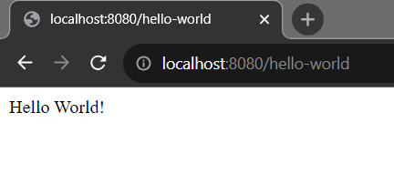

## Spring Boot Hello World Example Application


In this post, we are going to explore how to create a simple spring boot application using spring initializer.


**Initial requirements:**

    - JavaSE Version: 17+
    - Maven: 3.3.9+
    - An IDE (Eclipse or IntelliJ IDE)
    - Spring Boot: 3.1.2


Let's follow the following steps:

## Bootstrap Your Spring Boot Project

For bootstrapping our spring boot project, we will use spring initializer. So, visit here: [text](https://start.spring.io/) for bootstrapping our first spring boot application.


It will be a Maven based project and we use Java as a language. Spring Boot version should be 3.1.2 or vice versa.

In the project metadata section, provide the necessary info required for your project.

Group: com.company

Artifact: spring-boot-example

Name: spring-boot-example

Description: Demo Project for Spring Boot

Package: com.company

**Note**: Here, Group name will be the package name and Artifact name will be the name of your project. Here we select java version 17 and jar tool for packaging our application.


## Add Dependency

Now we add maven dependency. As it is a simple Hello World application, thus we add Spring Web dependency.

After adding the spring web starter dependency, just click on Generate button. It will package your application into a zip file. Then, Extract the spring-boot-example.zip file to any directory. Later we will import it in our IDE.


## Import Your Project into Your Favourite IDE

Open your favourite Ide. In my case IntelliJ Ide. Import the spring-boot-example application into your ide.

Let's see how to import project in your favourite Ide.

<b>Intellij:</b> File -> Open -> Select the project folder -> Ok (finish) It will now open your project in the current window or new window. Remember your project directory location you have just downloaded or extracted.

<b>Eclipse:</b> File -> Import -> Existing Maven Project -> Next -> Browse (you have just downloaded and extracted) -> Select the project folder (spring-boot-example) -> Finish

<b>Note:</b> When you Generate the spring-boot-example project, it is a .zip file. The file name should be spring-boot-example.zip file. You must unzip or extract it to somewhere in order to import it into your ide.


<b>Note:</b> It is also possible to bootstrap your spring boot application from your Ide. You may have to use STS (Spring tool suite Ide) or download necessary plugins or extensions for this.


After successfully importing the spring boot project, please wait few seconds to resolve the maven dependencies.


## Create a Controller Class

First of all, create a controller package in the **src/main/java/com/example** folder.

Then, inside it create a java class called **HelloController.java**

Now, Open **HelloController.java** class and create a method name **printHello(){}** and it will return a String message, when you run your application.


**HelloController.java**


```js

package com.example.controller;

import org.springframework.web.bind.annotation.GetMapping;
import org.springframework.web.bind.annotation.RestController;

@RestController
public class HelloWorld {

    @GetMapping("/hello-world")
    private String printHello(){
        return "Hello World!";
    }
}

```


You can see, we annotate the class by **@RestController** annotation and in the method level we use @GetMapping annotation. These are spring web related annotations. We will describe them in upcoming tutorial.


But note, the @GetMapping or @RequestMapping annotation will tell us where we find our endpoint in the browser (URL OR URI)

## Run Your Application


Now it's time to test our simple spring boot application. So, run the <b>SpringBootExampleApplication.java</b> file. If the application runs successfully, in the console you see the following message.

```console

2023-08-24T15:18:44.049+06:00  WARN 2556 --- [           main] ion$DefaultTemplateResolverConfiguration : Cannot find template location: classpath:/templates/ (please add some templates, check your Thymeleaf configuration, or set spring.thymeleaf.check-template-location=false)
2023-08-24T15:18:44.151+06:00  INFO 2556 --- [           main] o.s.b.w.embedded.tomcat.TomcatWebServer  : Tomcat started on port(s): 8080 (http) with context path ''
2023-08-24T15:18:44.160+06:00  INFO 2556 --- [           main] c.j.SpringBootExampleApplication         : Started SpringBootExampleApplication in 4.062 seconds (process running for 4.813)

```

Here, our application runs on port 8080 in localhost. Yes, it is a default port running spring boot application and you can always change it from the **application.properties** file.


So, Open your favourite browser and type: [text](http://localhost:8080/hello-world) and then you will see the Hello World! String message.





**Note**: Make sure you terminate or shut down your application and restart again. Otherwise the application will produce error message that port 8080 is used already or vise versa.


## How to Change Spring Boot Default port?

In order to change your default port, just open **application.properties** file and add the following configuration to change your default port number.

```
server.port = 9090 # Now our application listen port 9090 instead of 8080
```


Talk soon, </br>
Shakil Ahmed
