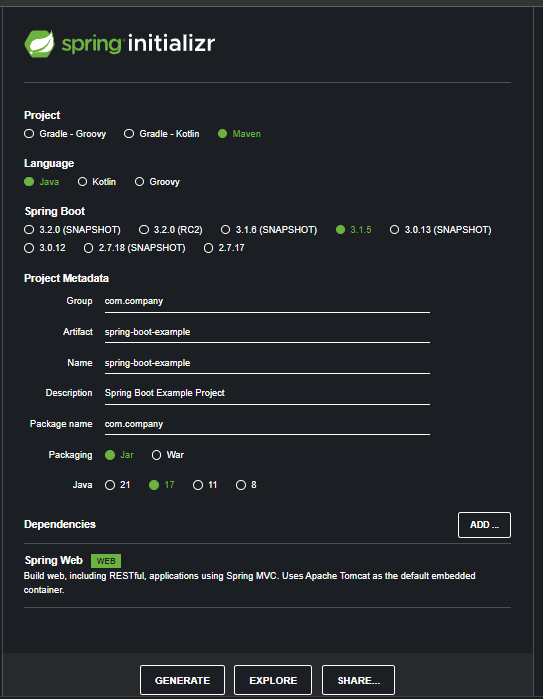
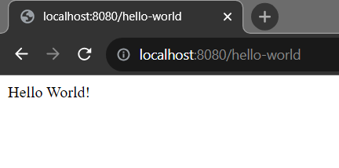

## Spring Boot Hello World example

In this tutorial, we will explain how to create a simple spring boot hello world application.

Basic requirements in order to create a spring boot application:

    - JavaSE Version: 17+
    - Maven: 3.3.9+
    - An IDE (Eclipse or Intellij ide)
    - Spring Boot: 3.1.2

<b>Note:</b> In this project, I will use intellij idea.

Let's follow the following steps: 

<b>Step 1:</b> Open Spring Initializer. Visit here: https://start.spring.io/ for creating spring boot application.



<b>Step 2:</b> It will be a Maven based project and we use Java as a language. Spring Boot version should be 3.1.2 or vice versa.

<strong>Step 3:</strong> In the Project Metadata section provide GroupId and ArtifactId name. </br>
<b>GroupId: com.example</b> </br>
<b>ArtifactId: spring-boot-example</b> (at the end Application will be added)

<b>Note</b>: Here, Group name will be the package name and Artifact name will be the name of your project. Here we select java version 17 and jar tool for packaging our application.


<b>Step 4:</b> Now we add maven dependency. As it is a simple Hello World application, thus we add Spring Web dependency. 

Step 5: Click on Generate button. It will package your application into a zip file. Then, Extract the spring-boot-example.zip file to any directory. Later we will import it in our IDE.

<b>Step 6:</b> Open your favourite Ide. In my case Intellij Ide. Import the spring-boot-example application into your ide. 

<b>Intellij:</b> File -> Open -> Select the project folder -> Ok (finish) It will now open your project in the current window or new window. Remember your project directory location you have just downloaded or extracted.

<b>Eclipse:</b> File -> Import -> Existing Maven Project -> Next -> Browse (you have just downloaded and extracted) -> Select the project folder (spring-boot-example) -> Finish 

<b>Note:</b> When you Generate the spring-boot-example project, it is a .zip file. The file name should be spring-boot-example.zip file. You must unzip or extract it to somewhere in order to import it into your ide. 

<b>Note:</b> It is also possible to bootstrap your spring boot application from your ide. You may use STS (Spring tool suite ide) or download necessary plugins or extensions for this.

<b>Step 7:</b> After successfully importing the spring boot project, please wait few seconds to resolve the maven dependencies.


<p>Step 8:</> Create a controller package in the <b>src/main/java/com/example</b> folder. 

Then, inside it create a java class called HelloController.java 

Step 9: Open <b>HelloController.java</b> class and create a method name <b>printHello(){}</b> and it will return a String message, when you run your application.

See here: 

```js

package com.example.controller;

import org.springframework.web.bind.annotation.GetMapping;
import org.springframework.web.bind.annotation.RestController;

@RestController
public class HelloWorld {

    @GetMapping("/hello-world")
    private String printHello(){
        return "Hello World!";
    }
}

```

You see, we annotate the class by <b>@RestController</b> annotation and in the method level we use @GetMapping annotation. These are spring web related annotations. We will describe them in upcoming tutorial.

But note, the @GetMapping or @RequestMapping annotation will tell us where we find our endpoint in the browser (URL OR URI)


Step 9: Run the <b>SpringBootExampleApplication.java</b> file. If the application runs successfully, in the console you see the following message.

```console

2023-08-24T15:18:44.049+06:00  WARN 2556 --- [           main] ion$DefaultTemplateResolverConfiguration : Cannot find template location: classpath:/templates/ (please add some templates, check your Thymeleaf configuration, or set spring.thymeleaf.check-template-location=false)
2023-08-24T15:18:44.151+06:00  INFO 2556 --- [           main] o.s.b.w.embedded.tomcat.TomcatWebServer  : Tomcat started on port(s): 8080 (http) with context path ''
2023-08-24T15:18:44.160+06:00  INFO 2556 --- [           main] c.j.SpringBootExampleApplication         : Started SpringBootExampleApplication in 4.062 seconds (process running for 4.813)

```

You see, our application runs on port 8080. Yes, it is a default port runs spring boot application and you can always change it from the application.properties file.

Step 10: Open your favourite browser and type: http://localhost:8080/hello-world and see Hello World! String message.




Note: Make sure you terminate or shut down your application and restart again. Otherwise the application will produce error message that port 8080 is used already or vise versa.

## How to change spring boot default port?

Open <b>application.properties</b> file and add the following configuration to change your default port number.

```
server.port = 9090 # Now our application listen port 9090 instead of 8080
```

Talk soon, </br>
Shakil Ahmed
