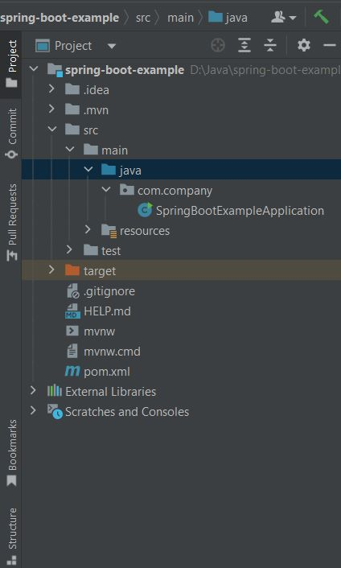
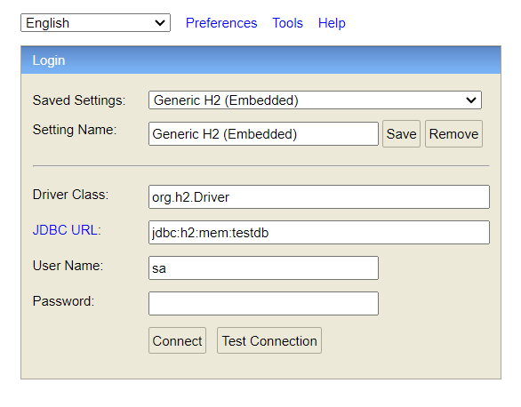
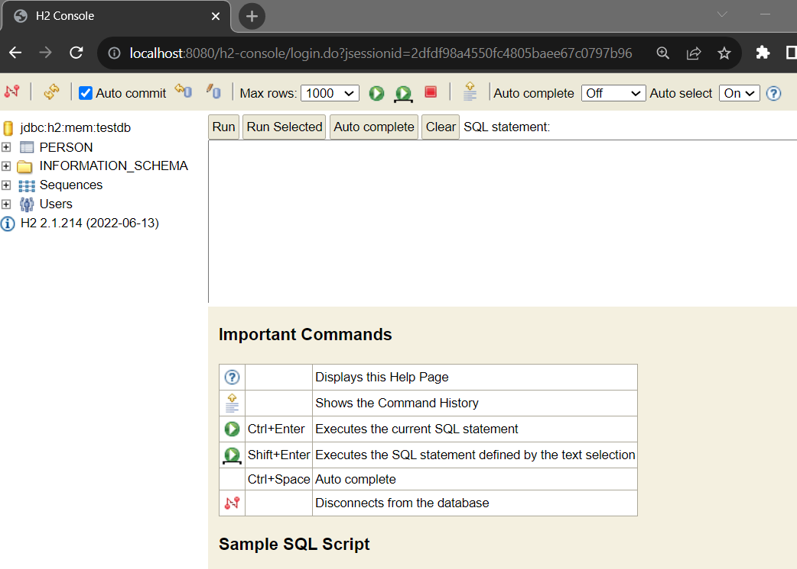
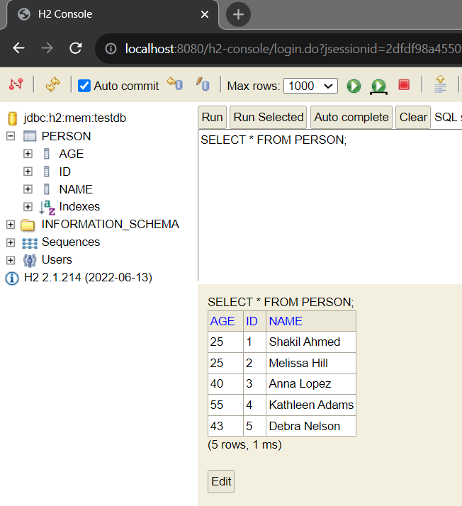

## Spring Boot JPA example application


In this tutorial we are going to create a simple Spring Data JPA Application.

**Initial Requirements:**
    - JavaSE: 8+ 
    - Maven : 3.3.9+
    - An IDE: (Eclipse or IntelliJ IDE, You can use STS too)
    - Spring Boot: 3.1.2


**Note:** Spring data jpa is a superset of jpa specification for managing relation database system from the java application. It allows us to work between java objects and relational database. JPA is a set of interfaces and it doesn't provide implementation and spring data jpa provides the implementation as well. And jpa follows the feature of ORM - Object relational mapping and provides runtime apis for processing queries and transactions on the objects against database. 


**Let's use following steps to create spring data jpa application.**


**Step 1:** Open Spring Initializer. Visit here: [https://start.spring.io/](https://start.spring.io/) for creating spring boot application.

**Step 2:** As it will be a Maven based project and we use Java as a language. Spring Boot version should be 3.1.2 or vice versa.

**Step 3:** In the Project Metadata section provide Group and Artifact name. 
<b>Group: com.javaondemand</b>
<b>Artifact: spring-boot-example</b> (at the end Application will be added)

Here, Group name will be the package name and Artifact name will be the name of your project. We use jar as a packaging and java version 17. You can use java 8, 11 too.


<strong>Step 4:</strong> Now we add dependency. We add here Spring web, Spring Data Jpa and H2 for in-memory database spring-boot-starter dependency. 

<strong>Step 5:</strong> Click on Generate button. It will generate your a zip file. Then, unzip or extract the spring-boot-example.zip file to any directory, remember the location. Later we will import it into our IDE.

<strong>Step 6:</strong> Open your favourite Ide. In my case Intellij Ide. Import the spring-boot-example application into your ide. 

<strong>IntelliJ:</strong> File -> Open -> Select the project folder -> Ok (finish) It will now open your project in the current window or new window. Remember your project location you have just downloaded or extracted.

<strong>Eclipse:</strong> File -> Import -> Existing Maven Project -> Next -> Browse (you have just download and extracted) -> Select the project folder (spring-boot-example) -> Finish 

**VS Code:** File > Open Folder > Browse the existing spring boot project > Select Folder.

**NetBeans:** File > Open Project > Browse the existing spring boot project (maven project) > Open project.

<b>Note:</b> When you Generate the spring-boot-example project, it is a .zip file. The file name should be <b>spring-boot-example.zip</b> file. You must unzip or extract it to somewhere in order to import it into your ide okay. 


<strong>Step 7:</strong> After successfully importing the spring boot example project, please wait few seconds to resolve the maven dependencies. Then, you see the following project directory structure of your spring boot project. 



<b>Step 8:</b> Create a model package in the <b>src/main/java/com/javaondemand</b> directory. And the, create Person entity class. 


**Person.java**

```
package com.javaondemand.model;

import jakarta.persistence.*;

@Entity
@Table(name = "person")
public class Person {
    @Id
    @GeneratedValue(strategy = GenerationType.AUTO)
    private int id;
    private String name;
    private int age;

    public Person() {
    }

    public Person(int id, String name, int age) {
        this.id = id;
        this.name = name;
        this.age = age;
    }

    public int getId() {
        return id;
    }

    public void setId(int id) {
        this.id = id;
    }

    public String getName() {
        return name;
    }

    public void setName(String name) {
        this.name = name;
    }

    public int getAge() {
        return age;
    }

    public void setAge(int age) {
        this.age = age;
    }
}
```

Here, we annotate the Person.java class by @Entity annotation as it is persistent class. And we externally name our table person <b>@Table(name="person")</b> 
Here, the properties are id, name and age. We must annotate the id by @Id annotation because it will be the primary key of the database table.

As well as, we generate no-arg constructors, getter and setter methods. 
Right click on your mouse > Generate -> Constructors/getter-setter or follow the shortcut if you use intellij ide: Alt+Insert -> Constructor/Getter or Setter

Note: When a class treats like a database table and the the attributes treat as table column name then, we say it is a persistent class. I mean, data will be persisted in the database.


<b>Step 9:</b> Create <b>PersonRepository.java</b> interface in the <b>src/main/java/com/javaondemand/repository</b> directory. (It is not necessary to create repository package, just for ease we create new packages)

In <b>PersonRepository.java</b> interface we extends CrudRepository spring boot jpa related interface. It provides shopisticated methods for managing CRUD(create, read, update, delete) operations. 


**PersonRepository.java""

```
package com.javaondemand.repository;

import com.javaondemand.model.Customer;
import com.javaondemand.model.Person;
import org.springframework.data.repository.CrudRepository;

public interface PersonRepository extends CrudRepository<Person, Integer> {
    Customer findByName(String name);
    //custom methods
}

```

<b>Step 10:</b> Now, create <b>PersonPersistent.java</b> class inside the <b>src/main/java/com/javaondemand/dao</b> package. 

Here, we implement the <b>CommandLineRunner</b> interface and annotate the class <b>@Component</b> annotation. So that we can persist or save our person entity data. 

<b>Step 11:</b> Before working on <b>PersonPersistent.java</b> DAO class, we have to provide our database related information in <b>application.properties</b> file.
You find <b>application.properties</b> file in <b>src/main/resources</b> folder. Open it and provide the following H2 in-memory database information.

```
## For h2 database configuration
spring.datasource.url=jdbc:h2:mem:testdb
spring.datasource.driverClassName=org.h2.Driver
spring.datasource.username=sa
spring.datasource.password=
spring.jpa.database-platform=org.hibernate.dialect.H2Dialect
#enabling the H2 console
spring.h2.console.enabled=true
```

Here, we provide h2 datasource url, driver-class-name, username, password, database-platform information. Also, we have to enable the H2 console so that we find it in the browser in this url [localhost://8080/h2-console](localhost://8080/h2-console)

Note: We can provide all the application related configurations in the application.properties file.


<b>Step 12:</b> Now, open <b>PersonPersistent.java</b> class and create few person objects with data and invoke the CrudRepository save method method to save the person objects in the database.

**PersonPersistent.java**

```
package com.javaondemand.dao;

import com.javaondemand.model.Person;
import com.javaondemand.repository.PersonRepository;
import org.springframework.beans.factory.annotation.Autowired;
import org.springframework.boot.CommandLineRunner;
import org.springframework.stereotype.Component;

@Component
public class PersonPersistent implements CommandLineRunner {

    @Autowired
    private PersonRepository personRepository;
    @Override
    public void run(String... args) throws Exception {

        //create 5 person objects
        Person p1 = new Person(101, "Shakil Ahmed", 25);
        Person p2 = new Person(102, "Melissa Hill", 25);
        Person p3 = new Person(103, "Anna Lopez", 40);
        Person p4 = new Person(104, "Kathleen Adams", 55);
        Person p5 = new Person(105, "Debra Nelson", 43);

        //save person objects by calling CrudRepository save() method
        personRepository.save(p1);
        personRepository.save(p2);
        personRepository.save(p3);
        personRepository.save(p4);
        personRepository.save(p5);

    }
}
```

Here, we have **@Autowired** the **PersonRepository.java** interface in order to access CrudRepository **save()** method. 

And the notable thing is that, we don't have to start or close the transaction. If you use merely jpa, we have to start and close the transaction but we can skip this boilerplate code if we use spring data jpa.

**Note:** We use persist() method to save entity object in jpa but spring data jpa provides save() method that also does the same operation like persist() method.

<b>Step 13:</b> Run tha main class <b>SpringBootExampleApplication.java</b> and if it runs successfully you see the following console message.

```
2023-08-26T15:10:59.138+06:00  INFO 4176 --- [           main] o.s.b.w.embedded.tomcat.TomcatWebServer  : Tomcat started on port(s): 8080 (http) with context path ''
2023-08-26T15:10:59.149+06:00  INFO 4176 --- [           main] c.j.SpringBootExampleApplication         : Started SpringBootExampleApplication in 4.67 seconds (process running for 5.511)
```

It shows, our application runs on 8080 port. We can also change the port in the application.properties file as well. 

Just open your **application.properties** file and change the port whatever you want.
<b>server.port=9090</b> //Terminate the application and rerun it, now it will run on port 9090 

Hence, look at out last step.

<b>Step 14:</b> Open your favourite browser and type: [http://localhost://8080/h2-console](http://localhost://8080/h2-console) and you see the following page:



Click on connect button and a new window will appear.



You see, a person table has already been generated. 

Just run: SELECT * FROM PERSON; and it will show you the person table with 3 columns.




Means, the data of person entity has been successfully persisted into our H2 in-memory relational database. 
