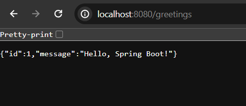
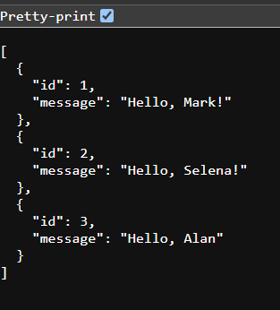

## Develope a Simple Rest Api with Spring Boot

In this tutorial, we are going to explore how to develope a simple greeting rest api using spring boot. In order to complete this application, make sure, you have a spring boot project in your system and in your project classpath (pom.xml file if you use maven) spring web mvc dependency has been added.

## Create a Domain Model

Let's create a simple pojo java class and name Greeting.java and in this file define few properties like id, and message. As we don't use any database technology for this post, thus no need to use alternative annotation.


**Greeting.java** (in com.company package)

```
package com.company;
public class Greeting {
    private int id;
    private String message;

    public Greeting() {
    }

    public Greeting(int id, String message) {
        this.id = id;
        this.message = message;
    }

    public int getId() {
        return id;
    }

    public void setId(int id) {
        this.id = id;
    }

    public String getMessage() {
        return message;
    }

    public void setMessage(String message) {
        this.message = message;
    }
}
```

## Create a Rest Controller Class

Let's create a simple controller class, let's name it **GreetingController.java** class. The purpose of this file to handle the mapping request and provide few metadata in order to build our greeting rest api. First of all, mark the class @RestController annotation.

```
package com.company;

import org.springframework.web.bind.annotation.GetMapping;
import org.springframework.web.bind.annotation.RestController;

@RestController
public class GreetingController {
    @GetMapping("/greetings")
    public Greeting getGreeting(){
        return new Greeting(1, "Hello, Spring Boot!");
    }
}
```

After running the application if you now visit the uri [text](http://localhost:8080/greetings) you will see a greeting json response like below. How does it work? Because we have annotated our class by @RestController annotation and it is used to build rest api in spring boot. This annotation is the combination of @Controller and @ResponseEntity annotation. 



Here are the real use of @Controller and @RestController annotation.

2. **@Controller**: This annotation marks a class as a Spring MVC controller. It's typically used to define the endpoints for handling HTTP requests and best for handling template files (such as html files).


3. **@RestController**: Similar to **@Controller**, but it indicates that the returned value of methods should be directly written to the HTTP response body instead of being interpreted as a view name (like template files). When you want to build an api, like json api or restful web service, you should use it instead or @Controller annotation.


## Return List of Greeting Response

Instead of getting a singe json response, how to get list for json response? See the code below


```
package com.company;

import org.springframework.web.bind.annotation.GetMapping;
import org.springframework.web.bind.annotation.RestController;

import java.util.List;

@RestController
public class DemoController {
    @GetMapping("/greetings")
    public List<Greeting> getGreeting(){

        List<Greeting> greetings = List.of(
                new Greeting(1, "Hello, Mark!"),
                new Greeting(2, "Hello, Selena!"),
                new Greeting(3, "Hello, Alan")
        );

        return greetings;
    }
}
```

If you now open [text](http://localhost:8080/greetings) you will see list of json greeting messages.



