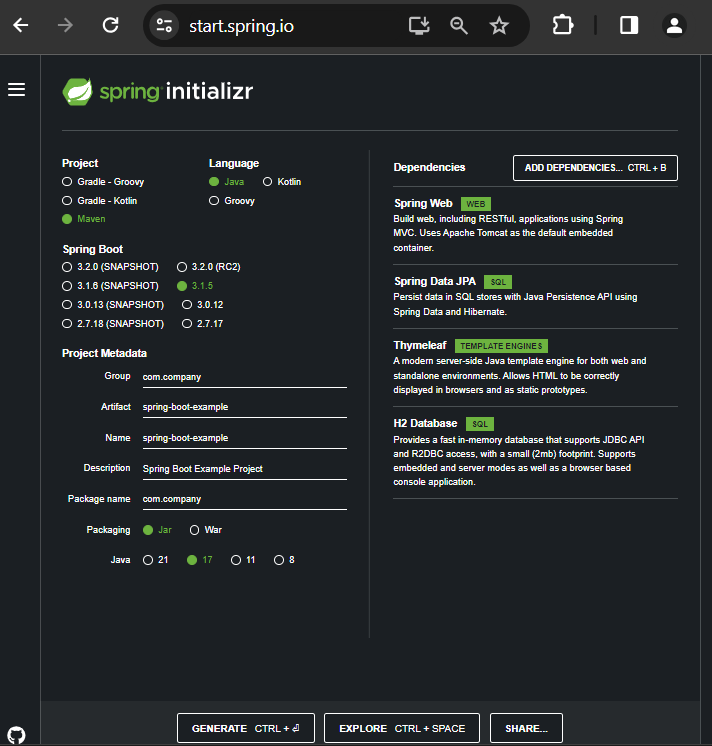
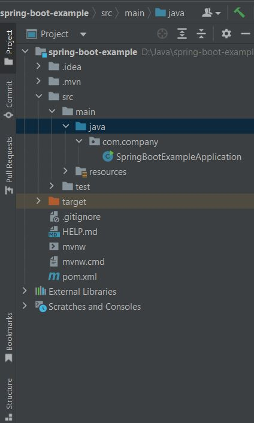

## Spring Data JPA One-To-Many and Many-to-One mapping tutorial

In this simple example tutorial, we will describe how to use JPA One-to-many and Many-to-one mapping in Spring Boot.


**Note:** For database persistence, we will use Spring Data JPA.

**When to use **@OneToMany** or **@ManyToOne** mappings?** - When one entity is associated will multiple other entities or More than one entity/object is associated with a single entity/object. In database technology we say, a column of a table is linked with more than one tables or multiples tables are linked with one tables column/record.

Like, An owner has three cars but but each car has only one owner, a person has has many bank accounts but each account has only one person or owner etc.

**Note:** Entity association is only possible when the object or type is entity itself.


To understand the scenario clearly, we will go under a simple project.


If you don't have any Spring Boot application bootstrapped yet, let's create one.


Let's follow the below steps to bootstrap a simple Spring Boot application using spring initializer.

1. Open [https://start.spring.io/](https://start.spring.io/) and provide necessary information to create spring boot project. The project will be a .zip file and we have to unzip it in a directory to work with it.

***Now in this page, Select***
    - Maven as a build tool (you can select gradle as well)
    - Java as a language
    - Spring Boot version 3.0.12 (or the latest version)
    - In the Project Metadata section, provide your application group, artifact, package name etc. Note: The group and package name will be same. Also the artifact and name of your project will be same as well (Not mandatory). 
    - Then, select jar for packaging (for simplicity) and select the java language version. The java language version I use is 17 (LTS). You can choose 8, 11 or the latest LTS version.
    - The last step is to adding dependencies. Add the following starter dependencies:
        - Spring Web (MVC)
        - Spring Data JPA
        - H2/MySQL driver dependency (H2 for embedded database); Select H2 for simplicity 





2. After generating the .zip file now unzip it to any directory. 

3. Import the unzip spring-boot-example project into your favourite Ide.

**Eclipse:** File > Import > Maven > Existing Maven projects > Next > Browse your spring boot project (you have just downloaded)> Click Finish. Please wait few seconds to complete the whole process and resolving the maven dependencies.

**Intellij Ide:** File > Open > Browse the existing spring boot project > Click Ok. Likewise eclipse, wait few seconds to resolve maven/Gradle dependencies.

**VS Code:** File > Open Folder > Browse the existing spring boot project > Select Folder.

**NetBeans:** File > Open Project > Browse the existing spring boot project (maven project) > Open project.  


4. The project file structure will be like this.




5. Now, Create a model package in **com.company** folder. Inside the model package, create an entity class called **Person** and Relationship entity class called **Car**. Both are annotated by **@Entity** annotation. Here, the Person class is the relationship owner. Thus, we have used **@JoinColumn** annotation in it. 

    ***Also note that, the OneToMany or ManyToOne mappings, the ManyToOne side will always be the relationship owner. Thus, you never can use mappedBy attribute in the @ManyToOne side. Please use both annotations to make the approach handy. (Here I skip this)***


**Person.java**
```
package com.company.model;

import jakarta.persistence.*;


@Entity
public class Person {
    @Id
    @GeneratedValue(strategy = GenerationType.AUTO)
    private int id;
    private String name;
    
    @ManyToOne(cascade = CascadeType.ALL)
    @JoinColumn(name = "car_id")
    private Car car;

    public Car getCar() {
        return car;
    }

    public void setCar(Car car) {
        this.car = car;
    }

    public Person() {
        super();
    }

    public Person(int id, String name) {
        this.id = id;
        this.name = name;
    }

    public int getId() {
        return id;
    }

    public void setId(int id) {
        this.id = id;
    }

    public String getName() {
        return name;
    }

    public void setName(String name) {
        this.name = name;
    }

    @Override
    public String toString() {
        return "Person{" + "id=" + id +
                ", name='" + name + '\'' +
                ", car=" + car +
                '}';
    }
}
```


About the code above: We have annotated the class above by **@Entity** annotation to make it persistent class. By default it is the table name in your database. The Person class contains id, name as attributes. It also contains, associated class with **@ManyToOne** annotation. There is also **@JoinColumn** annotation is used to provide the foreign key column name. The foreign key will be found in the Person table not the Car table. Note, if you don't use the **@JoinColumn(name = "car_id")** then the foreign key column name would be (person_car). 


**Car.java** 

```js
package com.company.model;

import jakarta.persistence.Entity;
import jakarta.persistence.GeneratedValue;
import jakarta.persistence.GenerationType;
import jakarta.persistence.Id;

@Entity
public class Car{
    @Id
    @GeneratedValue(strategy = GenerationType.AUTO)
    private int car_id;
    private String name;
    private String brand;

    public Car() {
        super();
    }

    public Car(int car_id, String name, String brand) {
        this.car_id = car_id;
        this.name = name;
        this.brand = brand;
    }

    public int getCar_id() {
        return car_id;
    }

    public void setCar_id(int car_id) {
        this.car_id = car_id;
    }

    public String getName() {
        return name;
    }

    public void setName(String name) {
        this.name = name;
    }

    public String getBrand() {
        return brand;
    }

    public void setBrand(String brand) {
        this.brand = brand;
    }

    @Override
    public String toString() {
        return "Car{" + "car_id=" + car_id +
                ", name='" + name + '\'' +
                ", brand='" + brand + '\'' +
                '}';
    }
}

```


6. Now create **PersonRepository.java** interface class in **com.company.repository** package. (You may have to create the repository package first of all). Here, we extends **JpaRepository**. You may also extends **CrudRepository** as well.


**PersonRepository.java**

```
package com.company.repository;

import com.company.model.Person;
import org.springframework.data.jpa.repository.JpaRepository;
import org.springframework.stereotype.Repository;

import java.util.List;

@Repository
public interface PersonRepository extends JpaRepository<Person, Integer> {

    List<Person> findByName(String name);
}
```


**Note:** Skip **findByName(String name)** query method for the time being. It is a custom query method to find the entity records by name.


6. Create a **PersonController.java** class in **com.company.controller** package. 


**PersonController.java**

```
package com.company.controller;


import com.company.repository.EmployeeRepository;
import com.company.model.Employee;
import org.springframework.beans.factory.annotation.Autowired;

import org.springframework.web.bind.annotation.*;

import java.util.List;


@RestController
public class EmployeeController {

    @Autowired
    private EmployeeRepository employeeRepository;
    //get all the employees

    @GetMapping("/employees")
    public List<Employee> getAll(){
        return employeeRepository.findAll();
    }

    @PostMapping("/employees")
    public int saveEmployee(@RequestBody Employee employee){
        return employeeRepository.save(employee).getId();
    }

    //find by id
    @GetMapping("/employees/{id}")
    public Employee findById(@PathVariable int id) {
        return employeeRepository.findById(id).get();
    }

    @GetMapping("/employees/name/{firstName}")
    public List<Employee> getByFirstName(@PathVariable String firstName){
        return employeeRepository.findByFirstName(firstName);
    }

    @GetMapping("/employees/role/{role}")
    public List<Employee> getEmployeeByRole(@PathVariable String role){
        return employeeRepository.findByRole(role);
    }

    @DeleteMapping("/employees/{id}")
    public void deleteEmployee(@PathVariable("id") int id){
        employeeRepository.deleteById(id);
    }
}
```


The most common rest annotations (http verbs) have been used here like **@GetMapping**, **@PostMapping**, **@DeleteMapping** etc. We focus on **@GetMapping** and **@PostMapping** only.

**@GetMapping("/persons"):** Get all the person records

**@GetMapping("/persons/{id}):** Get a person record by id

**@PostMapping("persons"):** Save or persist a new person record in this endpoint

**@DeleteMapping("/persons/{id}):** Delete a single person by id


Additionally, we have annotated the PersonController class by **@RestController** annotation to make it behave like web application and get accessible of all the rest endpoints.

7. Now, open the main class file and run the example application or type ***Shift+F10.***

Note: The application listens port 8080 in localhost.


8. Add database configuration in **application.properties** file. It is located in resources folder. 

```
spring.datasource.url=jdbc:h2:mem:testdb
spring.datasource.driverClassName=org.h2.Driver
spring.datasource.username=sa
spring.datasource.password=
spring.jpa.database-platform=org.hibernate.dialect.H2Dialect
#enabling the H2 console
spring.h2.console.enabled=true
```
***spring.h2.console.enabled=true*** # enable h2 embedded database to access from your web browser.


9. After run the application successfully, Open Postman or use Curl to post some fake data.

If Postman: 

In this step we will use Postman, a popular rest client to work with rest APIs. If, in your system postman is already installed do the following 
    - Open it (if Postman is already installed)
    - Invoke the url: [http://localhost:8080/persons](http://localhost:8080/persons)
    - Select Body and row then JSON as content-type
    - Insert the below demo data (one by one)
    - At last, click on send button 

Imagine, we have three person records in the persons table and all are owned Car named "A".

```js
//First person
{
    "name": "Shakil Ahmed",
    "car": {
        "name": "A",
        "brand": "X"
    }
}

//second person
{
    "name": "Bob Smith",
    "car": {
        "name": "A",
        "brand": "X"
    }
}

//third person

{
    "name": "Jekov Jenkov",
    "car": {
        "name": "A",
        "brand": "X"
    }
}

//you can also do like this:
{
    "id": 1
    "name": "Shakil Ahmed",
    "car": {
        "id": 1
        "name": "A",
        "brand": "X"
    }
}

//If you don't use id, then id will be generated automatically.
//but if you use id, then, you must use the id both (parent-entity + child-entity) too.
```

10. Invoke the url: [http//localhost:8080/persons](http//localhost:8080/persons) in your favourite web browser. You will see all the persons records in json format.

Also, if you call the @GET request in Postman, the response will be pretty straightforward.

```js
[
    {
        "id": 1,
        "name": "Shakil Ahmed",
        "car": {
            "car_id": 1,
            "name": "A",
            "brand": "X"
        }
    },
    {
        "id": 2,
        "name": "Bob Smith",
        "car": {
            "car_id": 1,
            "name": "A",
            "brand": "X"
        }
    },
    {
        "id": 3,
        "name": "Jekov Jenkov",
        "car": {
            "car_id": 1,
            "name": "A",
            "brand": "X"
        }
    }
]
```

12. Also check the same response in your H2 console. Invoke the url: [http://localhost:8080/h2-console](http//localhost:8080/h2-console) click enter -> Connect. Now run: **SELECT * FROM PERSON;** in the command section.

Now the person table would be like this:


You see there is an extra table called **car_id**. It is the foreign key of this table that indicates which car belongs to which person. Here all the person acquires the same car. It is how **@ManyToOne** mapping works. Where multiple entities can be associated with only one entity. Like, same car may be owned by many persons etc.


**But if you run this command: SELECT * FROM CAR;**


You now see, the Car table only contains car_id, name and brand columns. But, there is only one car in the car table. Also notice that the foreign key is only available in the relationship owner entity/table (in this case, the Person table) though you can use the mapping annotations bidirectionally.

In our case, the Person table is the relationship owner. 

