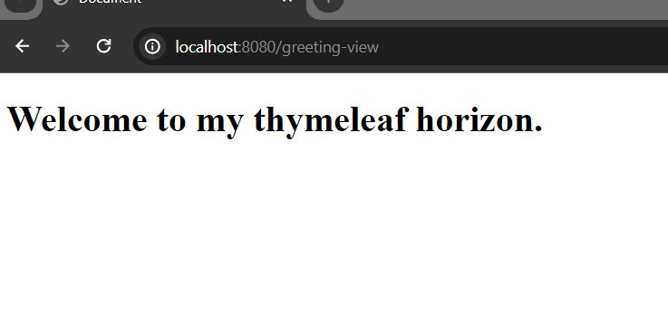

# Spring Boot Thymeleaf View

Thymeleaf is a server side template engine based on java programming language and it wroks on both web and standalone environments. We can use thymeleaf as an alternative of frontend frameworks like react or angular.

In this tutorial we are going to explore how to add thymeleaf dependency in our spring boot application. 
   
Let's assume we have a simple spring boot application in our system. Open it in your ide and then click on the pom.xml file. Now inside the dependency section, add the thymeleaf maven dependency. Please reload your pom.xml file then.

```
<dependency>
    <groupId>org.springframework.boot</groupId>
    <artifactId>spring-boot-starter-thymeleaf</artifactId>
</dependency>
```

# Create Our First Thymeleaf View.

There is a templates folder in the resources folder (src/main/resources/templates) in your application. All the template files (like html files) will reside here. (Like in javaEE, if you use jsp instead of thymeleaf all the web files (html files) reside in WEB_INF folder). <br/> Now create greeting.html file in this folder. And write the following simple html code.

```
<!DOCTYPE html>
<html lang="en">
<head>
    <meta charset="UTF-8">
    <meta name="viewport" content="width=device-width, initial-scale=1.0">
    <title>Document</title>
</head>
<body>
    <h1>Welcome to my thymeleaf horizon.</h1>
</body>
</html>
```

Now if you run your spring boot application (If you don't make any changes, you application
will listen 8080 port in localhost.) and then open [http://localhost:8080/greeting](http://localhost:8080/greeting) there will be an white lavel error message shown. Why? Because, thymeleaf is serverside template engine. We have to resolve the view so that we can access the thymeleaf .html files from localhost.

Anyway, now create a controller class called GreetingController in our com.company package. And the annotate the class by @Controller annotate. This annotation will handle the view. No much modification will be required.

The GreetingController.java will look like.

```
package com.company;

import org.springframework.stereotype.Controller;
import org.springframework.web.bind.annotation.GetMapping;

@Controller
public class GreetingController {
    @GetMapping("/greeting-view")
    public String greeting(){
        return "greeting";
    }
}

```

Please run the application again and if you now visit the url: [http://localhost:8080/greeting-view](http://localhost:8080/greeting-view) You will see the following demo html file. 



Here the @GetMapping annotaion is being used to handle the web request made by clien computer. 

